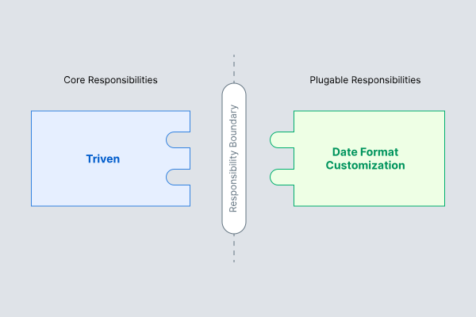

title: A couple of improvements to Triven
date: 2022-04-12
description: What would be the best way of allowing custom date formats for articles? And how to make it possible to keep posts out of the blog homepage? Discover in here the strategies I adopted to implement these new functionalities.
keywords: improvements, Triven, formatting, date, plugin, architecture

---

Time zone aside, date is probably the worst thing a programmer has to deal with. Months contain an irregular amount of days, one of them doesn't have even thirty days. The year is not filled with 370 days nor 360. It contains 365 - but not always. Imagine the task of subtracting five days. Business days or regular days? Holidays included? If the subtraction starts on the second day of a month, the result will be on the previous one - and, if it's a leap year, the month could have one more day... Date formatting is not less complex. Day, month, year? Month, day, year? Split by comma, slash or dash?

Triven is a [static blog generator based in Markdown with delightful support for multi-language](https://rafaelcamargo.com/blog/generating-a-multi-language-blog-based-in-markdown/). While developing its earlier versions, the only possible date formats were MM/DD/YYYY, for articles written in American English, and DD/MM/YYYY for any other language. I opted for that strategy because it didn't require anything more than the date already written by the user on the markdown file. However, the impossibility of setting a custom date format - to make it more friendly - really bothered me.

  
_Comprehensive map of all countries that use the MM/DD/YYYY date format_

In the last weeks, I started to figure out a way of allowing custom date formats for articles. The first strategy that came to mind was offering a limited set of formats that users could choose on the Triven configuration file. To bridge the chosen format and the date shown on the articles, I'd use a library like *date-fns*. Seemed like a good-enough strategy, but I discarded it very soon because I didn't like the idea of adding one more dependency to the project. Date formatting didn't seem a core task to me, hence it shouldn't be done by Triven. Since that's a side-task, it would be better not to be coupled to the tool. Then I remembered the concept of *Plugin Architecture*, explained in the chapter *Boundaries: Drawing lines* of the book *Clean Architecture*.

  
_Plugin Architecture_

## Custom date format

The plugin architecture fitted like a glove. As date format customization is not a core task, Triven must not be responsible for that. Instead, Triven might allow a third-party formatter to be *plugged* into it. According to this approach, the Triven configuration file started to accept, since version [0.12.0](https://github.com/glorious-codes/glorious-triven/commit/db4fb2dd0bd63346bd31e0e3f716d858854e1a9c), the `formatters` section, by which a date formatter may be connected to the tool:

``` javascript
{
  formatters: {
    date: (isoDateString, lang) => {
      // Returns a string representing
      // the date formatted as you wish.
    }
  }
}
```
With this new capability, the responsibility to format a date was kept out of Triven code, and users got all the necessary flexibility to format dates as they might want.

## Unlisted articles

The second improvement allows users to publish an article, but not list it on the blog homepage. Whether it's a post welcoming newcomers to a newsletter, or a publication you want feedback for before making it widely available. Since the version [0.11.0](https://github.com/glorious-codes/glorious-triven/commit/dfc6f6027a947729f988d5d0b396575d63060d04) you can keep an article out of the homepage by adding an attribute called `unlisted` to the article markdown file:

``` markdown
title: Won't be listed on the homepage
unlisted: true

---

Your publication
```
Heads up! Publications set as `unlisted` will be ignored by search engine bots, but will remain public. Any person with the link will be able to access and view it normally.
