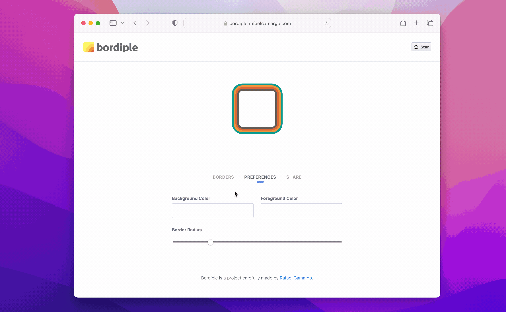
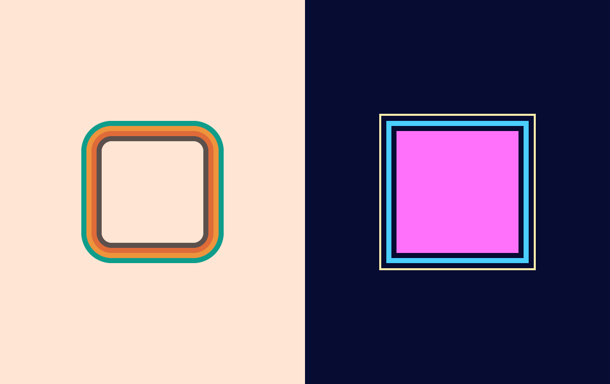

title: Bordiple is a CSS multiple borders generator
date: 2023-06-28
description: After not having found any tool like this on the internet, I decided to make the life of programmers and designers that need apply multiple borders in their creations easier.
keywords: multiple borders, css, gerator, bordiple

---

At the moment I finished to write my last post about [elements with multiple borders using pure CSS](https://rafaelcamargo.com/blog/elements-with-multiple-borders-using-pure-css/), I kept wondering how productive it would be if there were an online tool that aid programmers and designers to create and visualize multiple borders elements. Since I haven't found any, I decided to create [Bordiple](https://bordiple.rafaelcamargo.com/).

  
_Preview and share your creations with ease_

Likewise online tools used to generate CSS gradients, the idea behind Bordiple is to make the development of multiple border elements easier through a friendly interface that allows any person to create, visualize and copy the CSS code related to the generated borders. It's also possible to customize the preview area, making the necessary adjustments under the tab *Preferences*. At last, any creation can be seamlessly shared using the sharing link available under the tab *Share*.

  
_[70s Groove](https://bordiple.rafaelcamargo.com/?b=W3sid2lkdGgiOjUsImNvbG9yIjoiIzVjNTA0YyJ9LHsid2lkdGgiOjUsImNvbG9yIjoiI2RmNmIzOSJ9LHsid2lkdGgiOjUsImNvbG9yIjoiI2VlOTQzZCJ9LHsid2lkdGgiOjUsImNvbG9yIjoiIzBmOWQ4YiJ9XQ&p=eyJiZ0NvbG9yIjoiI2ZmZTZkNCIsImZnQ29sb3IiOiIjZmZlNmQ0IiwiYm9yZGVyUmFkaXVzIjoiMTAifQ) vs [80s Disco](https://bordiple.rafaelcamargo.com/?b=W3sid2lkdGgiOjUsImNvbG9yIjoiIzA3MGMzMiJ9LHsid2lkdGgiOjUsImNvbG9yIjoiIzRhY2ZmZiJ9LHsid2lkdGgiOjUsImNvbG9yIjoiIzA3MGMzMiJ9LHsid2lkdGgiOiIyIiwiY29sb3IiOiIjZmZlZGFlIn1d&p=eyJiZ0NvbG9yIjoiIzA3MGMzMiIsImZnQ29sb3IiOiIjZmY3MmZjIiwiYm9yZGVyUmFkaXVzIjoiMCJ9)_

Bordiple is free, open-source, and, if you liked it, consider to support the project staring it on [Github](https://github.com/rafaelcamargo/bordiple). The more are the stars, the greater is the visibility gained by the project. The greater is the visibility, the more are the people that will have the opportunity to know it and enjoy its benefits. Thank you!
