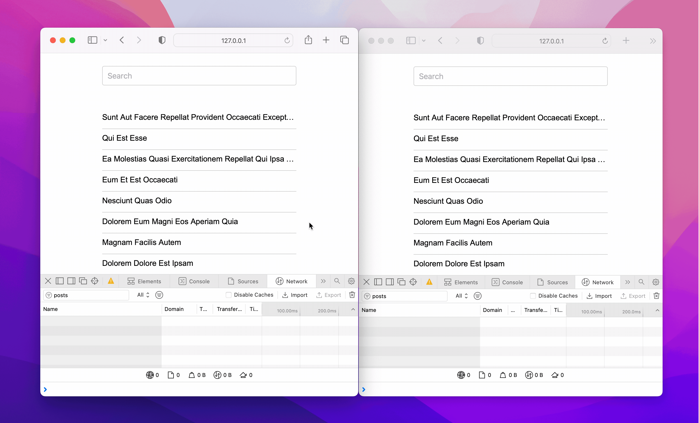

title: Debouncing requests with React Query
date: 2023-02-24
description: Sooner or later, every application ends up needing to implement a debouncing strategy in some parts of its code to avoid noisy events. Learn how to prevent unnecessary requests with one of the most popular libraries of the React ecosystem.
keywords: debouncing, react query

---

Unnecessary requests generate an overload that charges a high price from those who serve data as well as from those who consume them, since both parts waste resources transmitting data that won't be used.

One of the most popular strategies to avoid unnecessary requests is called *debouncing*. According to the [Wiktionary](https://en.wiktionary.org/wiki/debounce), the term joins *de* + *bounce* and means:

> To discard events or signals that should not be processed because they occurred too close together.

A frequent case of a *bounce* that fires unnecessary requests is filtering a list by a term. If the term has 5 letters, and one request occurs at every letter typed, 4 requests were meaningless and, therefore, should have been prevented.

The React Query library offers some benefits for those who need to manage requests within a React application. By default, it prevents simultaneous requests to the same resource and is able to cache responses as easily as passing a simple parameter to the query.

However, debouncing is an advantage not brought by React Query, unfortunately. So we need to wrap it in a simple abstraction able to satisfy that necessity too. The following example suggests a way of extending React Query to add the new functionality with less than forty lines of code:

``` javascript
import { useState, useEffect } from 'react';
import { useQuery } from 'react-query';

export const useCustomQuery = (
  params,
  request,
  { debounce, ...options } = {}
) => {
  const [newParams, setNewParams] = useState(params);
  const stringify = obj => JSON.stringify(obj);

  useEffect(() => {
    if (stringify(params) !== stringify(newParams)) {
      const timerId = setTimeout(
        () => setNewParams(params),
        debounce
      );
      return () => clearTimeout(timerId);
    }
  }, [params]);

  return useQuery(newParams, request, options);
}
```
In this [*gist*](https://gist.github.com/rafaelcamargo/eda94014a8e087334a201feea1f6e6df), you find an *index.html* containing all the necessary code to try the above implementation locally.

  
_Without debounce (left). With debounce (right)._

The animation above shows the power of *debouncing* in practice. Without it (window at left), the application fires **12 requests** and exchanges **28.3 KB** of data. With it (window at right), the application fires only **1 request** and exchanges **294 B**. A total saving of 91% in requests and 99% in transmitted data.

To learn more about Rect Query, visit its [official website](https://react-query-v3.tanstack.com/).
