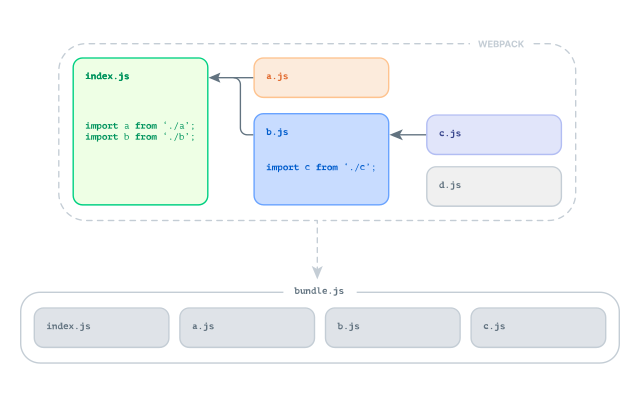
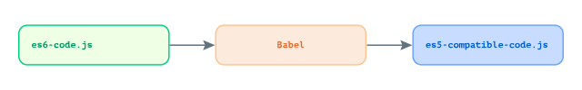

title: From AngularJS to React
date: 2020-08-01
description: For those who have programmed a lot using AngularJS, the first impression when coming across a React component may not be the best. Seeing JavaScript and HTML sharing the same space is likely the most significant impact. But do not get carried away by appearances. React is far less strange than the first impression might suggest.
keywords: angularjs, react, differences

---

For those who have programmed a lot using AngularJS, the first impression when coming across a React component may not be the best. Seeing JavaScript and HTML sharing the same space is likely the most significant impact. But do not get carried away by appearances. React is far less strange than the first impression might suggest.

Before we dig deeper into the differences between AngularJS and React, we need to have an overview of the structure that supports React. The JavaScript code that we will see in a React component is not supported natively by the language. Another still very incipient feature is the use of modules. Two development tools come into play to make those features available: *Webpack* and *Babel*.

## Webpack

Webpack allows us to organize the code into *modules*. Every variable or function is private in a module and has to be explicitly exported to become public. Public content is visible and can be imported by the other modules. That said, popular strategies like IIFE *(Immediately Invoked Function Expression)* are no longer necessary to avoid polluting the global scope with undesired variables or functions.

On the Webpack configuration file, we set a module as an *entry-point*. Then Webpack will resolve the modules imported by the entry-point, as well as all the other modules imported by subsequent modules. Through a long *module-by-module* scan, Webpack creates a dependency tree and connects them into a single file called *bundle*.

As we can see in the image, all the necessary modules to resolve the entry-point were included in the bundle. The bundle contains *index.js (entry-point)*, *a.js*, *b.js* e *c.js*. Since no module imported *d.js* during the entry-point resolution, it was left out. This is nice because it means that modules that are not effectively used by the application are not bundled, avoiding unnecessary weight.

## Babel

Compared to Webpack, Babel is much simpler to understand. It is a code transpiler and allows us to use JavaScript language features that are not fully supported by browsers yet. In the case of React, it goes a little further and, through a specific preset, makes it possible to use HTML within JavaScript code. This syntax is popularly called *JSX*.

In this [repository](https://github.com/rafaelcamargo/minimal-react), you can check the *.babelrc* and *webpack.config.js* configuration files containing only what is minimally required to bundle and run a React application.

## Template Engine

The way to handle HTML is where you will see most of the differences between AngularJS and React. Bindings, Loops and Conditional Rendering work radically different in React.

### Bindings

AngularJS has a philosophy called *Two-Way Data Binding*. Through the *ng-model* directive, AngularJS binds the controller variable to the template and vice versa. When the variable changes on the controller, the template is automatically updated. And when the user changes the variable on the template, the controller gets updated as well. Also, a child component can change the value of a property passed by its parent. That is, not only parents change a property value given to its children, but also children change the property values received by their parents.

React treats binding differently. It is *One-Way Data Binding*. The value of a variable present on the controller reflects automatically on the template, but when the variable changes on the template, its value is not automatically updated on the controller. You need to handle this change manually. Component property values can only be updated upside down too. That is, from the parent to the child, not otherwise.

Playground: [Two-Way Data Binding](https://demo.pitsby.com/#!/components/angular/playground?tab=2&code=eyJ0ZW1wbGF0ZSI6IjxkaXYgY2xhc3M9XCJwbGF5Z3JvdW5kLXByZXZpZXctY29udGFpbmVyXCI%2BXG4gIDxsYWJlbD5cbiAgICBOYW1lXG4gIDwvbGFiZWw%2BXG4gIDxkaXY%2BXG4gICAgPGlucHV0IHR5cGU9XCJ0ZXh0XCIgbmctbW9kZWw9XCIkY3RybC5uYW1lXCIgLz5cbiAgPC9kaXY%2BXG4gIDxkaXY%2BXG4gICAgTmFtZToge3sgJGN0cmwubmFtZSB9fVxuICA8L2Rpdj5cbjwvZGl2PiIsImNvbnRyb2xsZXIiOiJmdW5jdGlvbiBjb250cm9sbGVyKCkge1xuICBjb25zdCAkY3RybCA9IHRoaXM7XG5cbiAgJGN0cmwubmFtZSA9ICcnO1xufVxuXG5yZXR1cm4gY29udHJvbGxlcjsiLCJzdHlsZXMiOiIucGxheWdyb3VuZC1wcmV2aWV3LWNvbnRhaW5lciB7IHBhZGRpbmc6IDMwcHg7IH0ifQ%3D%3D), [One-Way Data Binding](https://demo.pitsby.com/#!/components/react/playground?tab=1&code=eyJjb250cm9sbGVyIjoiLy8gVGhpcyBmdW5jdGlvbiByZXByZXNlbnRzIGEgV2VicGFjayBNb2R1bGVcbmZ1bmN0aW9uKCkge1xuICBjb25zdCB7IHVzZVN0YXRlIH0gPSBSZWFjdDtcblxuICAvLyBUaGlzIGZ1bmN0aW9uIHJlcHJlc2VudHMgYSBGdW5jdGlvbmFsIFJlYWN0IENvbXBvbmVudFxuICByZXR1cm4gZnVuY3Rpb24oKXtcbiAgICBjb25zdCBbbmFtZSwgc2V0TmFtZV0gPSB1c2VTdGF0ZSgpO1xuICAgIFxuICAgIGNvbnN0IG9uTmFtZUNoYW5nZSA9IGV2dCA9PiB7XG4gICAgICBzZXROYW1lKGV2dC5jdXJyZW50VGFyZ2V0LnZhbHVlKTtcbiAgICB9O1xuXG4gICAgcmV0dXJuIChcbiAgICAgIDxkaXYgY2xhc3NOYW1lPVwicGxheWdyb3VuZC1wcmV2aWV3LWNvbnRhaW5lclwiPlxuICAgICAgICA8bGFiZWw%2BXG4gICAgICAgICAgTmFtZVxuICAgICAgICA8L2xhYmVsPlxuICAgICAgICA8ZGl2PlxuICAgICAgICAgIDxpbnB1dCB0eXBlPVwidGV4dFwiIG9uQ2hhbmdlPXsgb25OYW1lQ2hhbmdlIH0vPlxuICAgICAgICA8L2Rpdj5cbiAgICAgICAgPGRpdj5cbiAgICAgICAgICBOYW1lOiB7IG5hbWUgfVxuICAgICAgICA8L2Rpdj5cbiAgICAgIDwvZGl2PlxuICAgICk7XG4gIH1cbn0iLCJzdHlsZXMiOiIucGxheWdyb3VuZC1wcmV2aWV3LWNvbnRhaW5lciB7IHBhZGRpbmc6IDMwcHg7IH0ifQ%3D%3D).

### Conditional Rendering

It was also using another directive that parts of a template could be conditionally rendered in AngularJS. All you needed to do was passing a Boolean variable to the *ng-if* directive to decide if the element and its children would be shown or not.

React uses the resources of the JavaScript language to achieve the same result. *If statements*, ternary and logical operators.

Playground: [Ng-if](https://demo.pitsby.com/#!/components/angular/playground?tab=2&code=eyJ0ZW1wbGF0ZSI6IjxkaXYgY2xhc3M9XCJwbGF5Z3JvdW5kLXByZXZpZXctY29udGFpbmVyXCI%2BXG4gIDxsYWJlbD5cbiAgICBOYW1lXG4gIDwvbGFiZWw%2BXG4gIDxkaXY%2BXG4gICAgPGlucHV0IHR5cGU9XCJ0ZXh0XCIgbmctbW9kZWw9XCIkY3RybC52aXNpdG9yTmFtZVwiIG5nLWJsdXI9XCIkY3RybC5vbk5hbWVJbnB1dEJsdXIoJGV2ZW50KVwiIC8%2BXG4gIDwvZGl2PlxuICA8ZGl2IG5nLWlmPVwiJGN0cmwuc2hvdWxkU2hvd0dyZWV0aW5nXCI%2BXG4gICAgSGVsbG8ge3sgJGN0cmwudmlzaXRvck5hbWUgfX0hXG4gIDwvZGl2PlxuPC9kaXY%2BIiwiY29udHJvbGxlciI6ImZ1bmN0aW9uIGNvbnRyb2xsZXIoKSB7XG4gIGNvbnN0ICRjdHJsID0gdGhpcztcblxuICAkY3RybC52aXNpdG9yTmFtZSA9ICcnO1xuICBcbiAgJGN0cmwub25OYW1lSW5wdXRCbHVyID0gZXZ0ID0%2BIHtcbiAgICBzZXRHcmVldGluZ1Zpc2liaWxpdHkoISFldnQuY3VycmVudFRhcmdldC52YWx1ZSk7XG4gIH07XG4gIFxuICBmdW5jdGlvbiBzZXRHcmVldGluZ1Zpc2liaWxpdHkoc2hvdWxkU2hvd0dyZWV0aW5nKXtcbiAgICBjb25zb2xlLmxvZyhzaG91bGRTaG93R3JlZXRpbmcpXG4gICAgJGN0cmwuc2hvdWxkU2hvd0dyZWV0aW5nID0gc2hvdWxkU2hvd0dyZWV0aW5nO1xuICB9XG59XG5cbnJldHVybiBjb250cm9sbGVyOyIsInN0eWxlcyI6Ii5wbGF5Z3JvdW5kLXByZXZpZXctY29udGFpbmVyIHsgcGFkZGluZzogMzBweDsgfSJ9), [If Statement](https://demo.pitsby.com/#!/components/react/playground?tab=1&code=eyJjb250cm9sbGVyIjoiZnVuY3Rpb24oKSB7XG4gIGNvbnN0IHsgdXNlU3RhdGUgfSA9IFJlYWN0O1xuXG4gIHJldHVybiBmdW5jdGlvbigpe1xuICAgIGNvbnN0IFt2aXNpdG9yTmFtZSwgc2V0VmlzaXRvck5hbWVdID0gdXNlU3RhdGUoKTtcbiAgICBcbiAgICBjb25zdCBoYW5kbGVOYW1lID0gZXZ0ID0%2BIHtcbiAgICAgIHNldFZpc2l0b3JOYW1lKGV2dC5jdXJyZW50VGFyZ2V0LnZhbHVlKTtcbiAgICB9O1xuICAgIFxuICAgIGNvbnN0IGJ1aWxkR3JlZXRpbmcgPSBuYW1lID0%2BIHtcbiAgICAgIGlmKG5hbWUpIHtcbiAgICAgICAgcmV0dXJuIDxwPkhlbGxvIHsgbmFtZSB9ITwvcD47XG4gICAgICB9XG4gICAgfTtcblxuICAgIHJldHVybiAoXG4gICAgICA8ZGl2IGNsYXNzTmFtZT1cInBsYXlncm91bmQtcHJldmlldy1jb250YWluZXJcIj5cbiAgICAgICAgPGxhYmVsPlxuICAgICAgICAgIE5hbWVcbiAgICAgICAgPC9sYWJlbD5cbiAgICAgICAgPGRpdj5cbiAgICAgICAgICA8aW5wdXQgdHlwZT1cInRleHRcIiBvbkJsdXI9eyBoYW5kbGVOYW1lIH0gLz5cbiAgICAgICAgPC9kaXY%2BXG4gICAgICAgIHsgYnVpbGRHcmVldGluZyh2aXNpdG9yTmFtZSkgfVxuICAgICAgPC9kaXY%2BXG4gICAgKTtcbiAgfVxufSIsInN0eWxlcyI6Ii5wbGF5Z3JvdW5kLXByZXZpZXctY29udGFpbmVyIHsgcGFkZGluZzogMzBweDsgfSJ9), [Operador &&](https://demo.pitsby.com/#!/components/react/playground?tab=1&code=eyJjb250cm9sbGVyIjoiZnVuY3Rpb24oKSB7XG4gIGNvbnN0IHsgdXNlU3RhdGUgfSA9IFJlYWN0O1xuXG4gIHJldHVybiBmdW5jdGlvbigpe1xuICAgIGNvbnN0IFt2aXNpdG9yTmFtZSwgc2V0VmlzaXRvck5hbWVdID0gdXNlU3RhdGUoKTtcbiAgICBcbiAgICBjb25zdCBoYW5kbGVOYW1lID0gZXZ0ID0%2BIHtcbiAgICAgIHNldFZpc2l0b3JOYW1lKGV2dC5jdXJyZW50VGFyZ2V0LnZhbHVlKTtcbiAgICB9O1xuXG4gICAgcmV0dXJuIChcbiAgICAgIDxkaXYgY2xhc3NOYW1lPVwicGxheWdyb3VuZC1wcmV2aWV3LWNvbnRhaW5lclwiPlxuICAgICAgICA8bGFiZWw%2BXG4gICAgICAgICAgTmFtZVxuICAgICAgICA8L2xhYmVsPlxuICAgICAgICA8ZGl2PlxuICAgICAgICAgIDxpbnB1dCB0eXBlPVwidGV4dFwiIG9uQmx1cj17IGhhbmRsZU5hbWUgfSAvPlxuICAgICAgICA8L2Rpdj5cbiAgICAgICAgeyB2aXNpdG9yTmFtZSAmJiA8cD5IZWxsbyB7IHZpc2l0b3JOYW1lIH0hPC9wPiB9XG4gICAgICA8L2Rpdj5cbiAgICApO1xuICB9XG59Iiwic3R5bGVzIjoiLnBsYXlncm91bmQtcHJldmlldy1jb250YWluZXIgeyBwYWRkaW5nOiAzMHB4OyB9In0%3D), [Operador Ternário](https://demo.pitsby.com/#!/components/react/playground?tab=1&code=eyJjb250cm9sbGVyIjoiZnVuY3Rpb24oKSB7XG4gIGNvbnN0IHsgdXNlU3RhdGUgfSA9IFJlYWN0O1xuXG4gIHJldHVybiBmdW5jdGlvbigpe1xuICAgIGNvbnN0IFt2aXNpdG9yTmFtZSwgc2V0VmlzaXRvck5hbWVdID0gdXNlU3RhdGUoKTtcbiAgICBcbiAgICBjb25zdCBoYW5kbGVOYW1lID0gZXZ0ID0%2BIHtcbiAgICAgIHNldFZpc2l0b3JOYW1lKGV2dC5jdXJyZW50VGFyZ2V0LnZhbHVlKTtcbiAgICB9O1xuICAgIFxuICAgIGNvbnN0IGJ1aWxkR3JlZXRpbmcgPSBuYW1lID0%2BIHtcbiAgICAgIHJldHVybiBuYW1lID8gPHA%2BSGVsbG8geyBuYW1lIH0hPC9wPiA6IDxwPkVudGVyIHlvdXIgbmFtZSBpbiB0aGUgZmllbGQgYWJvdmUuPC9wPjtcbiAgICB9O1xuXG4gICAgcmV0dXJuIChcbiAgICAgIDxkaXYgY2xhc3NOYW1lPVwicGxheWdyb3VuZC1wcmV2aWV3LWNvbnRhaW5lclwiPlxuICAgICAgICA8bGFiZWw%2BXG4gICAgICAgICAgTmFtZVxuICAgICAgICA8L2xhYmVsPlxuICAgICAgICA8ZGl2PlxuICAgICAgICAgIDxpbnB1dCB0eXBlPVwidGV4dFwiIG9uQmx1cj17IGhhbmRsZU5hbWUgfSAvPlxuICAgICAgICA8L2Rpdj5cbiAgICAgICAgeyBidWlsZEdyZWV0aW5nKHZpc2l0b3JOYW1lKSB9XG4gICAgICA8L2Rpdj5cbiAgICApO1xuICB9XG59Iiwic3R5bGVzIjoiLnBsYXlncm91bmQtcHJldmlldy1jb250YWluZXIgeyBwYWRkaW5nOiAzMHB4OyB9In0%3D).

### Loops

Following the same way used to conditionally render parts of a template, loops made with the *ng-repeat* directive in AngularJS are done in React using plain JavaScript like *map*, for instance.

Playground: [Ng-repeat](https://demo.pitsby.com/#!/components/angular/playground?tab=2&code=eyJ0ZW1wbGF0ZSI6IjxkaXYgY2xhc3M9XCJwbGF5Z3JvdW5kLXByZXZpZXctY29udGFpbmVyXCI%2BXG4gIDxkaXY%2BXG4gICAgRnJ1aXRzXG4gIDwvZGl2PlxuICA8Zm9ybSBuZy1zdWJtaXQ9XCIkY3RybC5oYW5kbGVGcnVpdFN1Ym1pc3Npb24oKVwiPlxuICAgIDxpbnB1dCB0eXBlPVwidGV4dFwiIG5nLW1vZGVsPVwiJGN0cmwubmV3RnJ1aXRcIiBwbGFjZWhvbGRlcj1cIkFkZCBhIGZydWl0Li4uXCIgLz5cbiAgPC9mb3JtPlxuICA8dWw%2BXG4gICAgPGxpIG5nLXJlcGVhdD1cImZydWl0IGluICRjdHJsLmZydWl0c1wiPlxuICAgICAge3sgZnJ1aXQgfX1cbiAgICA8L2xpPlxuICA8L3VsPlxuPC9kaXY%2BIiwiY29udHJvbGxlciI6ImZ1bmN0aW9uIGNvbnRyb2xsZXIoKSB7XG4gIGNvbnN0ICRjdHJsID0gdGhpcztcblxuICAkY3RybC5mcnVpdHMgPSBbJ0JhbmFuYScsICdPcmFuZ2UnXTtcbiAgXG4gICRjdHJsLmhhbmRsZUZydWl0U3VibWlzc2lvbiA9ICgpID0%2BIHtcbiAgICBpZigkY3RybC5uZXdGcnVpdCkgYWRkRnJ1aXQoJGN0cmwubmV3RnJ1aXQpO1xuICAgICRjdHJsLm5ld0ZydWl0ID0gJyc7XG4gIH07XG4gIFxuICBmdW5jdGlvbiBhZGRGcnVpdChmcnVpdCl7XG4gICAgJGN0cmwuZnJ1aXRzLnB1c2goZnJ1aXQpO1xuICB9XG59XG5cbnJldHVybiBjb250cm9sbGVyOyIsInN0eWxlcyI6Ii5wbGF5Z3JvdW5kLXByZXZpZXctY29udGFpbmVyIHsgcGFkZGluZzogMzBweDsgfSJ9), [Map](https://demo.pitsby.com/#!/components/react/playground?tab=1&code=eyJjb250cm9sbGVyIjoiZnVuY3Rpb24oKSB7XG4gIGNvbnN0IHsgdXNlU3RhdGUgfSA9IFJlYWN0O1xuXG4gIHJldHVybiBmdW5jdGlvbigpe1xuICAgIGNvbnN0IFtmcnVpdHMsIHNldEZydWl0c10gPSB1c2VTdGF0ZShbJ0JhbmFuYScsICdPcmFuZ2UnXSk7XG4gICAgXG4gICAgY29uc3QgaGFuZGxlRnJ1aXRTdWJtaXNzaW9uID0gZXZ0ID0%2BIHtcbiAgICAgIGNvbnN0IGlucHV0ID0gZXZ0LmN1cnJlbnRUYXJnZXQucXVlcnlTZWxlY3RvcignW25hbWU9XCJmcnVpdFwiXScpO1xuICAgICAgaWYoaW5wdXQudmFsdWUpIHNldEZydWl0cyhbIC4uLmZydWl0cywgaW5wdXQudmFsdWUgXSk7XG4gICAgICBpbnB1dC52YWx1ZSA9ICcnO1xuICAgICAgZXZ0LnByZXZlbnREZWZhdWx0KCk7XG4gICAgfTtcblxuICAgIHJldHVybiAoXG4gICAgICA8ZGl2IGNsYXNzTmFtZT1cInBsYXlncm91bmQtcHJldmlldy1jb250YWluZXJcIj5cbiAgICAgICAgPGRpdj5cbiAgICAgICAgICBGcnVpdHNcbiAgICAgICAgPC9kaXY%2BXG4gICAgICAgIDxmb3JtIG9uU3VibWl0PXsgaGFuZGxlRnJ1aXRTdWJtaXNzaW9uIH0%2BXG4gICAgICAgICAgPGlucHV0IHR5cGU9XCJ0ZXh0XCIgbmFtZT1cImZydWl0XCIgcGxhY2Vob2xkZXI9XCJBZGQgYSBmcnVpdC4uLlwiIC8%2BXG4gICAgICAgIDwvZm9ybT5cbiAgICAgICAgPHVsPlxuICAgICAgICAgIHsgZnJ1aXRzLm1hcCgoZnJ1aXQsIGluZGV4KSA9PiA8bGkga2V5PXtpbmRleH0%2BeyBmcnVpdCB9PC9saT4pIH1cbiAgICAgICAgPC91bD5cbiAgICAgIDwvZGl2PlxuICAgICk7XG4gIH1cbn0iLCJzdHlsZXMiOiIucGxheWdyb3VuZC1wcmV2aWV3LWNvbnRhaW5lciB7IHBhZGRpbmc6IDMwcHg7IH0ifQ%3D%3D).

As we see, one of the traits that separate React from AngularJS so much is how the template is perceived. To illustrate that difference, some developers use to say: *AngularJS puts JavaScript in HTML, React puts HTML in JavaScript*.

But the main differences between AngularJS and React are not limited to the template engine. The Component Lifecycle API changes a lot as well.

## Lifecycle Hooks

Lifecycle hooks give us the necessary conditions to perform specific tasks. When some tasks only can be done after the component template has already been rendered, we can use the component initialization hook, for example. On the other hand, if we need to perform a task at the moment in which a component is removed from the DOM, we can use the component termination hook.

### Initialization/Mounting

The hook that represents the component initialization in AngularJS is *$onInit*. This is the function AngularJS runs at the moment in which component is fully ready for use. That is, the template is rendered, and all the variables present on the controller are bound to it.

Tasks that need to be performed in specific moments of the React component lifecycle are passed to a function called *useEffect*. Not so intuitive, the name of this function relates to the term side effect. Within *useEffect* we can be sure that the task will run only after the component is mounted.

Playground: [$onInit](https://demo.pitsby.com/#!/components/angular/playground?tab=2&code=eyJ0ZW1wbGF0ZSI6IjxkaXYgY2xhc3M9XCJwbGF5Z3JvdW5kLXByZXZpZXctY29udGFpbmVyXCI%2BXG4gIDxoMT5QbGF5Z3JvdW5kPC9oMT5cbjwvZGl2PiIsImNvbnRyb2xsZXIiOiJmdW5jdGlvbiBjb250cm9sbGVyKCkge1xuICBjb25zdCAkY3RybCA9IHRoaXM7XG5cbiAgLy8gQXQgdGhpcyBtb21lbnQsIGNvbXBvbmVudCBpcyBub3QgZnVsbHkgYnVpbHQuXG4gIGFsZXJ0UGFnZUhlYWRpbmcoKTtcbiAgXG4gICRjdHJsLiRvbkluaXQgPSAoKSA9PiB7XG4gICAgLy8gSGVyZSB5b3UgY2FuIHJ1biB0YXNrcyB0aGF0IGRlcGVuZCBvblxuICAgIC8vIGNvbXBvbmVudCdzIG1hcmt1cCwgZm9yIGV4YW1wbGUuXG4gICAgYWxlcnRQYWdlSGVhZGluZygpO1xuICB9O1xuICBcbiAgZnVuY3Rpb24gYWxlcnRQYWdlSGVhZGluZygpe1xuICAgIGNvbnN0IGhlYWRpbmcgPSBkb2N1bWVudC5xdWVyeVNlbGVjdG9yKCdoMScpO1xuICAgIHJldHVybiBoZWFkaW5nID8gd2luZG93LmFsZXJ0KGhlYWRpbmcudGV4dENvbnRlbnQpIDogd2luZG93LmFsZXJ0KCdObyBoZWFkaW5nIGZvdW5kIScpO1xuICB9XG59XG5cbnJldHVybiBjb250cm9sbGVyOyIsInN0eWxlcyI6Ii5wbGF5Z3JvdW5kLXByZXZpZXctY29udGFpbmVyIHsgcGFkZGluZzogMzBweDsgfSJ9), [useEffect](https://demo.pitsby.com/#!/components/react/playground?tab=1&code=eyJjb250cm9sbGVyIjoiZnVuY3Rpb24oKSB7XG4gIGNvbnN0IHsgdXNlRWZmZWN0IH0gPSBSZWFjdDtcblxuICByZXR1cm4gZnVuY3Rpb24oKXtcbiAgICBjb25zdCBhbGVydFBhZ2VIZWFkaW5nID0gKCkgPT4ge1xuICAgICAgY29uc3QgaGVhZGluZyA9IGRvY3VtZW50LnF1ZXJ5U2VsZWN0b3IoJ2gxJyk7XG4gICAgICByZXR1cm4gaGVhZGluZyA%2FIHdpbmRvdy5hbGVydChoZWFkaW5nLnRleHRDb250ZW50KSA6IHdpbmRvdy5hbGVydCgnTm8gaGVhZGluZyBmb3VuZCEnKTtcbiAgICB9XG5cbiAgICAvLyBBdCB0aGlzIG1vbWVudCwgY29tcG9uZW50IGlzIG5vdCBmdWxseSBidWlsdC5cbiAgICBhbGVydFBhZ2VIZWFkaW5nKCk7XG5cbiAgICB1c2VFZmZlY3QoKCkgPT4ge1xuICAgICAgLy8gSGVyZSB5b3UgY2FuIHJ1biB0YXNrcyB0aGF0IGRlcGVuZCBvblxuICAgICAgLy8gY29tcG9uZW50J3MgbWFya3VwLCBmb3IgZXhhbXBsZS5cbiAgICAgIGFsZXJ0UGFnZUhlYWRpbmcoKTtcbiAgICB9LCBbXSk7XG5cbiAgICByZXR1cm4gKFxuICAgICAgPGRpdiBjbGFzc05hbWU9XCJwbGF5Z3JvdW5kLXByZXZpZXctY29udGFpbmVyXCI%2BXG4gICAgICAgIDxoMT5QbGF5Z3JvdW5kPC9oMT5cbiAgICAgIDwvZGl2PlxuICAgICk7XG4gIH1cbn0iLCJzdHlsZXMiOiIucGxheWdyb3VuZC1wcmV2aWV3LWNvbnRhaW5lciB7IHBhZGRpbmc6IDMwcHg7IH0ifQ%3D%3D).

### Destruction/Unmounting

Like the tasks that should be run when the component is already mounted, some other tasks need to run right before component unmounts. Consider some task adding an event listener to the document at the moment the component initializes. That listener must be removed from the document when the component is removed from the DOM. Otherwise, every initialization of that component will add one more listener causing unexpected behavior.

The AngularJS hook that allows us to run a task right before a component is removed from the DOM is called *$onDestroy*.

The hook used in React to do this keeps the same, *useEffect*. In the previous case - *initialization*, we just passed a function to the hook that will be run at the moment in which the component is fully mounted. When you need to run a task right before the component is unmounted, the function passed to *useEffect* must return another one. That other one should contain the tasks that will run right before the end of the component life.

Playground: [$onDestroy](https://demo.pitsby.com/#!/components/angular/playground?tab=2&code=eyJ0ZW1wbGF0ZSI6IjxkaXYgY2xhc3M9XCJwbGF5Z3JvdW5kLXByZXZpZXctY29udGFpbmVyXCI%2BXG4gIDxoMT5QbGF5Z3JvdW5kPC9oMT5cbjwvZGl2PiIsImNvbnRyb2xsZXIiOiJmdW5jdGlvbiBjb250cm9sbGVyKCkge1xuICBjb25zdCAkY3RybCA9IHRoaXM7XG4gIFxuICAkY3RybC4kb25Jbml0ID0gKCkgPT4ge1xuICAgIGRvY3VtZW50LmFkZEV2ZW50TGlzdGVuZXIoJ2NsaWNrJywgYWxlcnRQYWdlSGVhZGluZyk7XG4gIH07XG4gIFxuICAkY3RybC4kb25EZXN0cm95ID0gKCkgPT4ge1xuICAgIGRvY3VtZW50LnJlbW92ZUV2ZW50TGlzdGVuZXIoJ2NsaWNrJywgYWxlcnRQYWdlSGVhZGluZyk7XG4gIH07XG4gIFxuICBmdW5jdGlvbiBhbGVydFBhZ2VIZWFkaW5nKCl7XG4gICAgY29uc3QgaGVhZGluZyA9IGRvY3VtZW50LnF1ZXJ5U2VsZWN0b3IoJ2gxJyk7XG4gICAgcmV0dXJuIGhlYWRpbmcgPyB3aW5kb3cuYWxlcnQoaGVhZGluZy50ZXh0Q29udGVudCkgOiB3aW5kb3cuYWxlcnQoJ05vIGhlYWRpbmcgZm91bmQhJyk7XG4gIH1cbn1cblxucmV0dXJuIGNvbnRyb2xsZXI7Iiwic3R5bGVzIjoiLnBsYXlncm91bmQtcHJldmlldy1jb250YWluZXIgeyBwYWRkaW5nOiAzMHB4OyB9In0%3D), [useEffect](https://demo.pitsby.com/#!/components/react/playground?tab=1&code=eyJjb250cm9sbGVyIjoiLy8gVGhpcyBmdW5jdGlvbiByZXByZXNlbnRzIGEgV2VicGFjayBNb2R1bGVcbmZ1bmN0aW9uKCkge1xuICBjb25zdCB7IHVzZUVmZmVjdCB9ID0gUmVhY3Q7XG5cbiAgLy8gVGhpcyBmdW5jdGlvbiByZXByZXNlbnRzIGEgRnVuY3Rpb25hbCBSZWFjdCBDb21wb25lbnRcbiAgcmV0dXJuIGZ1bmN0aW9uKCl7XG4gICAgY29uc3QgYWxlcnRQYWdlSGVhZGluZyA9ICgpID0%2BIHtcbiAgICAgIGNvbnN0IGhlYWRpbmcgPSBkb2N1bWVudC5xdWVyeVNlbGVjdG9yKCdoMScpO1xuICAgICAgaWYoaGVhZGluZylcbiAgICAgICAgd2luZG93LmFsZXJ0KGhlYWRpbmcudGV4dENvbnRlbnQpO1xuICAgIH07XG5cbiAgICB1c2VFZmZlY3QoKCkgPT4ge1xuICAgICAgZG9jdW1lbnQuYWRkRXZlbnRMaXN0ZW5lcignY2xpY2snLCBhbGVydFBhZ2VIZWFkaW5nKTtcbiAgICAgIFxuICAgICAgcmV0dXJuICgpID0%2BIHtcbiAgICAgICAgZG9jdW1lbnQucmVtb3ZlRXZlbnRMaXN0ZW5lcignY2xpY2snLCBhbGVydFBhZ2VIZWFkaW5nKTtcbiAgICAgIH1cbiAgICB9KTtcblxuICAgIHJldHVybiAoXG4gICAgICA8ZGl2IGNsYXNzTmFtZT1cInBsYXlncm91bmQtcHJldmlldy1jb250YWluZXJcIj5cbiAgICAgICAgPGgxPlBsYXlncm91bmQ8L2gxPlxuICAgICAgPC9kaXY%2BXG4gICAgKTtcbiAgfVxufSIsInN0eWxlcyI6Ii5wbGF5Z3JvdW5kLXByZXZpZXctY29udGFpbmVyIHsgcGFkZGluZzogMzBweDsgfSJ9).

As we noticed, the underlying logic on how to handle a component does not change too much from AngularJS to React as the code appearance may suggest. Once you understand the differences regarding the form, any developer familiar with AngularJS will have no trouble developing React components.
