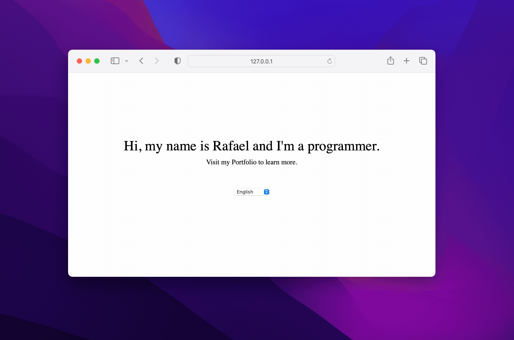
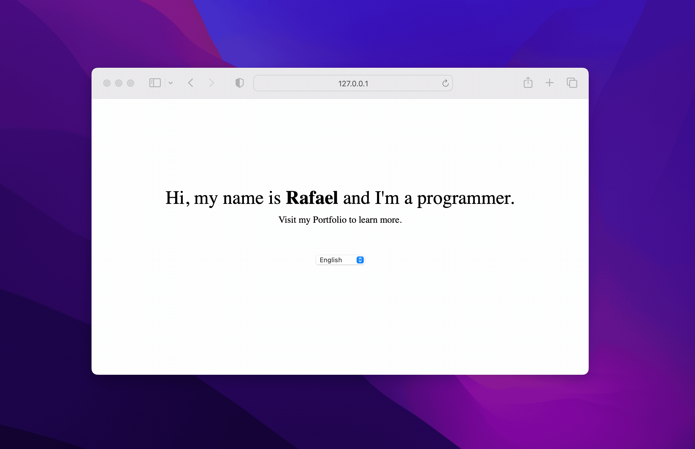
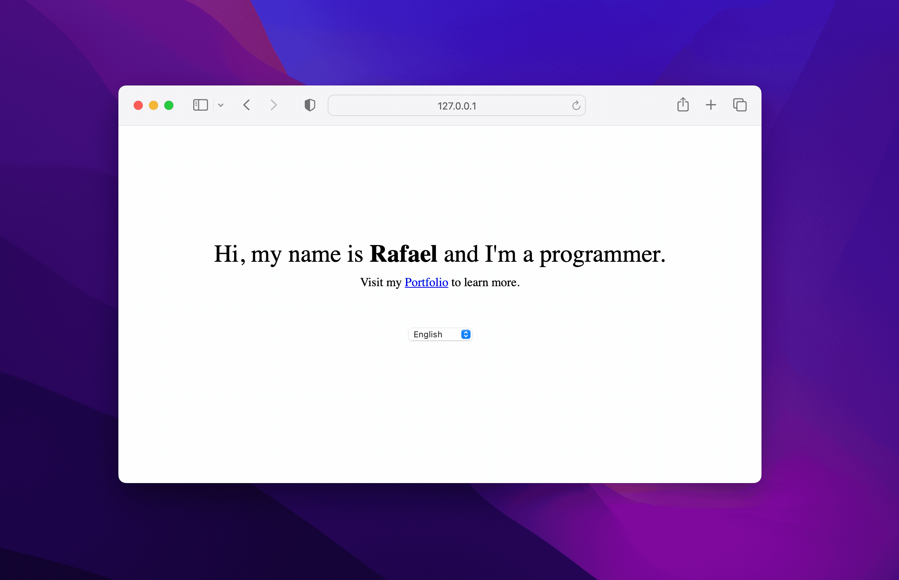

title: Handling HTML within React i18next translations
date: 2023-11-29
description: Dealing with plain text in translation files is a trivial activity. But when part of the translation needs to be in bold or contains a link, challenges may arise. Discover how to overcome these challenges with the aid of the i18next library.
keywords: html, translations, react, i18next

---

Supporting multiple languages within the same software can be a huge advantage for companies aiming to conquer markets beyond their own country's borders.

One of the most popular JavaScript libraries focused on internationalizing applications is i18next. One of the first questions that may come to mind is: if i18next is the *next,* what would be the *previous*? I have no idea either. I imagine that the *next* here is just playing with the letter *n* present in *i18n,* an acronym representing the letters *i* and *n* from the word *internationalization* plus the *18* letters between them. But if you know the real meaning, don't hesitate to tell me.

It's important to clarify that all the code presented in this post will use i18next along with react-i18next, the library's wrapper for React.

So, let's start with the simplest way possible. Two sentences that don't use any HTML. Plain text. Besides the two sentences, just a language selector:

```javascript
import { useTranslation } from 'react-i18next';

const App = () => {
  const { t, i18n } = useTranslation();
  const languages = [
    { value: 'en', label: 'English' },
    { value: 'pt', label: 'Portuguese' }
  ];
  const handleLanguageChange = ({ target: { value } }) => {
    i18n.changeLanguage(value);
  }

  return (
    <>
      <h1>{t('greeting')}</h1>
      <p>{t('tagline')}</p>
      <select
        aria-label="language"
        value={i18next.language}
        onChange={({ target }) => i18n.changeLanguage(target.value)}
      >
        {languages.map(({ label, value }) => (
          <option key={value} value={value}>{label}</option>
        ))}
      </select>
    </>
  );
}
```

The respective translations for 'greeting' and 'tagline' are:

```json
{
  "resources": {
    "en": {
      "translation": {
        "greeting": "Hi, my name is Rafael and I'm a programmer.",
        "tagline": "Visit my Portfolio to learn more."
      }
    },
    "pt": {
      "translation": {
        "greeting": "Olá, sou programador e me chamo Rafael.",
        "tagline": "Visite meu Portfolio para saber mais."
      }
    }
  }
}
```

Below is the result of what we have so far:



The result is nice, but let's say we need to interfere with the style and dynamics of part of the text. How about highlighting *Rafael* in bold and making the word *Portfolio* a link?

Let's start with styling the name Rafael. For that, we need to specify in our translation the part of the text that will receive the HTML interference:

```json
{
  "resources": {
    "en": {
      "translation": {
        "greeting": "Hi, my name is <b>Rafael</b> and I'm a programmer.",
        "tagline": "Visit my Portfolio to learn more."
      }
    },
    "pt": {
      "translation": {
        "greeting": "Olá, sou programador e me chamo <b>Rafael</b>.",
        "tagline": "Visite meu Portfolio para saber mais."
      }
    }
  }
}
```

Once delimited, we now need to pass the HTML component to the respective region of the text. To do that, we can't solely use the `t` function anymore. We need something that gives us more power. i18next offers the `<Trans>` component for this purpose. Among the properties this component accepts is one called `components`, precisely the property we'll use:

```javascript
import { useTranslation, Trans } from 'react-i18next';

const App = () => {
  const { t, i18n } = useTranslation();
  // existing code

  return (
    <>
      <h1>
        <Trans
          i18nKey="greeting"
          components={{ b: <strong /> }}
        />
      </h1>
      <p>{t('tagline')}</p>
      {/* existing code */}
    </>
  );
}
```

The `components` property takes an object. Each key of that object is identified according to the marker used in the translation. If I had marked my translation with the symbol `<c>`, the key in the `components` object wouldn't be identified with the letter `b` anymore, but rather with the letter `c`. Here's the result:



With the styling of the name 'Rafael' completed, let's go a bit further. In addition to wrapping the word 'Portfolio' in an `<a>` anchor, let's set an `href` attribute for it. Again, we first need to delimit our translation with a specific marker:

```json
{
  "resources": {
    "en": {
      "translation": {
        "greeting": "Hi, my name is <b>Rafael</b> and I'm a programmer.",
        "tagline": "Visit my <a>Portfolio</a> to learn more."
      }
    },
    "pt": {
      "translation": {
        "greeting": "Olá, sou programador e me chamo <b>Rafael</b>.",
        "tagline": "Visite meu <a>Portfolio</a> para saber mais."
      }
    }
  }
}
```

Next, we again use the `<Trans>` component:

```javascript
import { useTranslation, Trans } from 'react-i18next';

const App = () => {
  const { t, i18n } = useTranslation();
  // existing code

  return (
    <>
      <h1>
        <Trans
          i18nKey="greeting"
          components={{ b: <strong /> }}
        />
      </h1>
      <p>
        <Trans
          i18nKey="tagline"
          components={{ a: <a href={`https://rafaelcamargo.com/?lang=${i18next.language}`} /> }}
        />
      </p>
      {/* existing code */}
    </>
  );
}
```

Finally, the expected result:



Both i18next and its `<Trans>` component are versatile and very powerful. Besides styling part of a translation or inserting links, i18next also allows us to format data, interpolate variables, and manage singular and plural words. To learn more about the full power of this library, visit its official documentation at [i18next.com](https://www.i18next.com/) and also the documentation for its React wrapper at [react.i18next.com](https://react.i18next.com/).

If you're curious to run this code on your computer, check out this [Gist](https://gist.github.com/rafaelcamargo/2b35ab21f8e5829247d25e94e3faa308) containing everything needed to make the solution work using just one HTML file.
