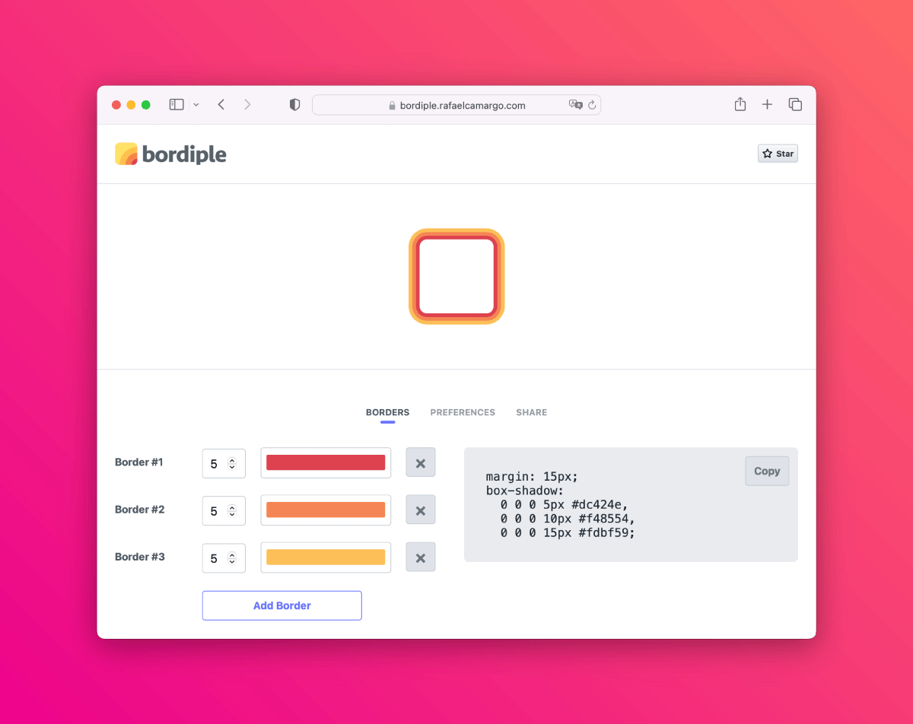

title: Handling indentation in Testing Library assertions
date: 2023-08-29
description: One of the most common tasks in tests written with Testing Library is asserting the presence of dynamic text in the document. But what if the text were indented? How can you ensure that both the text and the indentation are correct?
keywords: indentation, assertion, test

---

About two months ago, while implementing [Bordiple](https://rafaelcamargo.com/blog/bordiple-is-a-css-multiple-borders-generator/), an unprecedented situation arose as I was writing an automated test. Since one of Bordiple's goals is to make front-end development a little easier, CSS code is automatically generated at the time borders are set via graphic interface.

  
_CSS code automatically generated by Bordiple_

The automated test consisted of defining some borders using the graphical interface and then ensuring that the displayed CSS code was correct. It should have been a fairly simple test. Using the Testing Library, I needed nothing more than the commonly used `getByText` function to query the expected text in the document. However, a small detail made this operation slightly more complicated. The displayed text (CSS code) is indented, as shown in the following HTML.

``` html
<code>margin: 20px;
box-shadow:
  0 0 0 5px #dc424e,
  0 0 0 10px #f48554,
  0 0 0 20px #333333;</code>
```

My first attempt was to query the text rigorously respecting line breaks and indentation.

``` javascript
const codeElement = container.querySelector('#codeWrapper > code');
const code = `margin: 20px;
box-shadow: 
  0 0 0 5px #dc424e,
  0 0 0 10px #f48554,
  0 0 0 20px #333333;`;
expect(within(codeElement).getByText(code)).toBeInTheDocument();
```

However, after running the test, it broke, claiming that the expected text was not found in the document. Assuming that I hadn't correctly indented the text used in the test, I replaced `code` with `codeElement.textContent` in the test assertion to check if that was indeed the problem:

``` javascript
expect(within(codeElement).getByText(codeElement.textContent)).toBeInTheDocument();
```

Incredibly, even though I had instructed Testing Library to query the element's own inner text, the test did not pass. The claim remained exactly the same: the expected text was not found in the document.

My next attempt was to ignore indentation in the text passed to the `getByText` function:

``` javascript
const codeElement = container.querySelector('#codeWrapper > code');
const code = [
  'margin: 20px;',
  'box-shadow: 0 0 0 5px #dc424e, 0 0 0 10px #f48554, 0 0 0 20px #333333;'
].join(' ');
expect(within(codeElement).getByText(code)).toBeInTheDocument();
```

Surprisingly, the test passed. Issue solved? Not entirely. The current test would ensure that the code was correctly generated, but it wouldn't guarantee that it was being presented as expected, that is, indented.

The strategy that remained for me was to forget about the text and focus on the HTML:

``` javascript
const codeElement = container.querySelector('#codeWrapper > code');
const code = `margin: 20px;
box-shadow: 
  0 0 0 5px #dc424e,
  0 0 0 10px #f48554,
  0 0 0 20px #333333;`;
expect(codeElement.innerHTML).toEqual(code);
```

Perfect. This way, the test finally ensures that the HTML contained within the `<code>` element was generated and also indented correctly.
