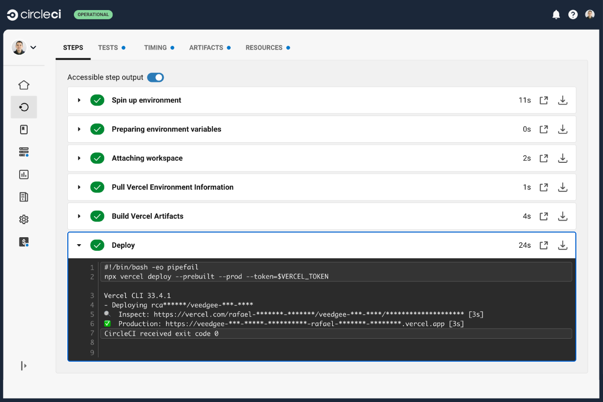
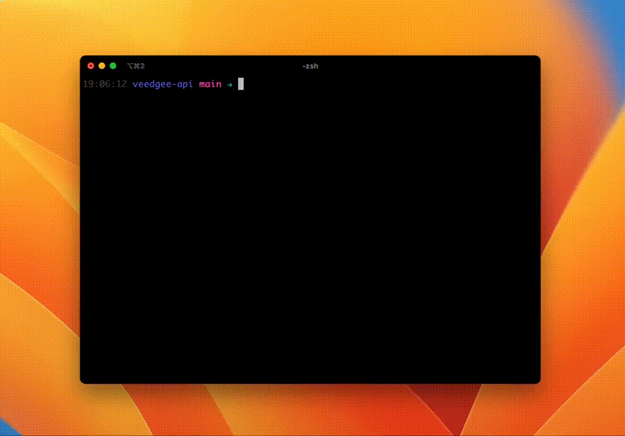

title: Lessons learned from building a Serverless NodeJS API with Vercel, Neon, and Prisma ORM
date: 2024-07-22
description: By offering generous free plans, Vercel and Neon have become great options for experimental projects. But if you're used to dealing with traditional infrastructure, the Serverless world can bring some challenges. In this post, I share the lessons I learned about continuous delivery, databases, and automated testing after releasing a Serverless NodeJS API.
keywords: vercel, neon, prisma orm, nodejs, serverless, continous delivery, automated testing

---

This week marks two months since my latest pet project went live. [Veedgee](https://veedgee.compilorama.com) was built using Serverless NodeJS and Serverless Postgres for the backend, and React for the frontend. While the frontend went exactly as expected, the Serverless backend threw me several curveballs, providing many learning experiences.

This post sums up what I learned about Continuous Delivery (CircleCI ➝ Vercel), Serverless Database (Neon), ORM (Prisma), and Automated Testing in a Serverless NodeJS application.

  
_Veedgee is a PWA and can be easily installed on either desktop or mobile._

## Continuous Delivery

I chose Vercel to host Veedgee's backend. By connecting a GitHub repository to Vercel, every new commit automatically triggers a deploy. If the commit is in a branch other than the main one, a preview deploy is triggered. If it's in the main branch, a production deploy is additionally triggered. This out-of-the-box Vercel-Github integration makes deployment a breeze since it requires no configuration, but it bypasses continuous integration and deploys even if an automated test fails.

To change this behavior, I disabled the Vercel-Github integration in the project settings and manually configured CircleCI to perform a deployment only after all other continuous integration stages have succeeded. To control deployments manually, I used the NPM package [vercel](https://www.npmjs.com/package/vercel), set up three environment variables, and added the deploy stage to my workflow.

### Environment Variables

1. `VERCEL_ORG_ID`: In Vercel, this is called **Vercel ID** and can be found in `/account`.
2. `VERCEL_PROJECT_ID`: The project ID is easier to find than the organization ID. Just go to the project settings tab. It's identified as **Project ID**.
3. `VERCEL_TOKEN`: To interact with Vercel using its NPM package, I created a token in my Vercel account settings (`/account/tokens`).

### Deploy via CircleCI

The deploy stage involved fetching environment information from Vercel with the `vercel pull` command, building the artifacts with the `vercel build` command, and finally releasing a new version of the API with the `vercel deploy` command. You can check out the entire CircleCI configuration for the Veedgee API [here](https://github.com/rafaelcamargo/veedgee-api/blob/main/.circleci/config.yml).

  
_Successful deploy executed in CircleCI_

## Database and ORM

Veedgee was also my first time experimenting with a Serverless Postgres database, a service offered by Neon. My impressions of Neon were excellent: easy-to-use interface and service, plus a generous free tier of 512MB storage.

However, there were many lessons learned regarding the ORM.

With less experience in backend than frontend, I started trying out some ORMs for NodeJS when planning Veedgee. I quickly decided on Sequelize. Its API seemed smooth and migration management was super easy.

With the continuous delivery workflow set up, I started developing the first endpoints using Sequelize locally. Then, it was time to release the first endpoint into production to see if it would run as smoothly in the cloud as it did locally.

After repeatedly failing to run Veedgee's API on Vercel, I discovered that Sequelize was not among the ORMs compatible with Vercel, as described on this [support page](https://vercel.com/docs/storage/vercel-postgres#orm-compatibility). While replacing Sequelize with [Prisma ORM](https://www.prisma.io), I learned many lessons in getting it to work on CircleCI and Vercel.

### Prisma Client

I discovered that to optimize the application build for each new deployment, Vercel caches several dependencies. Since Prisma doesn't get installed at each new build on Vercel, the Prisma Client served by Vercel can become outdated — a new model defined in `schema.prisma` might not be available to the application, for example. CircleCI uses that same strategy to speed up build times. To resolve this, I added a `postinstall` script to the project's `package.json`. This forces the generation of a new Prisma Client at each new build, whether on CircleCI or Vercel.

```json
{
  "scripts": {
    "postinstall": "prisma generate"
  }
}
```

### Prisma-Neon Connection

Unfortunately, Prisma doesn't come pre-configured to connect to a Serverless database. So, additional configuration steps were necessary to make the connection work properly.

### Pooling

The first adjustment was made to the database connection URL. The default URL generated by Neon assumes the connection will be from a traditional server, not serverless functions. Serverless functions might demand a large number of connections as usage increases. Neon recommends using a connection URL version that explicitly states the use of pooling.

  
_Veedgee's dashboard on Neon with pooling enabled_

### Prisma Driver

Another necessary adjustment for using the Serverless database correctly was adding the Neon Adapter and Neon Serverless Driver to the Prisma Client configuration.

Firstly, I installed the following NPM packages:

```
npm install -S @prisma/adapter-neon @neondatabase/serverless ws
```

Then, I enabled the use of adapters in the Prisma Client configuration, as it's still a Preview Feature in Prisma version 5.9.1:

```prisma
generator client {
  provider = "prisma-client-js"
  binaryTargets = ["native", "rhel-openssl-1.0.x"]
  previewFeatures = ["driverAdapters"]
}
```

Finally, I passed the Neon Adapter to the Prisma Client constructor:

```javascript
function buildProdDbClient(){
  neonConfig.webSocketConstructor = ws;
  const pool = new Pool({
    connectionString: process.env.DATABASE_URL
  });
  const adapter = new PrismaNeon(pool);
  return new PrismaClient({ adapter });
}
```

The final step of these adjustments required creating a service in my application to handle this condition. Since locally and in CI I don't serve a Serverless database, this adapter should be used only in production. You can check out the *database service* I created in my application [here](https://github.com/rafaelcamargo/veedgee-api/blob/main/src/services/database.js).

**Tip:** VS Code doesn't automatically detect the syntax of `.prisma` files. To comfortably manage the Prisma schema, I installed the [Prisma Plugin](https://marketplace.visualstudio.com/items?itemName=Prisma.prisma) for VS Code.

## Automated Testing

Since my application doesn't run serverless locally, I had to find a way to facilitate development and testing, both locally and in CircleCI. Lacking a better alternative, I chose the following strategy:

1. Created a module called `app.js` that exports a traditional Express application.
2. In the `index.js` module, I import and serve the Express app exported by `app.js`.
3. In the Vercel configuration, I route all requests to `app.js`. Based on the request's pathname, the Express app knows which controller method to execute, just like in a traditional Express app.

Though step 3 is a bad practice, as launching a whole Express application per request can significantly slow down the response time of a Serverless function, I chose this strategy for two reasons:

1. My application has only two endpoints, so it's very lightweight, making step 3's impact on the user experience minimal.
2. Running an Express app locally and in CircleCI allowed me to use the [Supertest](https://www.npmjs.com/package/supertest) library for integration tests, providing a smooth and enjoyable development experience.

  
_Integration tests execution_

You can see below how simple it is to create an integration test using Supertest:

```javascript
it('should create an event', async () => {
  const event = buildEvent();
  const response1 = await serve()
    .get(`/events?slug=${event.slug}`);
  expect(response1.status).toEqual(200);
  expect(response1.body).toEqual([]);
  const response2 = await serve()
    .post('/events')
    .set({ vatoken: 'vee123' })
    .send(event);
  expect(response2.status).toEqual(201);
  const response3 = await serve()
    .get(`/events?slug=${event.slug}`);
  expect(response3.status).toEqual(200);
  expect(response3.body).toEqual([{
    id: expect.any(String),
    created_at: expect.any(String),
    updated_at: expect.any(String),
    time: null,
    ...event
  }]);
});
```

After all these adjustments, Veedgee's API finally ran successfully on Vercel! My focus now is to find a way to combine the great development experience of Supertest with a non-Express-based application, allowing me to export just a handful of fully autonomous functions. If you know a good way to achieve this, please [contact me](/contact). I would greatly appreciate the help!

**Learn More**: If you liked this post, you might also be interested in [how to configure cache max age for static assets hosted on Firebase](/blog/configuring-cache-max-age-for-static-assets-hosted-on-firebase/).
