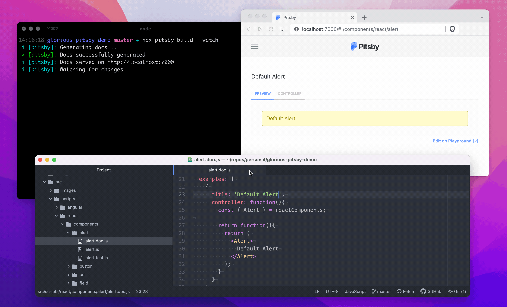

title: Little improvements to Pitsby
date: 2022-08-12
description: Better late than never. After a long break, good winds are blowing again on the latest version of the library. Performance and appearance were the topics that got improvements. In addition to the already known simplicity, from now on, documenting components will be fancier and faster.
keywords: pitsby, documentation, components, storybook, performance, appearance

---

More than one year after the last improvement, a few advances are more than welcome now. If Pitsby is still a non-existing word in your dictionary, you can now define it as a tool that aims to help you write UI components documentation easier. The main reason behind its existence was to offer an [alternative to Storybook](https://rcamargo.medium.com/the-alternative-to-storybookjs-fc48b18bfdeb)—the most popular tool at the time Pitsby was born—due to my tremendous uncomfortableness with Storybook's developer experience. These recent novelties, few but fabulous, focused on two topics.

## Performance

The first of them was to speed up *live reloading* during development time. Some steps regarding the web app update have been reorganized (and even removed), not requiring its recompilation anymore. Having this done, I could remove the *Webpack Dev Server* library in favor of a simpler and smaller one called [*Live Server*](https://github.com/tapio/live-server). The app containing the docs now compiles one single time, and just the impacted files got updated (or recreated) at every change.

## Appearance

Yes, the appearance of log messages shown on the terminal matters. I even risk saying that the appearance of *any* text matters, wherever it is. Think how hard it would be to write a program using an editor unable to highlight the code syntax with a beautiful color palette. The most recent version of Pitsby says bye to the old monochromatic log messages in favor of colorful and better-formatted ones, increasing their significance and readability.

  
_Pitsby live reload_

If Pitsby is already in your toolbox, enjoy these new experiences by installing its latest version. Otherwise, visit [pitsby.com](https://pitsby.com) and learn more.
