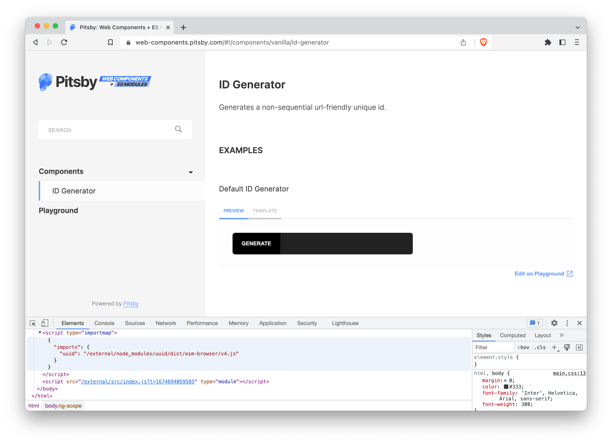

title: Pitsby now supports importmaps
date: 2023-01-27
description: In September of the last year, Pitsby started to support scripts set as module, but to unlock the full potential of modules, one improvement was still missing. Support to importmaps.
keywords: pitsby, importmap, interface, components, documentation

---

In September of the last year, a new feature was added to [Pitsby](https://pitsby.com). Scripts to be used by the generated documentation could be set as module on Pitsby's configuration file. To do so, you just needed to inform the attribute type on the object representing the script tag to be included in the docs.

``` javascript
{
  scripts: [
    {
      src: './path/to/es6/module.js',
      type: 'module'
    }
  ]
}
```

A few months later, an issue became evident. It was only possible to import modules from relative paths. In the case of absolute paths—when a third party code is imported from `node_modules` directory, for example—it wasn't possible to go ahead.

Version `1.33.0` of Pitsby, launched this month, overcomes this limitation. Pitsby now supports scripts set as [*importmap*](https://developer.mozilla.org/en-US/docs/Web/HTML/Element/script/type/importmap), allowing users to tell Browsers how to resolve modules imported from absolute paths. It's worth noticing that Browser still does not support scripts set as importmap to come from external sources. So, in these cases, you need to inform Pitsby that the script should be inlined:

``` javascript
{
  scripts: [
    {
      src: './path/to/docs/importmap.js',
      type: 'importmap',
      inline: true
    }
  ]
}
```

  
_[Demo documentation](https://web-components.pitsby.com/#!/components/vanilla/id-generator) of Web Components + ES6. Check out the code on [this repo](https://github.com/glorious-codes/glorious-pitsby-demo-web-components)._

Haven't you ever heard about Pitsby? Pitsby is one of several open-source tools offered by the [Glorious Codes](https://glorious.codes) project. It makes the process of documenting user interface components simple and straight, requiring almost no configuration. Pitsby supports legacy and modern frameworks from AngularJS to Vue, React, or Web Components. It contains a playground that allows users to prototype component compositions and share them with others. Pitsby's look and feel can be completely customized, and integrates seamlessly with Google Analytics. Learn more at [Pitsby's Official Website](https://pitsby.com).

