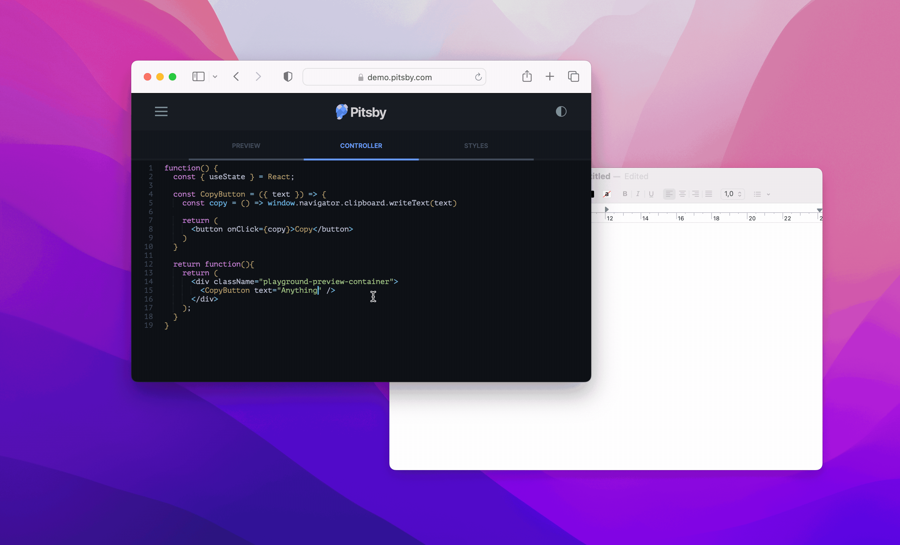

title: Testing copy-to-clipboard interactions with Jest and Testing Library
date: 2023-10-30
description: Copy buttons are everywhere on the internet. Using the keyboard to copy data from a website nowadays feels uncomfortable. But would it be possible to write tests that access data stored in the clipboard?
keywords: clipboard, react testing library, rtl, jest, copy, test

---

Long ago, I was amazed by the release of yet another project by Zeno Rocha, one of the most impressive professionals I know. The project was called *clipboard.js*. Back then, the most common strategy for implementing any button that copied data to the clipboard was to use Flash, a technology that faded away with the advent of HTML 5.

Over the years that followed, the ease introduced by *clipboard.js* in using the clipboard led to the proliferation of *Copy* buttons all over the internet. Nowadays, selecting text and pressing Ctrl+C (or Cmd+C) feels uncomfortable when we need to copy any data presented on a website.

But how do you write tests for this interesting use case? Is it possible to access the data stored in the clipboard during automated testing? The answer to the second question is yes, and below, you will find the answer to the first one.

The API that exposes the clipboard to the browser is provided through the `clipboard` object found in `window.navigator`. When it comes to text specifically, there are two methods that can be used: `writeText` and `readText`. Below is a test for a use case where a button labeled as Copy stores the text passed to it in the clipboard:
``` javascript
it('should copy text to clipboard', async () => {
  const text = 'Anything'
  render(<CopyButton text={text}/>)
  userEvent.click(screen.getByRole('button', { name: 'Copy' }))
  await pause(10)
  const copiedText = await window.navigator.clipboard.readText()
  expect(copiedText).toEqual(text)
})

async function pause(delay){
  return await new Promise(resolve => setTimeout(resolve, delay))
}
```

Note that after clicking the Copy button, a brief pause is required. This is necessary because both the `writeText` and `readText` functions operate asynchronously. It's important to note that the tools used in this test were Jest v29 and React Testing Library (commonly referred to as RTL) v12.

  
_React implementation of a Copy button_

Are you curious to see how the implementation that makes this test pass would look? Access this [playground](https://pitsby-demo.compilorama.com/#!/components/react/playground?tab=1&code=eyJjb250cm9sbGVyIjoiZnVuY3Rpb24oKSB7XG4gIGNvbnN0IENvcHlCdXR0b24gPSAoeyB0ZXh0IH0pID0%252BIHtcbiAgICBjb25zdCBjb3B5ID0gKCkgPT4gd2luZG93Lm5hdmlnYXRvci5jbGlwYm9hcmQud3JpdGVUZXh0KHRleHQpXG5cbiAgICByZXR1cm4gKFxuICAgICAgPGJ1dHRvbiBvbkNsaWNrPXtjb3B5fT5Db3B5PC9idXR0b24%252BXG4gICAgKVxuICB9XG5cbiAgcmV0dXJuIGZ1bmN0aW9uKCl7XG4gICAgcmV0dXJuIChcbiAgICAgIDxkaXYgY2xhc3NOYW1lPVwicGxheWdyb3VuZC1wcmV2aWV3LWNvbnRhaW5lclwiPlxuICAgICAgICA8Q29weUJ1dHRvbiB0ZXh0PVwiQW55dGhpbmdcIiAvPlxuICAgICAgPC9kaXY%252BXG4gICAgKTtcbiAgfVxufSIsInN0eWxlcyI6Ii5wbGF5Z3JvdW5kLXByZXZpZXctY29udGFpbmVyIHsgcGFkZGluZzogMzBweDsgfSJ9) and explore the possibilities offered by the Clipboard API right in your browser.
