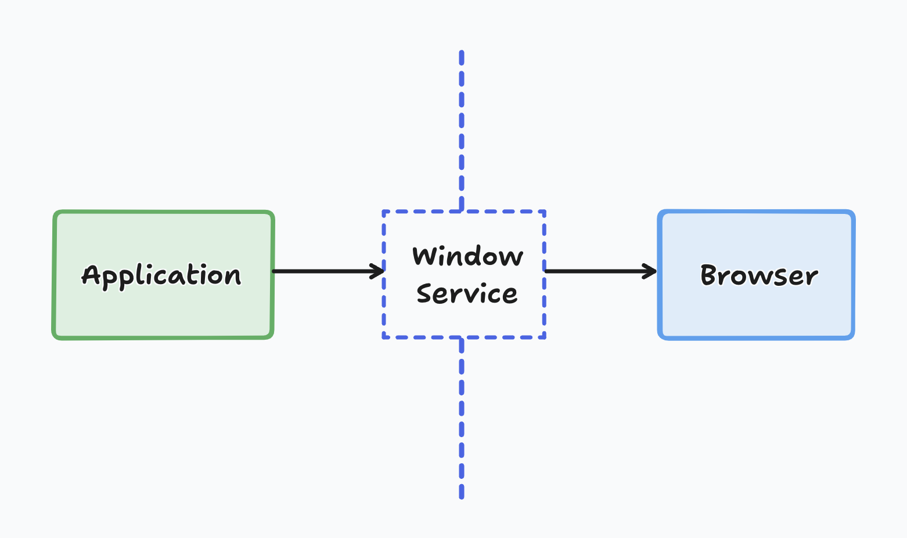

title: Testing redirections set via window location href with Jest
date: 2024-08-26
description: Redirects are pretty common in any web app. But when the destination is an external page, you might run into some challenges when testing that behavior. Learn how to set a boundary between your app's behavior and the browser's, making your tests easier to develop.
keywords: navigation not implemented, redirect, window, location, href, tests


---

Sometimes, we get hit with the following error when running our tests:

```
not implemented: navigation
```

A usual situation in which this kind of error may happen is when `window.location.href` is reassigned by the application code.

If this doesn't ring a bell, think of this scenario: when a user clicks a button in your app, they might either be redirected to another view within the same app — where only `window.history` is manipulated — or they might be redirected to an external page. It's when the app sends the user to an external page by changing the value of `window.location.href` that you'll see the error mentioned at the beginning of this post.

The simplest way to avoid this problem is by drawing a clear boundary between the behavior that's under the control of your app and the behavior that's the browser's responsibility (fetching another document when a new value is assigned to `window.location.href`).

  
_Boundary set by the Window Service_

You can create this boundary by setting up a service, which I like to call *window service* since it can also include other methods that solve other issues similar to the `href` reassignment. Here's how I specify it:

```javascript
// src/services/window.test.js
describe('Window Service', () => {
  it('should set window location href', () => {
    const { origin } = window.location;
    const newUrl = `${origin}/#my-custom-hash`;
    windowService.setHref(newUrl);
    expect(window.location.href).toEqual(newUrl);
  });
});
```

The goal of this suite is to make sure that `window.location.href` is actually updated by the browser when I set it using the `setHref` method. To avoid the not-implemented-navigation issue, we set a value that doesn't trigger any navigation by the browser: `/#my-custom-hash`.

```javascript
// src/services/window.js
const _public = {};

_public.setHref = href  => {
  window.location.href = href;
}

export default _public;
```

Now that we've ensured that calling `windowService.setHref` gives us the same result as directly assigning a value to `window.location.href`, we can replace direct assignments with the `setHref` method in our implementation and mock this method in our tests:

```javascript
describe('Conditional Button', () => {
  beforeEach(() => {
    windowService.setHref = jest.fn();
  });

  it('should redirect to help page if user does not satisfy some condition', () => {
    render(<ConditionalButton />);
    await screen.getByRole('button', { name: 'Go' });
    expect(windowService.setHref).toHaveBeenCalledWith(
      'https://some.support.page'
    );
  });
});
```

If this tip helped you successfully test redirection to an external page, you'll probably like knowing [how to mock search params in React component tests](/blog/simulando-search-params-nos-testes-de-um-componente-react/).
