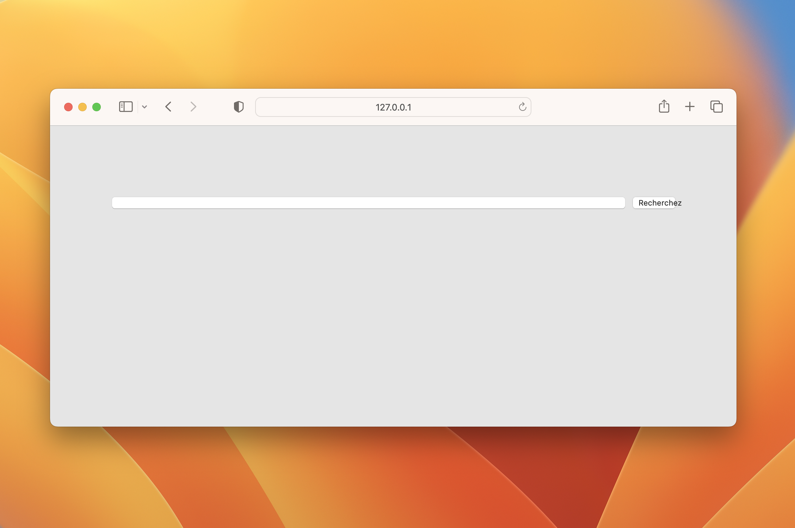

title: Using flexbox to make elements fill all the remaining space
date: 2023-12-20
description: Flexbox is by far one of the most challenging CSS features to become familiar with, but behind its complexity, lie superpowers. Discover how to solve this common challenge in flexible layouts in a robust and straightforward fashion.
keywords: flexbox, css, flex-gow

---

When designing a new application view, there are moments when we want an element to completely fill some remaining variable space.

For example, consider a form row containing two elements: a search box and a button. Since the width of this form row is fluid, sometimes shorter and other times narrower, how can we ensure that the search box will always fill all the remaining space, excluding the space reserved for the button?

An initial strategy would be to use the `calc()` function:

```css
:root {
  --button-width: 60px;
  --textbox-margin: 10px;
}
form {
  margin: 100px auto 0;
  padding: 0 20px 0;
  max-width: 600px;
}
input {
  width: calc(100% - var(--button-width) - var(--textbox-margin));
  margin-right: var(--textbox-margin);
}
button {
  width: var(--button-width);
}
```

  
_Search box fully filling the container's remaining space._

However, this strategy has at least two vulnerabilities.

Considering the default display mode for either search boxes and buttons, a simple change in the HTML file can interfere with the calculation and accidentally compromise the desired result. If you try writing the *input* and *button* elements of your HTML document on separate lines, you'll notice that the layout will be unexpectedly affected.

Another vulnerability is the necessity of applying a fixed width to the button. When an user interface needs to accommodate different languages, translations can affect the size of elements. Therefore, elements shouldn't have fixed dimensions to remain flexible enough to accommodate these variations.

  
_Elements with a fixed width may get visually broken in other languages._

Another strategy, much simpler and more robust, is to use the possibilities offered by CSS to make our layout **flexible**. These properties are part of the CSS module called *Flexbox*.

```css
form {
  margin: 100px auto 0;
  padding: 0 20px 0;
  max-width: 600px;
}
.row {
  display: flex; /* makes the layout flexible */
}
input {
  flex-grow: 1; /* expands a flexible element as much as possible */
  margin-right: 10px;
}
```

By using Flexbox, we achieve the same result with a smaller and simpler CSS code. Additionally, the button no longer requires a fixed width, enabling it to adjust its size as necessary. In this [Gist](https://gist.github.com/rafaelcamargo/82cd97cd55b5495b2d0570727b2aaf91), you'll find all the necessary code to achieve the result shown in the following animation:

  
_Simple and resilient solution using Flexbox._

Although the Flexbox API is not very intuitive, its properties are extremely powerful. The [CSS Tricks' Flexbox guide](https://css-tricks.com/snippets/css/a-guide-to-flexbox/) is extremely well written and constantly helps me understand, and better apply, the Flexbox properties. To go even further, you can also refer to the [Flexbox specification at W3C](https://www.w3.org/TR/css-flexbox-1/#overview).
