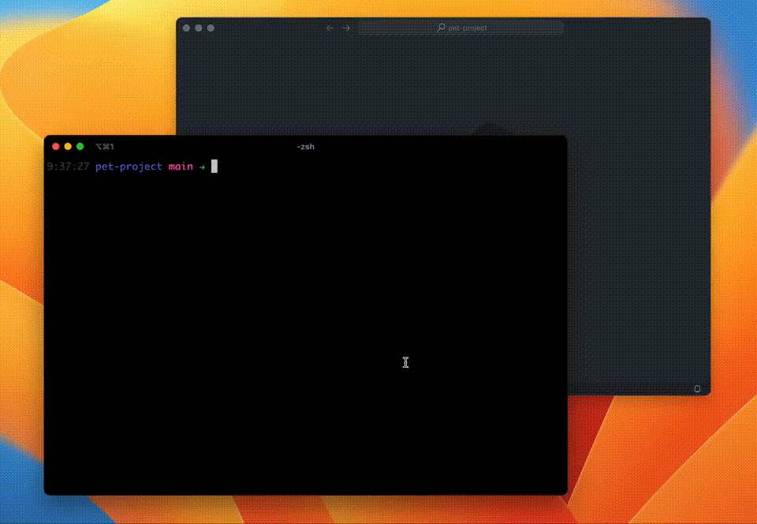

title: Using Git Rebase to keep your commit history clean and meaningful
date: 2024-06-30
description: Transforming the commit history into a biography that, chapter by chapter, describes everything that has happened throughout the life of a software is a huge benefit for everyone involved in its development. Therefore, mastering the use of some possibilities offered by Git Rebase is essential for this story to be well told.
keywords: git, rebase, rename, squash, fixup, drop

---

One of the most important factors to be observed in a Pull Request is how readable the code is. How well the naming of variables and functions is able to express their intention. How well responsibilities are distributed so that, when reading the implementation, we don't have to store dozens of variables in our weak human memory. In short, how well the story represented by those changes is told.

However, there is another place in the Pull Request where a story is told and that, unfortunately, receives much less attention from reviewers than the code: the commit history.

Each commit adds a new chapter to the biography of the software. The commit message is a chance to sum up what happened at that specific moment in time. When done well, it helps anyone in the future, whether it's a colleague or ourselves, to find out when a feature was added or removed, how a problem was fixed, or why an unusual strategy was used.

Even so, it is not surprising to come across messages like *wip*, *fix tests* or *code review*. These messages add nothing to the software's biography. If they didn't exist, nobody would even notice.

So how can we ensure an expressive and relevant commit history that transforms the journey of a software into a well-told story? The answer is: editing the history whenever necessary.

One of the most convenient strategies used to edit the commit history is performing a Git Rebase.

## Starting the edit

When starting the edit using the interactive mode (`-i`) of the `git rebase` command, it's necessary to specify from which commit your modifications will begin.

If all you need to do is rename the most recent commit in the history, pass `HEAD~1` as a parameter to the command:

```
git rebase -i HEAD~1
```

But if you need to merge your last two commits into the commit immediately before them, pass `HEAD~3` as the parameter, since you'll need to edit the three most recent commits in the history:

```
git rebase -i HEAD~3
```

**Tip:** When you run one of the commands above, you'll see a text editor open. The default text editor associated with Git is usually Vim. I'm not a fan of Vim, so I've changed this Git setting to use VS Code as the default text editor instead. This way, `git rebase` will always open the editing document not in Vim anymore but in VS Code. If this fits well for you too, just run the following command to make the change:

```
git config --global core.editor "code --wait"
```

The `--wait` flag tells Git to wait until the document opened in the editor is closed before proceeding with the command.

Now that you know how to initialize the command, it's time to learn how to rename, squash, and drop commits.

## Renaming a commit

After making a commit, you might realize that the chosen message doesn't quite express its meaning well. Git rebase allows you to easily edit the message of an already created commit, whether it's the most recent or not in the history.

If you need to rename the last commit in the history, execute:

```
git rebase -i HEAD~1
```

In the document that opens in the text editor, you'll see on the first line the term `pick`, the commit code, and the associated message. The rest of the document will be filled with instructions related to the rebase command itself.

Change the term `pick` to `r` (reword), save and close the file. A new document will open showing the message associated with the commit (first line) and below, other commit details like date, time, and changed files. Edit the message shown on the first line as you want, save and close the file.

There you go! By running the `git log` command, you can confirm that the message of the last commit has been updated according to your edit.

  
_Using Git Rebase to rename a commit_

## Squashing commits

There are situations where more than one commit ends up being part of the same change and could, therefore, be reduced to just one commit. In this case, the strategy to use is squashing. It combines two or more commits into a single one.

Consider a situation where the ability to delete a product is being implemented, and the current commit history looks like this (older on top):

```
feat: add deletion to the product resource
feat: add deletion button to the product actions
feat: add soft delete param to the product resource
```

Although the second-to-last and third-to-last commits address different concerns — one changing the UI and the other modifying an endpoint — and it's okay to keep these changes in separate commits, the last commit also relates to the endpoint, as if it were just a use case that was forgotten to be added to the third-to-last commit.

In this case, you can condense the story told in the history to two commits by squashing the last commit into the third-to-last one. To do this, start the rebase with the following command:

```
git rebase -i HEAD~3
```

In the history editing document, move the last commit to the second-to-last position, change the `pick` term to `s` (squash):

```
pick dc979e8 feat: create blog post delete resource
s f3abffc add soft delete param to the product resource
pick 24b7de5 feat: add deletion button to the product actions
```

After saving and closing the document, Git will open the text editor again for us to choose whether to keep both messages in the history, retain only one, or write an entirely new message. After saving and closing the file again, the rebase will be completed.

  
_Using Git Rebase to squash commits_

**Tip:** If the message of the commit into which other commits will be squashed continues to express its intent clearly after the operation, you can use the term 'f' (fixup) instead of 's'. Fixup has the same effect as 'squash', but it selects the commit message that receives the fixup as the final message.

## Dropping commits

If you simply need to delete a commit, the task is quite straightforward. Assuming the commit to be eliminated is the last one made, just initiate `git rebase`:

```
git rebase -i HEAD~1
```

Next, change the term `pick` to `d` (drop) in the history editing document, save, and close the file. That's it! When you run the `git log` command, you'll confirm that the commit has been dropped.

  
_Using Git Rebase to drop a commit_

## Heads up!

You've probably heard that Git is a very powerful tool, but also very dangerous. When editing history, it's worth paying close attention to a few points:

1. If conflicts arise during the changes you requested and you're not sure how to resolve them, press Cmd+C in the terminal and run the command `git rebase --abort`. That's it! Everything will be canceled, and you'll return to the state your history had before starting the rebase.

2. If you've already pushed the commits you're trying to change to the remote repository, you'll only be able to push the new changes to the remote repository by using the --force flag with the push command. This is because there will obviously be a difference between the state of the history in the remote repository and the state on your machine. Before running the push command with the --force flag, make sure that only you are working on the branch with such commits. Otherwise, you risk deleting commits from others and causing unnecessary chaos.

If you liked what you read here and want to discover even more possibilities offered by the `git rebase` command, check out the official Git [documentation](https://git-scm.com/book/en/v2/Git-Tools-Rewriting-History).
