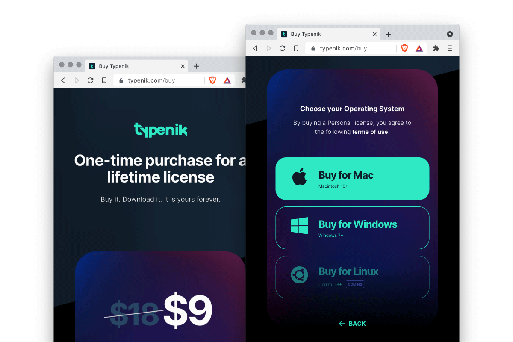
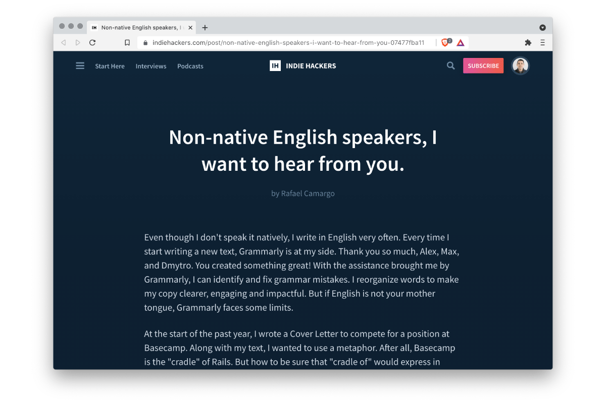

title: From idea to the first sale
date: 2021-10-29
description: My goal was modest: one single license sold until the end of this year. One inch of trade. Miles of satisfaction.
keywords: idea, Typenik, sale, Derek Sivers, Zeh Fernandes, Pliim, dictionary, english

---

If you haven't ever heard about Derek Sivers, visit his website now and read a couple of their [blog posts](https://sive.rs/blog). Paragraph by paragraph, your neck will become more elastic, and your head, freer to spin around, will start to notice a larger world than the one you were used to.

Reading his first book - [Anything You Want](https://www.amazon.com.br/Anything-You-Want-Lessons-Entrepreneur/dp/0241209048/ref=sr_1_1?__mk_pt_BR=%C3%85M%C3%85%C5%BD%C3%95%C3%91&crid=Q6P3ONPKWVVG&keywords=anything+you+want&qid=1593432727&sprefix=anyth%2Caps%2C281&sr=8-1) - by September of the last year, I had, one more time, a product idea. You can know more about the last of my failures reading [The pearl and the mussels](../the-pearl-and-the-mussels/). This new product, which I hope to be a pearl instead of a pile of mussels, would automate several tasks that I used to do manually. That is one of the splendid things that happen when you finish reading a book written by Sivers. You want to stop everything you're doing and start to change the world, even if that *world* is nothing more than a bunch of manual and repetitive tasks that you can't stand anymore.

I started to put an end to those tasks in the second quarter of this year. Ten weeks later, [Typenik](https://typenik.com/) has launched. An [English Augmented Dictionary](../why-i-built-an-english-augmented-dictionary/) for non-native speakers. Besides delivering everything a traditional dictionary does, Typenik allows you to search for terms containing more than one word, conjugates irregular and regular verbs and clears up the real meaning behind expressions.

My goal was modest: one single license sold until the end of this year. One inch of trade. Miles of satisfaction.

> Money is the ultimate feedback.
>
> [Extreme Programming Explained](https://www.amazon.com/-/es/gp/product/0321278658)

  
_Typenik's checkout page_

One week has passed since launch. No sales. Two, three, four weeks later. Zero licenses sold. Alright, I haven't promoted Typenik at any place yet, and popular wisdom has taught me that even a miracle needs some prayer to happen. Then, eight weeks after launch, one license has been sold. Still surprised, I noticed that the purchase had been made by someone close to me. Goal reached? Well... To have no doubts that a purchase was a consequence of genuine interest in the product, I decided that the objective would be satisfied with a purchase made by a person I didn't know.

With the miracle in mind, that was time to focus on the prayer. I explained what an [English Augmented Dictionary](https://typenik.com/blog/what-is-an-english-augmented-dictionary/) was in the first blog post of [Typenik's Blog](https://typenik.com/blog/), started to promote [Typenik on Twitter](https://twitter.com/typenik), and learned more about the habits of non-native English writers on [Reddit](https://www.reddit.com/r/EnglishLearning/comments/pupqbb/nonnative_english_speakers_i_want_to_hear_from_you/), [Hacker News](https://news.ycombinator.com/item?id=28646069#28646878), and [Indie Hackers](https://www.indiehackers.com/post/non-native-english-speakers-i-want-to-hear-from-you-07477fba11).

  
_Discussion at Indie Hackers_

The first purchase made by an unknown person finally happened almost five months after the product to be on the market. Bigger than the surprise with the sale was the happiness of noticing that my newest client was a designer I admire so much. A cycle of positive surprises had just been completed in front of me because [Pliim](https://pliim.app/), a product created by that designer, was a great inspiration for me to create my own too.

Building and selling software independently has made me reflect on the possibility of developing products with a vision quite different from the one disseminated by the Disrupt-o-mania Church and based on the gospel of Growth Hacking, Three Comma Club, and 30 Under 30. A vision guided by sufficient, not excessiveness. One that moves slowly without breaking things. One that ripens the world instead of rotting it.

Thanks, [Zé](https://twitter.com/zehf)!
