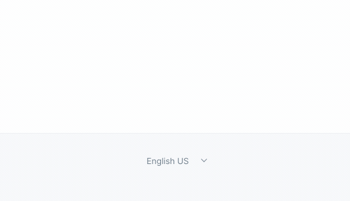

title: Generating a multi-language blog based in Markdown
date: 2021-10-11
description: For a long time in my career, writing about programming meant writing in English. This kind of 'anglo-driven' behavior started to change when I got introduced to an excellent professional who became one of my best friends.
keywords: blog, generator, markdown, multi-language, triven

---

For a long time in my career, writing about programming meant writing in English instead of my mother-language Portuguese. It seems to be the usual way in a profession mainly led by native English speakers. By the way, a large number of programming tools are available in English only, leading non-native English speakers like me to invent *Portuglish* words that end up looking like Frankensteins.

This kind of *anglo-driven* behavior started to change when I got introduced to [@fernahh](https://twitter.com/fernahh). Besides being an excellent professional, he became one of my best friends. In his [website](https://fernahh.com.br/), he shares several ideas using the old and gold Portuguese. Reading his blog posts, I asked myself: If I express my thoughts way better in my native language, why the heck I'm not writing in Portuguese?

So in 2019, I started to write my blog posts also in Portuguese. Two discoveries got in front of my eyes ever since. Firstly I discovered I am much more critical of my work when I read it in my mother tongue. The second discovery derives from the first one. I finally realized how bad I write - thanks to you who read it till here.

After deciding to write posts in Portuguese, I needed to find a tool to make this job easy. I searched for a Static Blog Generator with multi-language support included and ended up before those popular *Static Site Generators*. They offered mountains of features I wasn't interested in - Themes, Comments, CMS, E-Commerce - and zero features relating to what I needed - **delightful support to multi-language**. In addition, the two most popular tools in this category are written in Ruby and Go, not in the most beloved programming language in the world, JavaScript.

Facing this situation, I decided to create [Triven](https://github.com/glorious-codes/glorious-triven). If you need a static blog generator based in Markdown with **delightful support to multi-language**, you are just a couple of commands away from the paradise:

```
npm install -D @glorious/triven
npx triven build
```

From now on, you only need to focus on your content. Without writing one single line of code to configure Triven, you get:

✅ A multi-language homepage containing all your posts.  
✅ Specific homepage for each language.  
✅ Pagination.  
✅ Language menu.  
✅ A multi-language RSS feed.  
✅ Specific RSS feed for each language.  
✅ Layout inspired by [Hey World](https://world.hey.com/jason/hey-world-b02a6f2e).  
✅ 2.3kb of CSS.  
✅ 0kb of JavaScript.  

Another great trait is that Triven easily connects to any existing website. By default, Triven generates all its assets in a directory called `triven` at the root of your project. However, Triven can output those files to any other place. That is, if you already have a website, you only need to set `/blog` as the output directory for Triven generated files, and that's it - exactly what I did on my website.

  
_Language menu automatically built by Triven_

Finally, if you prefer customize every detail of your blog, no problem. On [Triven's repository](https://github.com/glorious-codes/glorious-triven#triven), you find all the information you need to customize everything you want.
