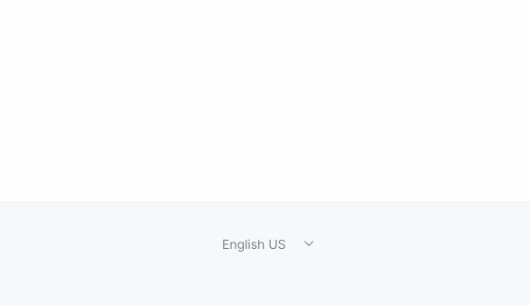

title: Gerando um blog multi-idiomas baseado em Markdown
date: 2021-10-10
description: Durante um longo período da minha carreira, escrever sobre programação significava escrever em inglês. Essa minha 'anglo-postura' em escrever 'english-only' começou a mudar quando fui apresentando a um excelente profissional que viria se tornar um grande amigo.
keywords: blog, gerador, markdown, multi-idiomas, triven
lang: pt-BR

---

Durante um longo período da minha carreira, escrever sobre programação significava escrever em inglês. Essa parece ser uma tendência natural numa profissão que tem como maiores expoentes pessoas que falam inglês nativamente. A propósito, um enorme número de ferramentas usadas na programação são também oferecidos apenas nesse idioma. Muitos dos termos usados diariamente por nós, não nativos em inglês, são *Franksteins-linguísticos* que incluem os verbos *mergear* e *deployar*, por exemplo.

Essa minha *anglo-postura* em escrever *english-only* começou a mudar quando fui apresentando ao [@fernahh](https://twitter.com/fernahh), que além de excelente profissional viria a se tornar um grande amigo. Em seu [site](https://fernahh.com.br/), ele compartilha várias de suas ideias no bom e velho português. Ao ler seus textos, me fiz a seguinte pergunta: se obviamente tenho condições de me expressar melhor no meu idioma nativo, por que diabos não escrevo em português?

Então a partir de 2019, comecei a escrever textos como este, em português. Isso resultou em duas descobertas. A primeira é que sou bem mais crítico a mim mesmo ao me ler em meu próprio idioma. A segunda descoberta deriva da primeira. Percebi finalmente o quão mal eu escrevo - obrigado a você que leu até aqui.

Tendo me decidido por escrever também em português, o próximo passo era encontrar uma ferramenta que facilitasse esse trabalho. Buscava eu por um gerador de blog estático que incluísse em suas funcionalidades o suporte a múltiplos idiomas. Me deparei com os famosos *Static Site Generators*. Ofereciam muito do que eu não precisava - Temas, Comentários, CMS, E-Commerce, etc - e nada ofereciam em relação ao que eu buscava - **suporte deslumbrante a múltiplos idiomas**. Além disso, os dois mais populares são escritos em Ruby e Go e não na linguagem mais amada do planeta, JavaScript.

Diante dessa situação, decidi criar o [Triven](https://github.com/glorious-codes/glorious-triven). Se o que você precisa é de um gerador de blog estático multi-idiomas baseado em Markdown, saiba que você está a dois comandos dele:

```
npm install -D @glorious/triven
npx triven build
```

Daí pra frente é só focar no conteúdo. Sem escrever uma linha sequer de configuração, você obtém:

✅ Uma homepage multi-idiomas contendo todos os seus textos.  
✅ Uma homepage específica para cada um dos idiomas.  
✅ Paginação.  
✅ Menu de idiomas.  
✅ RSS Feed multi-idiomas.  
✅ RSS Feed específico para cada um dos idiomas.  
✅ Layout inspirado no [Hey World](https://world.hey.com/jason/hey-world-b02a6f2e).  
✅ 2.3kb de CSS.  
✅ 0kb de JavaScript.

Além dos benefícios acima, o Triven pode ser facilmente conectado a qualquer site já existente. Por padrão, os arquivos estáticos são gerados num diretório chamado `triven` na raiz do seu projeto. Porém, esses arquivos podem ser salvos em qualquer outro lugar do seu projeto. Ou seja, se você já possui um site, basta definir esse local como sendo `/blog`, exatamente como fiz no meu site.

  
_Menu de idiomas do Triven_

Se você não é dos que se satisfazem com o conceito *zero config* e gosta mesmo é de personalizar o seu blog de cabo a rabo, sem problemas. No [repositório](https://github.com/glorious-codes/glorious-triven#triven) do projeto você encontra todas as informações que precisa para personalizar tudo que desejar.
