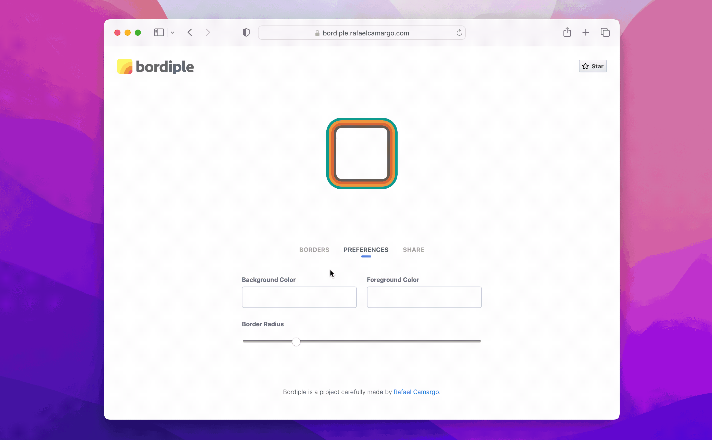

title: Bordiple, o gerador de múltiplas bordas CSS
date: 2023-06-28
description: Depois de não encontrar qualquer ferramenta desse tipo, decidi facilitar a vida de programadores e designers que precisam usar múltiplas bordas em suas criações.
keywords: múltiplas bordas, css, gerador, bordiple
lang: pt-BR

---

Ao terminar de escrever meu último post sobre [elementos com múltiplas bordas usando apenas CSS](https://rafaelcamargo.com/blog/elementos-com-multiplas-bordas-usando-apenas-css/), fiquei pensando o quão produtivo seria se houvesse uma ferramenta online que auxiliasse designers e programadores a criar e visualizar elementos com múltiplas bordas. Como não encontrei nenhuma, decidi criar o [Bordiple](https://bordiple.rafaelcamargo.com/).

  
_Pré visualize e compartilhe suas criações facilmente_

Assim como as ferramentas online usadas para criar gradientes, a ideia por trás do Bordiple é oferecer uma interface amigável que permita a qualquer pessoa criar, visualizar e copiar o código CSS relativo às bordas geradas. Além disso, é possível personalizar o preview na seção *Preferences* e compartilhar a criação copiando o link disponibilizado na seção *Share*.

  
_[70s Groove](https://bordiple.rafaelcamargo.com/?b=W3sid2lkdGgiOjUsImNvbG9yIjoiIzVjNTA0YyJ9LHsid2lkdGgiOjUsImNvbG9yIjoiI2RmNmIzOSJ9LHsid2lkdGgiOjUsImNvbG9yIjoiI2VlOTQzZCJ9LHsid2lkdGgiOjUsImNvbG9yIjoiIzBmOWQ4YiJ9XQ&p=eyJiZ0NvbG9yIjoiI2ZmZTZkNCIsImZnQ29sb3IiOiIjZmZlNmQ0IiwiYm9yZGVyUmFkaXVzIjoiMTAifQ) vs [80s Disco](https://bordiple.rafaelcamargo.com/?b=W3sid2lkdGgiOjUsImNvbG9yIjoiIzA3MGMzMiJ9LHsid2lkdGgiOjUsImNvbG9yIjoiIzRhY2ZmZiJ9LHsid2lkdGgiOjUsImNvbG9yIjoiIzA3MGMzMiJ9LHsid2lkdGgiOiIyIiwiY29sb3IiOiIjZmZlZGFlIn1d&p=eyJiZ0NvbG9yIjoiIzA3MGMzMiIsImZnQ29sb3IiOiIjZmY3MmZjIiwiYm9yZGVyUmFkaXVzIjoiMCJ9)_

O Bordiple é gratuito, seu código é livre, e se você curtiu a ferramenta, considere apoiar o projeto estrelando-o no [Github](https://github.com/rafaelcamargo/bordiple). Quanto mais estrelas o projeto tem, mais visibilidade ele ganha e, portanto, mais pessoas acabam podendo desfrutar dessa ferramente. Obrigado!
