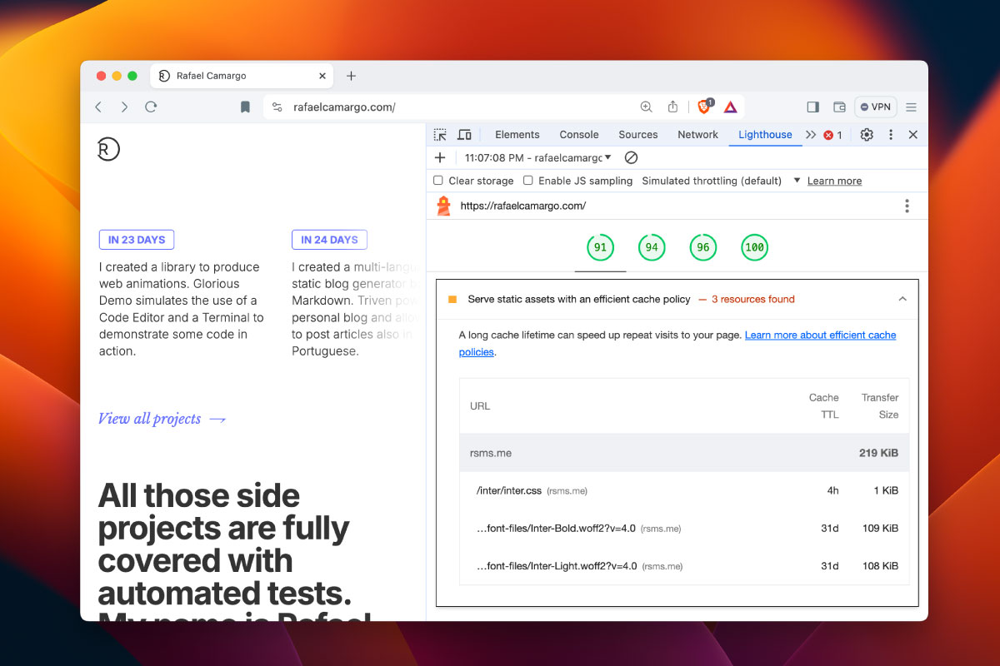

title: Configurando cache max age para arquivos estáticos hospedados no Firebase
date: 2024-04-29
description: O cache é parte fundamental de uma estratégia que visa otimizar a performance de um website. Às pessoas que retornam a uma página da web, uma boa política de cache tem potencial para acelerar em muito seu carregamento inicial. Descubra nesse post como fazer um ajuste fino no tempo de vida do cache de assets estáticos de um website hospedado no Firebase.
keywords: cache, assets estáticos, max-age, firebase, ttl
lang: pt-BR

---

Uma das maneiras mais eficientes de acelerar o carregamento de um website quando uma pessoa retorna a esse mesmo website é definindo um tempo de vida longo para o cache de assets estáticos como imagens, folhas de estilo e scripts.

Uma recomendação frequentemente oferecidas pelo Lighthouse, ferramenta que mede a performance de um website em tópicos como *FCP (First Contentful Paint)*, *LCP (Largest Contentful Paint)*, *CLS (Cumulative Layout Shift)*, entre outros, é que o website sirva assets estáticos com uma política eficiente de cache. Mas o que seria uma política eficiente? De acordo com a documentação do Google Chrome para desenvolvedores, uma política eficiente consiste em cachear por um período de [um ano ou mais](https://developer.chrome.com/docs/lighthouse/performance/uses-long-cache-ttl#how_to_cache_static_resources_using_http_caching) assets estáticos que raramente são alterados.

  
_Recomendação do Lighthouse relacionada à definição de uma melhor política de cache._

Uma vez entendida a importância de definir um *TTL (Time To Live)* longo para tais assets, precisamos então descobrir onde exatamente devemos fazer essa alteração, em outras palavras, descobrir em que parte do motor fica esse tal parafuso que deve ser apertado ou afrouxado. Vou utilizar aqui um exemplo prático referente ao serviço de hospedagem do Firebase. O Firebase é hoje um serviço mantido pelo Google, seu *free-tier* é bem generoso, o que o torna bastante convidativo para quem precisa colocar um site estático de maneira fácil e rápida no ar com custo zero.

Praticamente todas as configurações do firebase dentro do seu projeto se concentrarão em um arquivo chamado `firebase.json`. Esse arquivo possui uma chave chamada `hosting`, na qual são agrupadas as configurações especificamente relacionadas à hospedagem do seu website. É nesse agrupamento que você deve incluir suas definições para cache de assets estáticos. Portanto, insira dentro de `hosting` uma chave chamada `headers` que será um *Array* de objetos estruturados da seguinte maneira:

``` json
{
  "source": "**/*.@(jpg|jpeg|gif|png|js|css|svg|woff2)",
  "headers": [
    { "key": "Cache-Control", "value": "max-age=31536000"  }
  ]
}
```

A chave `source` representa um glob responsável por restringir os cabeçalhos definidos na chave `headers` a um conjunto específico de extensões de arquivo (.jpg, .jpeg, .gif, etc).

O único cabeçalho definido na configuração acima é o `Cache-Control` que tem seu valor definido como `max-age=31536000`. Em outras palavras, a idade máxima definida para caches relacionados àquelas respectivas extensões de arquivo é de 31.536.000 segundos, ou 1 ano.

O arquivo `firebase.json` final ficará assim:
``` json
{
  "hosting": {
    "headers": [{
      "source": "**/*.@(jpg|jpeg|gif|png|js|css|svg|woff2)",
      "headers": [
        {"key": "Cache-Control", "value": "max-age=31536000"}
      ]
    }]
  }
}
```

Para saber mais sobre as configurações de hospedagem do Firebase, acesse [essa página](https://firebase.google.com/docs/hosting/full-config#firebase-json_example). Nela você encontrará diversas outras possibilidades de configurações, como por exemplo *redirects* e *rewrites*.
