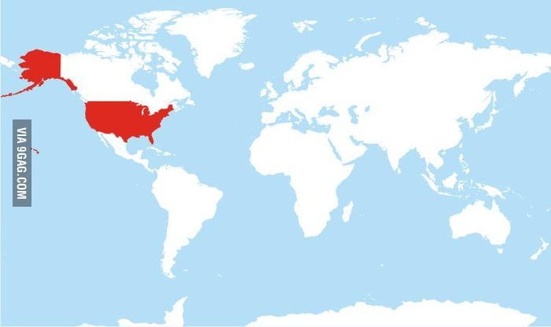
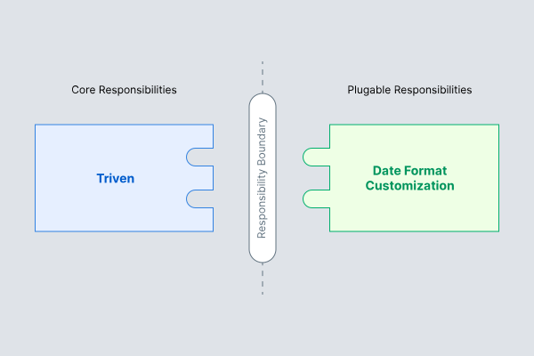

title: Duas novas melhorias ao Triven
date: 2022-04-12
description: Qual a melhor maneira de permitir a personalização do formato de data nos posts? E como permitir manter um post fora da homepage do blog? Contei aqui as estratégias que adotei para implementar essas duas novas funcionalidades.
keywords: melhorias, Triven, formatação, data, plugin, arquitetura
lang: pt-BR

---

Tirando o fuso horário, data é talvez a pior coisa com a qual um programador tem que lidar. Meses com quantidade de dias variados, um deles sem sequer ter trinta dias, o ano não dura nem 370 dias, nem 360, dura 365, mas nem sempre. Pense na tarefa de subtrair cinco dias. Cinco dias *úteis* ou *regulares*? Feriado conta? Se a conta começar no segundo dia do mês, o resultado cai no mês anterior. E se o ano for bissexto, o mês anterior pode ter um dia a mais... O formato da data não fica pra trás. Dia, mês, ano? Mês, dia, ano? Separados com vírgula, barra ou traço?

Triven é um [gerador de blog estático baseado em Markdown com suporte deslumbrante a múltiplos idiomas](/blog/gerando-um-blog-multi-idiomas-baseado-em-markdown). Enquanto criava sua primeira versão, os formatos definidos para data foram MM/DD/YYYY, para publicações no idioma estadounidense, e DD/MM/YYYY para publicações nos demais idiomas. Optei por essa estratégia porque ela não exigia nada mais que a própria data já informada pelo usuário no arquivo markdown da publicação. Porém, a incapacidade de apresentar datas num formato mais amigável, me deixava insatisfeito.

  
_Mapa explicativo de todos os países que usam o formato de data MM/DD/YYYY_

Nas últimas semanas comecei a planejar uma maneira de oferecer a possibilidade de personalizar o formato de data das publicações. A primeira estratégia que me passou pela cabeça foi oferecer uma variedade limitada de formatos que o usuário poderia definir no arquivo de configuração. Para fazer a ponte entre o formato definido e a data apresentada na publicação, eu usaria uma biblioteca estilo *date-fns*. Parecia uma estratégia boa o suficiente, mas logo em seguida, desconsiderei a inclusão de mais um dependência ao projeto. Formatar data não me pareceu uma tarefa essencial o suficiente para ser executada pelo próprio Triven. Formatar data seria uma atividade acessória e portanto, melhor que não estivesse acoplada à ferramenta. Lembrei então da *arquitetura baseada em plugins*, abordada no capítulo *Boundaries: Drawing lines*, do livro *Clean Architecture*.

  
_Arquitetura baseada em plugins_

## Formato de data personalizado

A estratégia baseada em plugins se encaixou perfeitamente à minha concepção de que formatar data era uma tarefa acessória e que portanto não deveria ser responsabilidade da ferramenta, mas sim de um código externo que pudesse ser *plugado* a ela. Dessa forma, o arquivo de configuração do Triven passou a oferecer a partir da versão [0.12.0](https://github.com/glorious-codes/glorious-triven/commit/db4fb2dd0bd63346bd31e0e3f716d858854e1a9c), uma seção `formatters`, pela qual é possível conectar um formatador de data à ferramenta:

``` javascript
{
  formatters: {
    date: (isoDateString, lang) => {
      // Retorna uma string contendo
      // a data no formato desejado.
    }
  }
}
```

Com essa nova possibilidade, a responsabilidade de personalizar o formato da data das publicações ficou fora do Triven, e o usuário da ferramenta passa a dispôr de toda a flexibilidade necessária para formatar a data da maneira que quiser.

## Publicações não listadas na homepage

A outra melhoria se refere a eventual necessidade de publicar um post, mas não listá-lo na homepage do blog. Seja esta uma publicação que dá boas vindas ao recém inscrito de uma *newsletter*, seja uma publicação para qual você busca feedbacks antes de torná-la amplamente acessível. A partir da versão [0.11.0](https://github.com/glorious-codes/glorious-triven/commit/dfc6f6027a947729f988d5d0b396575d63060d04) você pode manter uma publicação fora da homepage do blog adicionando o atributo `unlisted` ao arquivo markdown do post:

``` markdown
title: Não será listado na homepage do blog
unlisted: true

---

Sua publicação
```

Fique atento, as publicações definidas como `unlisted` serão ignoradas por motores de busca, mas o acesso à publicação é público. Qualquer pessoa que tenha a URL em mãos conseguirá visualizá-la normalmente.
