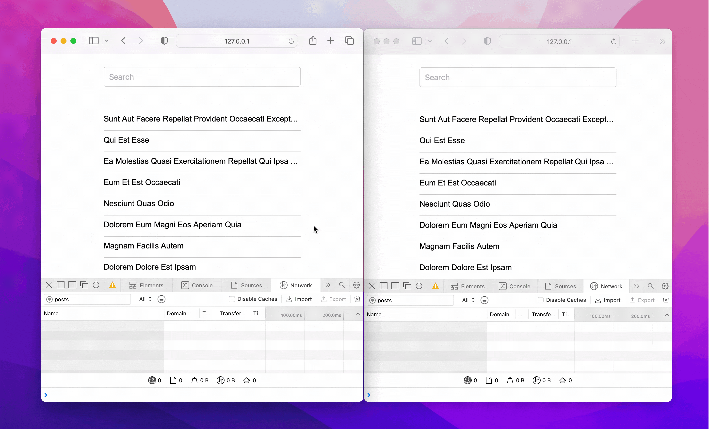

title: Implementando debounce com React Query
date: 2023-02-24
description: Cedo ou tarde toda aplicação acaba precisando implementar o debounce em algumas partes de seu código a fim de evitar eventos irrelevantes. Veja como prevenir requisições desnecessárias com uma das bibliotecas mais populares do ecossistema React.
keywords: debounce, react query
lang: pt-BR

---

Requisições desnecessárias produzem uma sobrecarga que prejudica tanto a quem serve os dados quanto a quem os consome, já que ambos desperdiçam recursos trafegando dados que não serão utilizados.

Uma das estratégias mais populares para evitar requisições desnecessárias é o *Debounce*. Segundo o [Wiktionary](https://en.wiktionary.org/wiki/debounce), o termo junta *de* + *bounce* e, em Português, significaria algo como "prevenir repiques", ou mais especificamente no universo da programação:

> Descartar eventos que não deveriam ser processados porque ocorreram num intervalo de tempo curto demais.

Um exemplo frequente de repique que culmina em requisições desnecessárias é filtrar uma lista por um termo. Se o termo a ser usado como filtro possui 5 letras, e a cada letra digitada for feita uma requisição, 4 requisições eram irrelevantes e, portanto, deveriam ter sido evitadas.

A biblioteca React Query oferece algumas facilidades para quem precisa gerenciar requisições feitas por uma aplicação React. Por padrão, ela previne requisições simultâneas para um mesmo recurso e faz cache de uma resposta a partir de um simples parâmetro passado opcionalmente a uma *query*.

Entretanto, a prevenção de repiques, ou *debounce*, é uma solução que não vem embutida na biblioteca, e, nesse caso, precisamos embrulhá-la numa simples abstração que satisfaça também essa necessidade. O exemplo a seguir sugere uma maneira de estender a biblioteca, adicionando a nova funcionalidade com pouco mais de vinte linhas de código:

``` javascript
import { useState, useEffect } from 'react';
import { useQuery } from 'react-query';

export const useCustomQuery = (
  params,
  request,
  { debounce, ...options } = {}
) => {
  const [newParams, setNewParams] = useState(params);
  const stringify = obj => JSON.stringify(obj);

  useEffect(() => {
    if (stringify(params) !== stringify(newParams)) {
      const timerId = setTimeout(
        () => setNewParams(params),
        debounce
      );
      return () => clearTimeout(timerId);
    }
  }, [params]);

  return useQuery(newParams, request, options);
}
```
Nesse [*gist*](https://gist.github.com/rafaelcamargo/eda94014a8e087334a201feea1f6e6df) você encontra um *index.html* contendo todo código necessário para experimentar localmente a implementação acima.

  
_Sem debounce (esquerda). Com debounce (direita)._

A animação acima exibe o poder do *debounce* na prática. Sem o recurso (janela à esquerda), a aplicação faz **12 requisições** e trafega **28.3 KB**. Com o recurso (janela à direita), a aplicação passa a fazer apenas **1 requisição** e trafega **294 B**. Uma economia de 91% em requisições e 99% em dados trafegados.

Para saber mais sobre a biblioteca React Query, visite seu [site oficial](https://react-query-v3.tanstack.com/).
