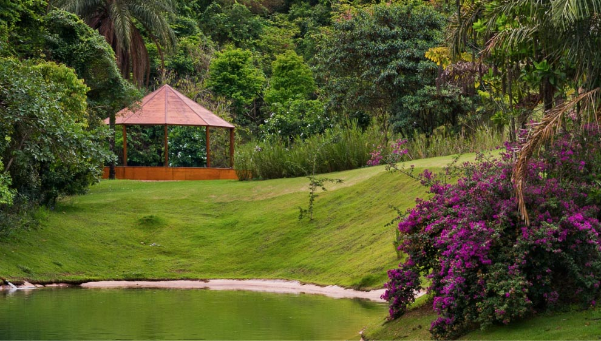

title: Incondicional Inhotim
date: 2020-06-06
description: Temos todos a capacidade de reconhecer a beleza no imediato momento em que nos colocamos diante dela. Essa foi a certeza que tomou conta de mim no dia que visitei o maior museu de arte contemporânea a céu aberto do mundo. Um jardim que poderia ser perfeitamente chamado de paraíso. Inhotim.
keywords: Inhotim, arte, Hélio Oiticica, Adriana Varejão, Valeska Soares
lang: pt-BR

---

Temos todos a capacidade de reconhecer a beleza no imediato momento em que nos colocamos diante dela. Essa foi a certeza que tomou conta de mim no dia que visitei o maior museu de arte contemporânea a céu aberto do mundo. Um jardim que poderia ser perfeitamente chamado de paraíso. Inhotim.

Dentro da galeria Cosmococa você deita na cama, se embala na rede, mergulha na piscina. Os cinco *quasi-cinemas*, conceito criado por Hélio Oiticica, invadem os seus sentidos na medida em que você os invade. Do terraço da galeria Adriana Varejão, você admira o belíssimo espelho d'água enquanto se deslumbra com espécies de pássaros da região amazônica pintados à mão sobre azulejos por Beatriz Sauer. E caminhando em meio a uma alta vegetação, você se vê nos espelhos da obra Folly ao descobrir a galeria de Valeska Soares.

  
_Galeria Adriana Varejão*_

  
_Galeria Cosmococa*_

  
_Galeria Valeska Soares*_

Essas são três das mais de vinte galerias de arte presentes no jardim. O que existe entre cada uma delas é a extraordinária natureza brasileira que tanto escutamos ao longo da vida, mas que aos trinta e dois anos eu ainda não tinha a mínima ideia do que significava. Inhotim é imenso não só em tamanho, mas também em significado e beleza.

  
_Terraço do Teatro Alpha*_

  
_Galeria True Rouge*_

## Nenhuma explicação

Anos mais tarde, converso com colegas num bar da cidade. Todos são programadores. Todos passam o dia lendo condições lógicas. O trabalho de todos os presentes consiste em explicar a uma máquina, por meio de uma linguagem de programação, o comportamento que eles querem que ela desempenhe.

Na conversa, meus elogios a Inhotim são inevitáveis. A curiosidade do pessoal aflora e um deles recorre ao celular para fazer uma rápida pesquisa. Ele me questiona qual o sentido de suspender um cubo vermelho, enquanto me mostra a obra Red, de Tsuruko Yamazaki, na tela do seu celular. Foi desconfortável para ele constatar que algo não tinha necessariamente resposta. Não era explicável. Não tinha lógica.

  
_Red de Tsuruko Yamazaki*_

## Muita oportunidade

A pergunta do meu colega representa a percepção de uma imensidão de pessoas. Vivemos numa sociedade excessivamente dependente de lógica. Lógica é a base do concreto e da rodovia, do combustível e do automóvel, da latitude e da longitude. A lógica está por toda parte. Sem lógica, perdemos totalmente as coordenadas.

Respondi então ao meu colega que a arte, antes de qualquer outra coisa, é sempre uma oportunidade. A oportunidade de, ao menos por alguns instantes, nos libertarmos das explicações. A oportunidade de imaginarmos tudo aquilo que a lógica nos desaconselha. A oportunidade de não precisar entender ou raciocinar. A oportunidade de não nos submeter a nenhuma condição lógica. A oportunidade de sermos, assim como Inhotim, incondicional.

<small><em>*Imagem encontrada na internet<em></small>.
