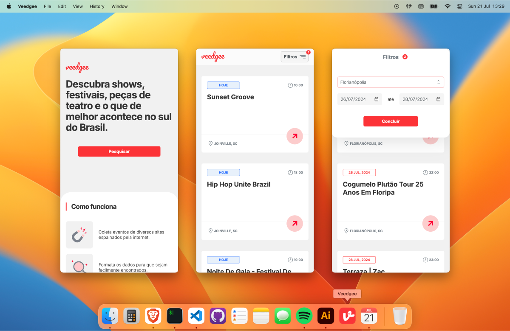
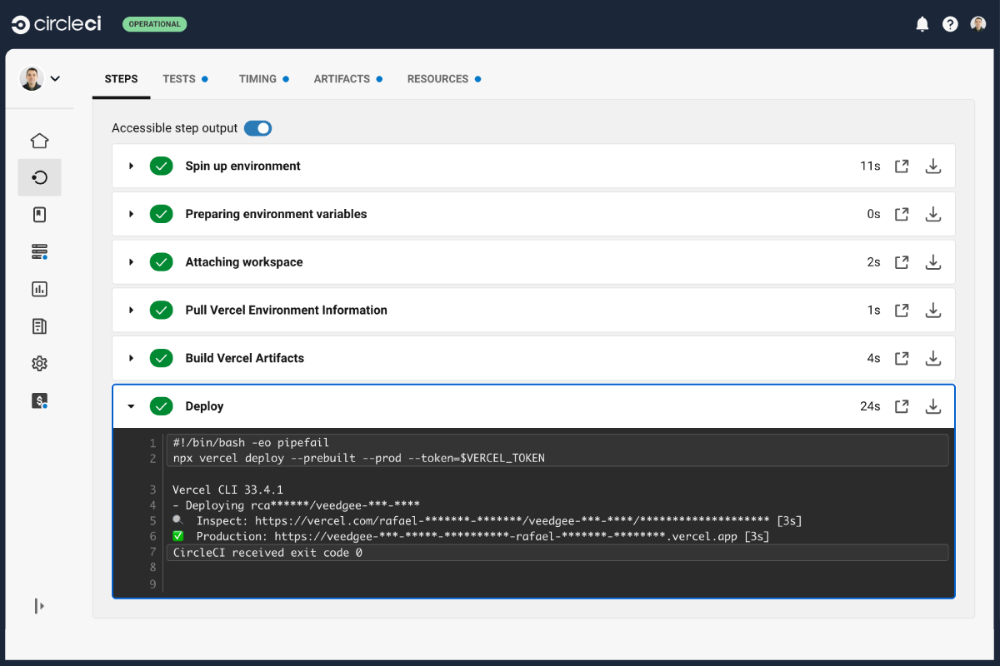
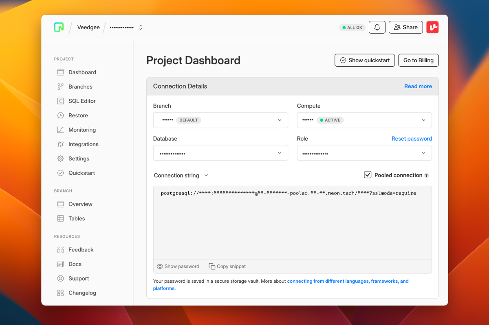
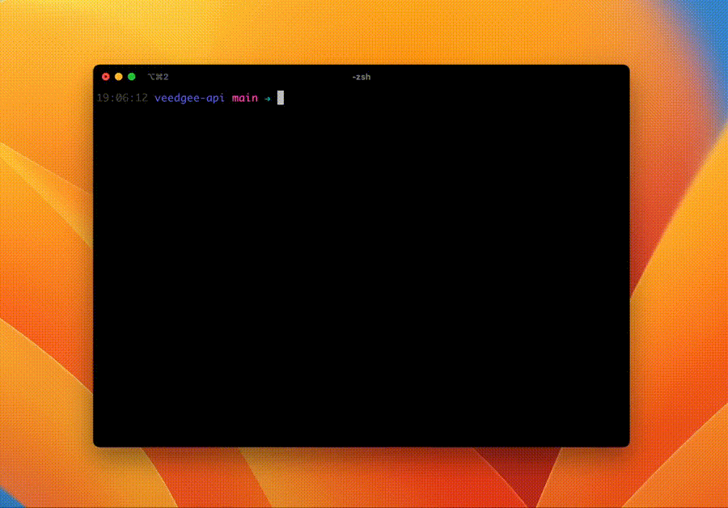

title: Lições aprendidas ao construir uma API NodeJS Serverless usando Vercel, Neon e Prisma ORM
date: 2024-07-22
description: Ao oferecerem generosos planos gratuitos, Vercel e Neon se tornaram ótimas opções para projetos experimentais, mas para quem está acostumado a lidar com uma infraestrutura tradicional, o universo Serverless pode representar alguns desafios. Neste post eu compartilho as lições que aprendi em termos de entrega contínua, banco de dados e testes automatizados ao colocar em produção uma API NodeJS Serverless.
keywords: vercel, neon, prisma orm, nodejs, serverless, entrega contínua, testes automatizados
lang: pt-BR

---

Neste semana, o meu mais recente projeto de estimação completa dois meses no ar. O [Veedgee](https://veedgee.compilorama.com/?locale=pt-BR) foi construído com Serverless NodeJS e Serverless Postgres, no backend, e com React no frontend. Enquanto no frontend tudo saiu exatamente conforme o esperado, no backend o universo Serverless me pregou várias peças, me proporcionando vários aprendizados.

Este post resume o que aprendi em termos de Entrega Contínua (CircleCI ➝ Vercel), Banco de Dados Serverless (Neon), ORM (Prisma) e Testes Automatizados em uma aplicação NodeJS Serverless.

  
_Veedgee é um PWA e pode ser facilmente instalado tanto no computador quanto no Celular._

## Entrega contínua

O serviço que escolhi para hospedar o backend do Veedgee foi o Vercel. Ao conectar um repositório do GitHub ao Vercel, cada novo commit significa automaticamente um novo deploy. Se o commit ocorre em um branch diferente da principal, um preview deploy é disparado. Se o commit ocorre na branch principal, é adicionalmente disparado um deploy de produção. Esse é o comportamento padrão da integração *Vercel-Github* que, se por um lado, torna o deploy fácil por não exigir qualquer configuração, por outro acaba desviando a integração contínua e executa deploys mesmo que algum teste automatizado tenha quebrado.

Para alterar esse comportamento, desliguei a integração Vercel-Github nas configurações do projeto e passei a fazer o deploy só depois do sucesso das demais etapas da [integração contínua](https://vercel.com/guides/how-can-i-use-circleci-with-vercel). Para assumir o controle sobre o deploy usei o pacote NPM [vercel](https://www.npmjs.com/package/vercel). Optando pelo CircleCI como serviço de integração contínua, tudo que precisei fazer foi criar três variáveis de ambiente e inserir a etapa de deploy no meu workflow.

### Variáveis de ambiente

1. `VERCEL_ORG_ID`: Dentro do Vercel, esse ID é na verdade chamado de **Vercel ID** e pode ser encontrado em `/account`.
2. `VERCEL_PROJECT_ID`: O ID do projeto pode ser encontrado mais facilmente do que o ID da organização. Basta acessar a aba settings do projeto. O ID está identificado como **Project ID**.  
3. `VERCEL_TOKEN`: Para poder interagir com o Vercel usando seu pacote NPM, precisei criar um token nas configurações da minha conta no Vercel (`/account/tokens`).

### Deploy via CircleCI

A etapa de deploy consistiu em buscar as informações de ambiente no Vercel com o comando `vercel pull`, construir os artefatos com o comando `vercel build` e, finalmente, liberá-los com o comando `vercel deploy`. Você pode conferir toda a configuração do CircleCI da API do Veedgee [aqui](https://github.com/rafaelcamargo/veedgee-api/blob/main/.circleci/config.yml).

  
_Deploy executado com sucesso no CircleCI_

## Banco de dados e ORM

O Veedgee foi também minha oportunidade de experimentar pela primeira vez um banco de dados Postgres Serverless, serviço oferecido pelo Neon. Minhas impressões em relação ao Neon foram excelentes. Interface e serviço fáceis de usar, além de um generoso free-tier de 512MB de armazenamento.

Em contrapartida, as lições relacionadas ao ORM foram muitas.

Como minha experiência com backend é bem menor do que com frontend, comecei a experimentar alguns ORMs para NodeJS quando ainda rascunhava os planos para construir o Veedgee. Não demorou muito para que eu decidisse usar o Sequelize. A API dele me pareceu oferecer uma experiência de uso bastante suave e o gerenciamento de migrações era super fácil.

Então, com o workflow de entrega contínua já configurado, comecei a desenvolver os primeiros endpoints usando o Sequelize localmente. Ao concluir o primeiro endpoint, era hora de colocá-lo em produção e conferir se o que já rodava suave localmente, rodaria suave também na nuvem.

Depois de falhar sucessivas vezes ao tentar rodar a API do Veedgee no Vercel, fui apresentado a uma página de ajuda com o título [Vercel Postgres - ORM compatibility](https://vercel.com/docs/storage/vercel-postgres#orm-compatibility), que dizia:

> Sequelize does not work on Vercel, use Prisma or any other compatible ORM as described on this support page.

Depois de remover o Sequelize do projeto, diversos foram os aprendizados ao tentar fazer o [Prisma ORM](ttps://www.prisma.io) funcionar no CircleCI e no Vercel.

### Prisma Client

A fim de otimizar o build da aplicação a cada novo deploy, o Vercel faz cache de diversas dependências. Como o Prisma não é instalado a cada novo build no Vercel, o Prisma Client servido pelo Vercel acaba por ficar desatualizado — um novo Model definido no `schema.prisma` pode acabar não ficando disponível para a aplicação, por exemplo. No caso do CircleCI, acontece exatamente a mesma situação. Para acelerar o tempo de build, o CircleCI recorre também ao cache de dependências. Para resolver esse problema, foi necessário adicionar ao `package.json` do projeto um script de `postinstall`. Ele força a geração de um novo Prisma Client a cada novo build do projeto, seja no CircleCI ou no Vercel.

``` json
{
  "scripts": {
    "postinstall": "prisma generate"
  }
}
```

### Conexão Prisma-Neon

Infelizmente o Prisma não vem pré-configurado para se conectar a um banco de dados Serverless. Portanto, alguns passos adicionais de configuração foram necessários para que a conexão funcionasse corretamente.

### Pooling

O primeiro ajuste foi feito na URL de conexão com o banco de dados. A URL padrão gerada pelo Neon deduz que a conexão será feita por um servidor tradicional e não por funções Serverless. Funções Serverless podem acabar demandando uma grande quantidade de conexões à medida que seu consumo vai aumentando. Portanto, o Neon recomenda que neste último caso seja usada uma versão da URL de conexão que explicite o uso do Pooling.

  
_Painel do Veedgee no Neon com Pooling habilitado_

### Prisma Driver

O outro ajuste necessário para que o uso do banco de dados Serverless funcione corretamente foi a inclusão do Neon Adapter e do Neon Serverless Driver nas configurações do Prisma Client.

Comecei instalando os seguintes pacotes NPM:

```
npm install -S @prisma/adapter-neon @neondatabase/serverless ws
```

Em seguida, habilitei o uso de adaptadores no configuração do Prisma Client, já que essa é ainda uma Preview Feature na versão 5.9.1 do Prisma:

``` prisma
generator client {
  provider = "prisma-client-js"
  binaryTargets = ["native", "rhel-openssl-1.0.x"]
  previewFeatures = ["driverAdapters"]
}
```

Por fim, passei o Neon Adapter para o construtor do Prisma Client:

``` javascript
function buildProdDbClient(){
  neonConfig.webSocketConstructor = ws;
  const pool = new Pool({
    connectionString: process.env.DATABASE_URL
  });
  const adapter = new PrismaNeon(pool);
  return new PrismaClient({ adapter });
}
```

O passo final desses ajustes envolvendo o Prisma Driver exigiu um pouco mais de trabalho. Como localmente — e no CI — eu não sirvo um banco de dados Serverless, esse adaptador deveria ser utilizado apenas no ambiente de produção. Isso exigiu que eu criasse um serviço em minha aplicação que pudesse lidar com essa condição. Você pode conferir o *database service* que criei em minha aplicação [aqui](https://github.com/rafaelcamargo/veedgee-api/blob/main/src/services/database.js).

**Dica:** O VS Code não detecta automaticamente a sintaxe de arquivos `.prisma`. Para que eu pudesse então gerenciar o schema do Prisma com mais conforto, precisei instalar o [Prisma Plugin](https://marketplace.visualstudio.com/items?itemName=Prisma.prisma) para VS Code.

## Testes Automatizados

Uma vez que, localmente, minha aplicação não era servida de maneira serverless, precisei encontrar uma maneira de facilitar o desenvolvimento e execução dos testes, tanto localmente quanto no CircleCI. Por falta de uma alternativa melhor, optei pela seguinte estratégia:

1. Criei um módulo chamado `app.js` que exporta uma aplicação tradicional Express.
2. No módulo `index.js`, eu importo e sirvo a aplicação Express exportada pelo módulo `app.js`.
3. Na configuração do Vercel, direciono todas as requisições para o módulo `app.js`. Então, baseada no *pathname* da requisição, a aplicação Express sabe qual método de qual controller executar, exatamente como acontece numa aplicação Express tradicional.

Embora o item 3 seja uma má prática, já que subir toda uma aplicação Express a cada request pode atrasar consideravelmente o tempo de resposta de uma função Serverless, optei por essa estratégia por dois motivos:

1. Minha aplicação tem apenas dois endpoints e, portanto, é extremamente enxuta, não fazendo com que o item 3 da minha estratégia penalizasse significativamente a experiência de uso do Veedgee.
2. Rodando uma aplicação Express localmente e no CircleCI pude usar a biblioteca [Supertest](https://www.npmjs.com/package/supertest) nos meus testes de integração, usufruindo de uma experiência de desenvolvimento suave e prazerosa.

  
_Execução dos testes de integração_

Veja a seguir o quão simples é criar um teste de integração usando a biblioteca Supertest:

``` javascript
it('should create an event', async () => {
  const event = buildEvent();
  const response1 = await serve()
    .get(`/events?slug=${event.slug}`);
  expect(response1.status).toEqual(200);
  expect(response1.body).toEqual([]);
  const response2 = await serve()
    .post('/events')
    .set({ vatoken: 'vee123' })
    .send(event);
  expect(response2.status).toEqual(201);
  const response3 = await serve()
    .get(`/events?slug=${event.slug}`);
  expect(response3.status).toEqual(200);
  expect(response3.body).toEqual([{
    id: expect.any(String),
    created_at: expect.any(String),
    updated_at: expect.any(String),
    time: null,
    ...event
  }]);
});
```

Ao final de todos esses ajustes, finalmente a API do Veedgee rodou com sucesso no Vercel! Meu foco agora é encontrar uma maneira de juntar a ótima experiência de desenvolvimento da biblioteca Supertest à uma aplicação que não seja baseada no Express, me permitindo assim apenas exportar um punhado de funções totalmente autônomas. Se você conhece uma boa maneira de alcançar esse resultado, não hesite em me [contatar](/contact). Serei imensamente grato pela colaboração!

**Saiba mais**: Se você se interessou pelo tema deste post, talvez tenha interesse em saber também [como configurar cache max age para arquivos estáticos hospedados no Firebase](/blog/configurando-cache-max-age-para-arquivos-estaticos-hospedados-no-firebase/).
