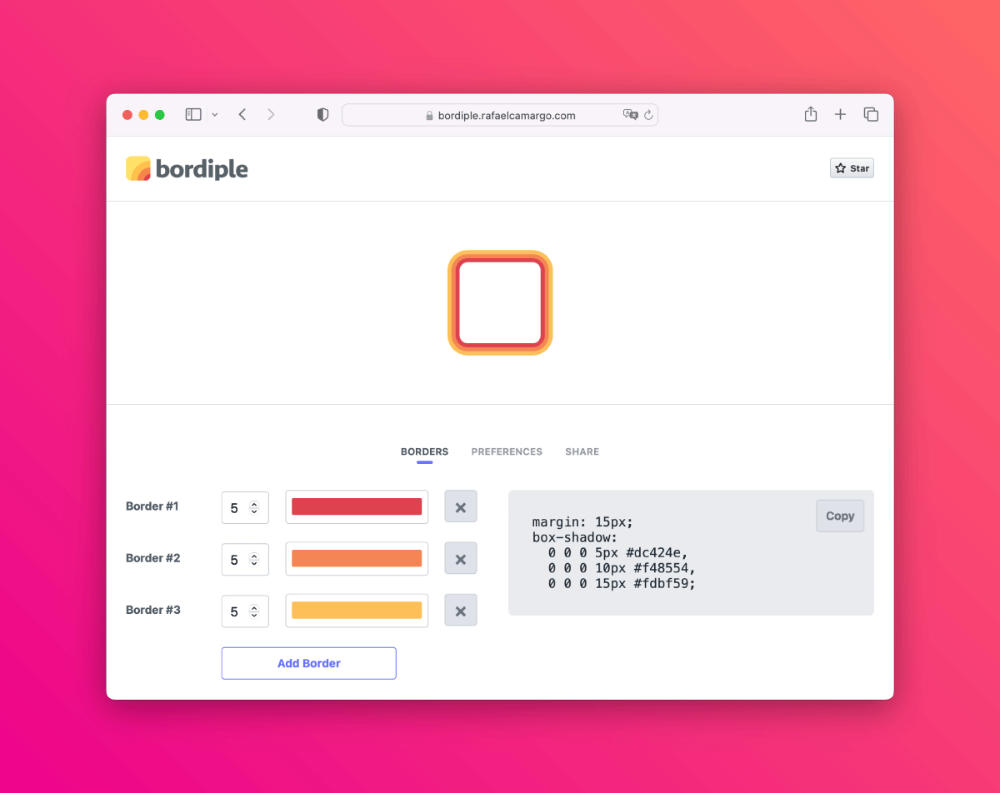

title: Lidando com indentação em asserções da Testing Library
date: 2023-08-29
description: Uma das tarefas mais triviais em testes escritos com a Testing Library é assegurar que um texto gerado dinamicamente está presente no documento. Mas e se esse texto estiver indentado, como garantir que tanto o texto quando a indentação estão corretos?
keywords: indentação, asserção, teste
lang: pt-BR

---

Há mais ou menos dois meses, enquanto implementava o [Bordiple](http://127.0.0.1:8765/blog/bordiple-o-gerador-de-multiplas-bordas-css/), uma situação inédita surgiu no momento em que eu escrevia um teste automatizado. Como um dos objetivos do Bordiple é facilitar o dia-a-dia de programadores front-end, código CSS é automaticamente gerado na medida em que as bordas são definidas via interface gráfica.

  
_Código CSS automaticamente gerado pelo Bordiple_

O teste automatizado consistia em definir algumas bordas usando a interface gráfica e então garantir que o código CSS exibido estava de acordo com o esperado. Seria um teste bastante simples. Usando a Testing Library, bastaria usar a função `getByText`, bastante comum, para buscar o texto esperado na tela. Porém, um pequeno detalhe tornou essa operação um pouco mais complicada. O texto exibido (código CSS) é indentado, conforme o HTML a seguir.

``` html
<code>margin: 20px;
box-shadow:
  0 0 0 5px #dc424e,
  0 0 0 10px #f48554,
  0 0 0 20px #333333;</code>
```

Minha primeira tentativa foi buscar pelo texto respeitando rigorosamente as quebras de linha e a indentação.

``` javascript
const codeElement = container.querySelector('#codeWrapper > code');
const code = `margin: 20px;
box-shadow: 
  0 0 0 5px #dc424e,
  0 0 0 10px #f48554,
  0 0 0 20px #333333;`;
expect(within(codeElement).getByText(code)).toBeInTheDocument();
```

Porém, ao rodar a suíte, o teste quebrou alegando que o texto buscado não foi encontrado no documento. Supondo que eu não tinha indentado corretamente o texto usado no teste, substituí `code` por `codeElement.textContent` na asserção do teste para verificar se esse era realmente o problema:

``` javascript
expect(within(codeElement).getByText(codeElement.textContent)).toBeInTheDocument();
```

Por incrível que pareça, ainda que eu tenha pedido para a Testing Library encontrar o texto de um elemento dentro dele mesmo, o teste não passou. A alegação continuava exatamente a mesma: o texto buscado não foi encontrado no documento.

Minha próxima tentativa foi ignorar a indentação no texto passado para a função `getByText`:

``` javascript
const codeElement = container.querySelector('#codeWrapper > code');
const code = [
  'margin: 20px;',
  'box-shadow: 0 0 0 5px #dc424e, 0 0 0 10px #f48554, 0 0 0 20px #333333;'
].join(' ');
expect(within(codeElement).getByText(code)).toBeInTheDocument();
```

Para minha surpresa, o teste passou. Assunto resolvido? Mais ou menos. Dessa forma, o teste garantiria que o código foi corretamente gerado, mas não garantiria que está sendo apresentado da maneira esperada. Ou seja, indentado.

A estratégia que me restou então foi a de esquecer o texto e focar no HTML:

``` javascript
const codeElement = container.querySelector('#codeWrapper > code');
const code = `margin: 20px;
box-shadow: 
  0 0 0 5px #dc424e,
  0 0 0 10px #f48554,
  0 0 0 20px #333333;`;
expect(codeElement.innerHTML).toEqual(code);
```

Perfeito. Dessa forma, o teste passou finalmente a garantir que o HTML contido no elemento `<code>` foi tanto gerado como indentado corretamente.
