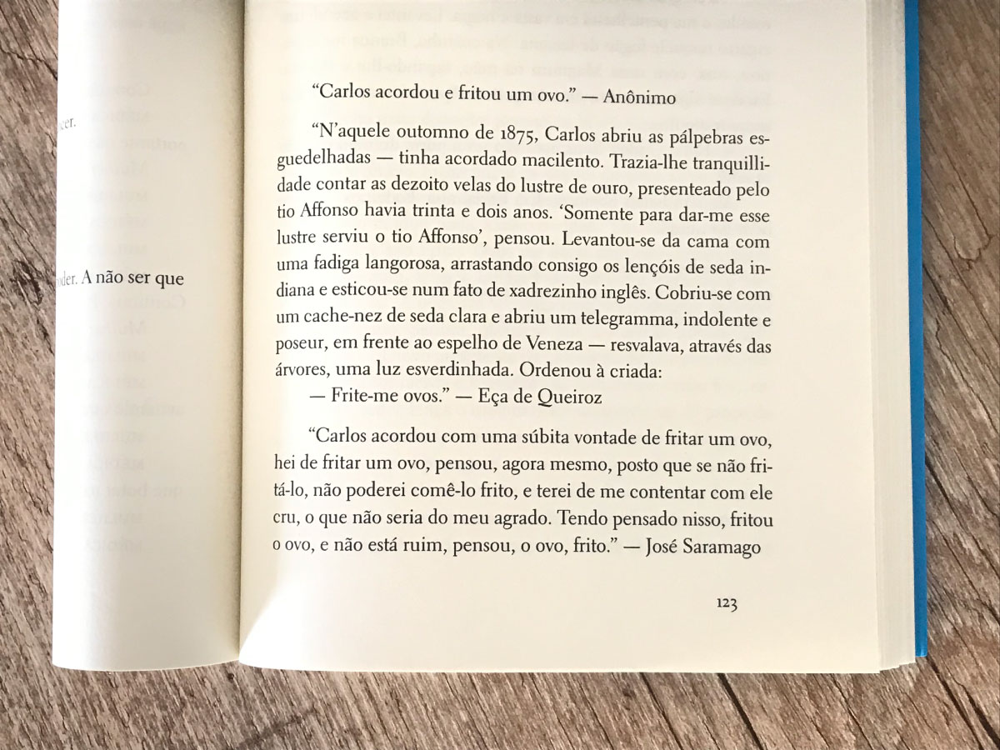

title: Limites da leitura
date: 2022-03-11
description: Jamais tive dificuldades para encontrar o portão de embarque indicado na minha passagem. Tampouco tenho dificuldades para detectar onde e quando ocorre o evento anunciado num convite recebido por email. Ler sempre foi uma atividade fácil.
keywords: limites, leitura, José Saramago
lang: pt-BR

---

Jamais tive dificuldades para encontrar o portão de embarque indicado na minha passagem. Tampouco tenho dificuldades para detectar onde e quando ocorre o evento anunciado num convite recebido por email. Ler sempre foi uma atividade fácil. Desde que me tornei capaz de associar um conjunto de letras a uma palavra, considerava adquirida a habilidade de ler.

Esse atestado de habilidade adquirida começou a ser ameaçado ao ler um trecho do livro *Several Short Sentences About Writing*:

> Do you remember, in school, going around the room, each student in turn reading a paragraph out loud? Remember how well some students read and others, how badly? It was a difference in comprehension, not of the sentence's meaning, but of its texture, pace, structure, actuality.

Sim, devo confessar que lembro. Sempre torcia para que na minha vez o parágrafo fosse curto - a exposição pública e a possibilidade de errar seriam então mínimas. Naquela época, eu poderia relacionar *passo* a muitas coisas, menos a uma frase. Meu conceito de leitura se limitava a agrupar palavras e alcançar com elas um significado. Respeitava religiosamente os *espaços*, sem ainda me dar conta que o *tempo* de cada pausa era bastante relativo.

Ler àquela maneira é como ser capaz de identificar corretamente todas as notas de uma canção, mas não necessariamente ser capaz de executá-las no ritmo correto - e se você já ouviu alguém bater palmas no contrapé da melodia, sabe o quanto o ritmo importa.

  
_Trecho da crônica O Ovo, de Gregório Duvivier_

A constatação definitiva de que os limites da minha leitura eram bastante tímidos se revelou ao longo das dezenas de páginas iniciais de *As intermitências da morte*. Depois de tantas vezes precisar reler as frases, cheguei a me questionar se tal dificuldade chamava-se analfabetismo funcional. É impossível ler *José Saramago* se você for incapaz de entrar no ritmo que ele impõe à prosa. Uma mesma ideia se estende por vírgulas a fio. Não é raro que o sujeito já tenha escapado da sua memória no momento em que você alcança o predicado. Leituras como essa demandam um vigor intelectual que nenhuma publicidade, placa de trânsito ou SMS tinham exigido de mim até então. Foi preciso meio livro de exercícios até retomar minha fluência no Português.

Encerrei o livro convencido de que leitura não é habilidade que se adquire, é habilidade que se cultiva.
