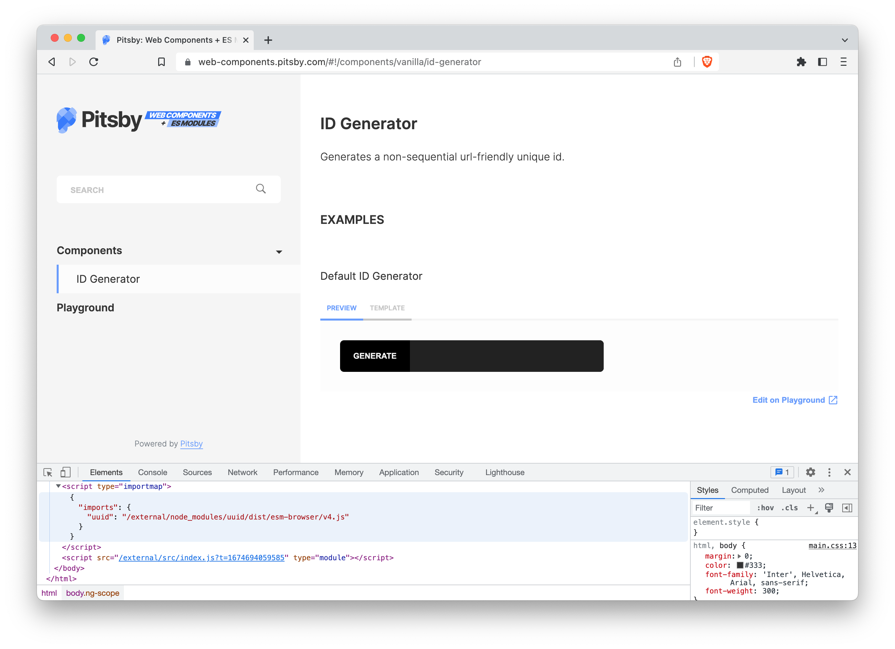

title: Pitsby agora com suporte a importmaps
date: 2023-01-27
description: Em setembro do ano passado, Pitsby passou a suportar scripts do tipo module, mas para que essa funcionalidade pudesse ser utilizada plenamente, ainda falta uma melhoria. O suporte a importmaps.
keywords: pitsby, importmap, interface, componentes, documentação
lang: pt-BR

---

Em setembro do ano passado, uma nova funcionalidade foi adicionada ao [Pitsby](https://pitsby.compilorama.com). Passava a ser possível importar scripts do tipo *module*. Para isso, bastava incluir na lista de scripts definidos no arquivo de configuração um objeto contendo o atributo referente ao tipo:

``` javascript
{
  scripts: [
    {
      src: './path/to/es6/module.js',
      type: 'module'
    }
  ]
}
```

Poucos meses se passaram e um problema se tornou evidente. Só era possível importar módulos através de *paths* relativos. Caso algum *path* fosse absoluto, como no caso em que se importa do diretório `node_modules` algum código terceiro, não era mais possível seguir em frente.

A partir da versão `1.33.0`, lançada esse mês, essa limitação não existe mais. Pitsby agora suporta scripts do tipo [*importmap*](https://developer.mozilla.org/en-US/docs/Web/HTML/Element/script/type/importmap) e permite que o usuário informe ao Browser como resolver módulos importados de *paths* absolutos. Vale lembrar que os Browsers ainda não suportam a possibilidade de um script do tipo *importmap* vir de uma fonte externa. Então é necessário que você informe ao Pitsby que seu script do tipo *importmap* seja *inline*:

``` javascript
{
  scripts: [
    {
      src: './path/to/docs/importmap.js',
      type: 'importmap',
      inline: true
    }
  ]
}
```

  
_Imagem do browser mostrando a inserção do "importmap" no Pitsby_

Nunca ouviu falar sobre o Pitsby? Pitsby é uma das diversas ferramentas open-source oferecidas pelo projeto [Glorious Codes](https://glorious.codes), que torna mais simples e direto o processo de documentar componentes de interface gráfica, exigindo quase nenhuma configuração. A ferramenta suporta tecnologias legadas e modernas desde AngularJS até VueJS, React, e Web Components, contém um playground que permite a seus usuários prototipar composições de componente e compartilhá-las com qualquer pessoa, pode ter seu visual completamente customizado, e integra facilmente com o Google Analytics. Saiba mais no [site oficial do Pitsby](https://pitsby.compilorama.com).

