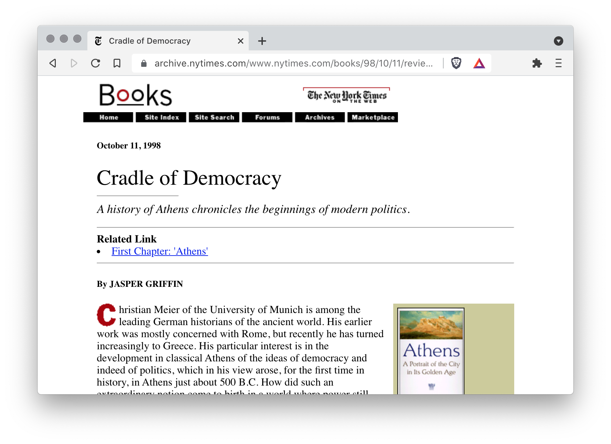

title: Porque criei um Dicionário Aumentado de Inglês
date: 2021-09-17
description: No início do ano passado, estava eu construindo uma cover letter a fim de disputar espaço numa empresa chamada Basecamp. Ao longo do texto, me deparei com a necessidade de usar uma metáfora, afinal a Basecamp é o 'berço do Rails'. Mas como ter certeza que 'cradle of Rails' expressaria em inglês o mesmo significado que a metáfora tem em português?
keywords: dicionário aumentado, inglês, typenik
lang: pt-BR

---

Cover letter é o termo em inglês para o que conhecemos por Carta de Apresentação. Se você já aplicou para uma vaga de emprego em uma empresa gringa, provavelmente já se deparou com ele.

No início do ano passado, estava eu construindo uma *cover letter* a fim de disputar espaço numa empresa chamada Basecamp. Ao longo do texto, me deparei com a necessidade de usar uma metáfora, afinal a Basecamp é o "berço do Rails". Mas como ter certeza que "cradle of Rails" expressaria em inglês o mesmo significado que a metáfora tem em português? Tudo bem, eu poderia abrir mão da metáfora e me comunicar de maneira literal: *the company where Rails was created*. Pronto, eliminaria qualquer possibilidade de erro. Mas removendo a possibilidade erro, eu removeria também um pouco do sabor do meu texto. E uma cover letter sem gosto certamente não aumentaria minhas chances. Eu precisava manter meu texto o mais bem temperado que eu pudesse.

Se você recorrer a um dicionário tradicional para tentar sanar essa dúvida, vai perceber que ele não te ajuda muito. Ou melhor, não te ajuda em nada.

  
_Dicionários tradicionais não aceitam termos contendo mais de uma palavra._

A partir daí, minha estratégia foi buscar referências daquele termo, *cradle of*, em famosas publicações como The New York Times, The New Yorker e The Guardian na esperança de sanar minha dúvida a partir do entendimento do contexto no qual a referência estava aplicada. Bingo! Seja verificando se uma metáfora continuava ou não funcionando em inglês, seja verificando a correta estrutura de uma frase ou parte dela, percebi que ler o contexto no qual as referências apareciam era tudo que eu precisava para exterminar minhas dúvidas.

  
_Referência a "cradle of" nos arquivos do The New York Times_

Mas restava ainda um pequeno problema. Fazer essa pesquisa de maneira manual em dois, três ou quatro sites era penoso e chato. Haveria então uma maneira de automatizar esse trabalho?

Typenik é o resultado dessa automação. Um produto que chamei de [Dicionário Aumentado de Inglês](https://typenik.compilorama.com/blog/what-is-an-english-augmented-dictionary/) porque entrega tudo que um dicionário tradicional oferece e vai além. Um conjunto de ferramentas que faz uso de diversos sites para que em um único lugar você elimine qualquer dúvida relacionada não só a definições, mas também a metáforas, expressões, conjugações ou qualquer outro termo composto por mais de uma palavra.

  
_Busque por referências em quantas fontes você desejar._

Se você costuma escrever em inglês frequentemente e já passou pelas dificuldades que citei aqui, experimente a companhia do [Typenik](https://typenik.compilorama.com) quando estiver construindo seu próximo texto.
