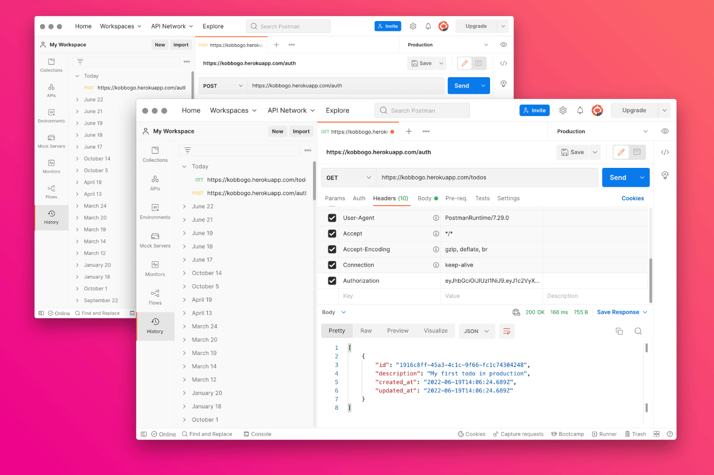
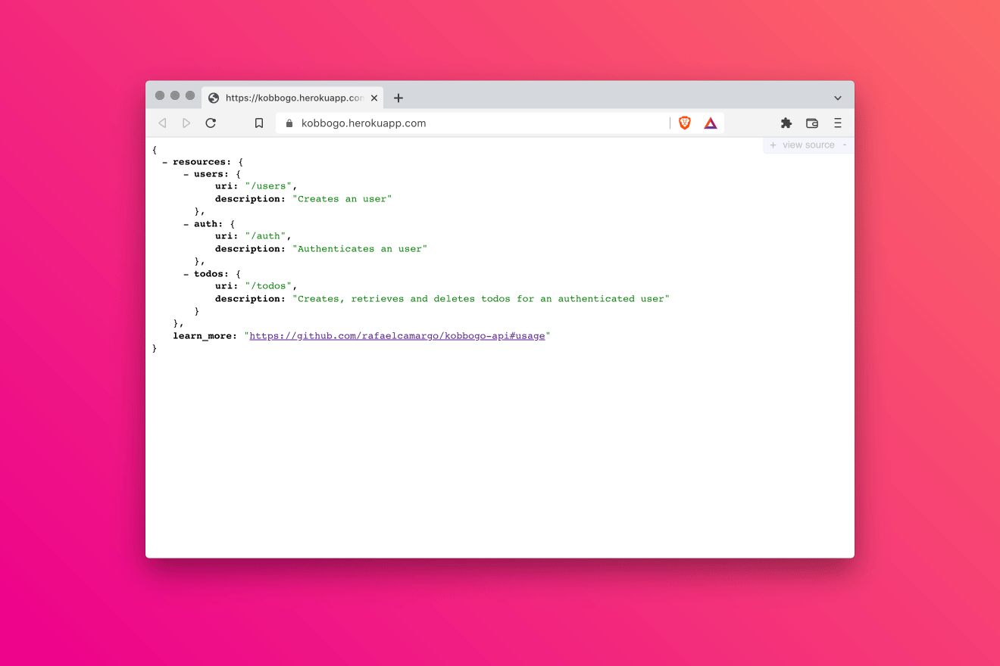

title: Primeiras impressões de um programador front-end sobre Ruby on Rails
description: Esse é o desfecho de uma história que começou no ano passado quando eu, um programador front-end, decidi estudar Ruby e SQL. Nessa última etapa, o desafio era construir uma API usando Rails e PostgreSQL.
keywords: Ruby, Rails, PostgreSQL, front-end, Rest, API, Pry, Rubocop, Heroku
date: 2022-06-30
lang: pt-BR

---

O que acontece ao programador front-end que decide criar sua primeira API com Rails? Ele se depara com inúmeros obstáculos, posso garantir.

Acabo de concluir meus estudos relacionados a backend e finalmente coloquei no ar uma API construída com o framework mais popular do universo Ruby, o Rails. Se eu tivesse que resumir a experiência em uma frase, eu diria: Aprender Rails é que nem aprender a tocar violão; durante um interminável primeiro mês você pensa diariamente em desistir,
mas basta conseguir trocar três acordes para começar a achar que possui um dom divino.

Minha intenção não será descrever o passo-a-passo sobre como chegar ao resultado que obtive. Dispensar os detalhes técnicos e focar nos *entraves & destaques* que pipocaram pelo caminho me parece uma alternativa mais divertida, e evita que o texto se torne uma colagem entediante de tutoriais já disponíveis em outros sites.

Em projetos que desenvolvo usando JavaScript, seja no Browser ou no servidor (Node), tenho o hábito de criar manualmente, um a um, todos os arquivos necessários - e somente o que é necessário - ao projeto, ao que chamo de [configuração limpa](https://rafaelcamargo.com/blog/configuracao-limpa/). Ao executar o comando do Rails que estrutura um novo projeto, me deparei com uma grande quantidade de diretórios e arquivos gerados.
Não podendo conter minha curiosidade, acessei diretório por diretório, arquivo por arquivo, para bisbilhotar do que se tratavam.
Encontrei algumas classes vazias e arquivos integralmente comentados.
Não removi nenhum deles, claro, mas fiquei com a impressão que estava mais uma vez diante da promessa que nos fazem na escola: você pode até não precisar disso agora, mas pode confiar, no futuro vai ser útil.
No caso da escola, ainda aguardo utilidade para os cálculos que aprendi em Química. Do Rails, esperarei mais compaixão.

Com a estrutura do projeto em pé, hora de escrever o primeiro teste automatizado: criar um usuário a partir de um payload contendo *username* e *password*. Percebo então que o Rails usa uma abordagem que eu não via mais em prática desde 2017. Um diretório específico para arquivos de teste. Embora não tenha sido de fato um entrave, hoje me soa desconfortável ter de replicar a estrutura de diretórios existentes na aplicação também no diretório que contém os testes. Em meus projetos com JavaScript, tenho acomodado o arquivo de teste junto à implementação. Além de economizar diretórios e facilitar o acesso, essa disposição deixa claro a todo novo programador o lugar de destaque que os testes ocupam no projeto.

Mas nenhum desses entraves pode ser comparado ao de escrever *User* dentro de um controller e ficar por minutos se questionando como o Rails sabe o que aquela variável representa sem que eu tenha importado um único arquivo sequer. Não sei se com todo mundo é assim, mas eu fui apresentado ao *auto-loading* a partir da seguinte mensagem: *uninitialized constant ApplicationController::JsonWebToken*. Foi através dela que cheguei às explicações que eu tanto precisava:

> In a normal Ruby program, dependencies need to be loaded by hand ... This is not the case in Rails applications, where application classes and modules are just available everywhere. Idiomatic Rails applications only issue require calls to load stuff from their lib directory, the Ruby standard library, Ruby gems, etc.
>
> [Autoloading and Reloading Constants](https://guides.rubyonrails.org/autoloading_and_reloading_constants.html)

O carregamento automático, por padrão, vale apenas para o diretório *app*. Para utilizar módulos e classes declarados em arquivos fora do diretório *app* (caso do diretório *lib*, por exemplo), você deve importá-los manualmente ou incluí-los aos diretórios observados pelo *auto-loading* na configuração da aplicação (opção pela qual optei).

  
_Experimentando a API via Postman_

Mas nem só de entraves foi feita a jornada. Houve também boas surpresas. Para começar, cito a possibilidade de parar a execução de um teste em um ponto específico do código e poder acessar os valores presentes no seu contexto. Inserindo a declaração *binding.pry* (oferecida pela gem *Pry*) em qualquer lugar do meu código, pude pausar a execução para entender melhor o estado das variáveis e o conteúdo das mensagens de erro.

O segundo destaque ficou por conta da gem *Rubocop*, uma biblioteca que analisa aspectos estáticos do código e oferece sugestões relacionadas a estilo, complexidade, entre outras questões. Ao rodar a análise pela primeira vez, me deparei com dezenas de sugestões. A grande maioria era relacionada a estilo, mas uma delas me deixou surpreso. O *Rubocop* foi capaz de detectar a ausência de um índice em uma das tabelas do banco de dados e sugeriu que eu o adicionasse, já que uma de suas colunas tinha a restrição de ser valor único, o *username* do usuário.

O último destaque ficou por conta do deploy em produção. Eu já havia usado o *Heroku* algumas vezes para publicar projetos usando Node, porém sem fazer uso de qualquer banco de dados. Desta vez, seria necessário um PostgreSQL. Dezenas de configurações começaram a pairar sobre minha cabeça anunciando um tremendo esforço pela frente. Para a minha surpresa, o *Heroku* não exigiu mais do que um commit de mim para que tudo estivesse rodando liso em seus servidores, uma experiência de deploy surpreendente. Para quem quiser experimentar a API, ela está disponível em [kobbogo.herokuapp.com](https://kobbogo.herokuapp.com/) e a documentação dos endpoints está em seu repositório no [Github](https://github.com/rafaelcamargo/kobbogo-api).

  
_Visão geral retornada pelo root path da API_

Compartilhando abaixo os links que foram essenciais para que eu superasse os obstáculos que surgiram. Se você é um programador front-end e se inspirou com essa história, esteja certo que esses links servirão de base para que você consiga criar também a sua primeira API:

- [Rest API with Ruby on Rails](https://www.udemy.com/course/ruby-on-rails-api-the-complete-guide/)
- [Testing for Beginners](https://testing-for-beginners.rubymonstas.org/)
- [RSpec Cheat Sheet](https://drive.google.com/file/d/1-q--B-DlZTDjFmM-pLE-9NnlWvTmg562/view)
- [JWT Authentication](https://medium.com/binar-academy/rails-api-jwt-authentication-a04503ea3248)
- [Using UUIDs](https://itnext.io/using-uuids-to-your-rails-6-application-6438f4eeafdf)
- [Code Coverage](https://github.com/simplecov-ruby/simplecov)
- [Static Code Analyzer](https://rubocop.org/)
- [Continuous Integration: Circle CI](https://circleci.com/docs/2.0/language-ruby)
- [Continuous Delivery: Heroku](https://circleci.com/developer/orbs/orb/circleci/heroku)

Antes de encerrar, eu não poderia deixar de agradecer a alguns programadores - alguns com quem trabalho, outro com quem já trabalhei - que me forneceram dicas valiosas ao longo do caminho: *Gabriel Escodino*, *Rodrigo Campos*, *Almir Mendes*, *Lucas Cunha* e *Lucas Merencia*. Muito obrigado, meus caros!
