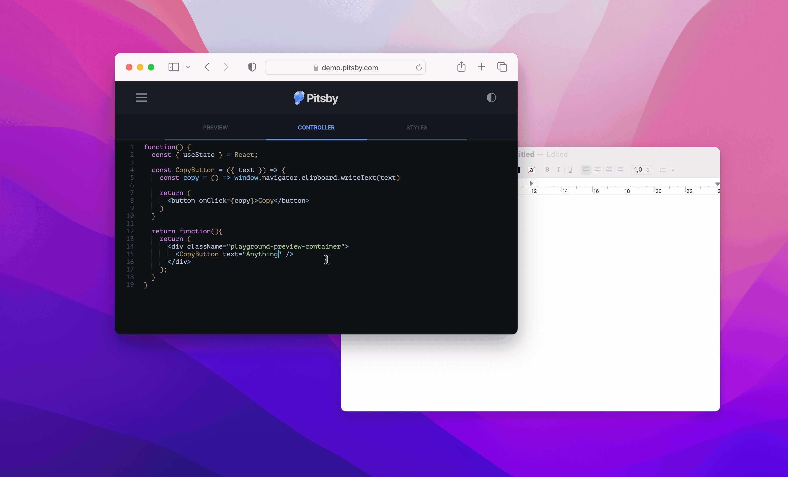

title: Testando a cópia de textos para a área de transferência com Jest e React Testing Library
date: 2023-10-25
description: Os botões Copiar estão hoje por toda a parte na internet. Usar o teclado para copiar dados de um site nos dias atuais soa desconfortável. Mas seria possível escrever testes que acessem dados armazenados na área de transferência?
keywords: clipboard, área de transferência, react testing library, rtl, jest, copiar, teste
lang: pt-BR

---

Muito tempo atrás, fiquei estupefato com o lançamento de mais um dos projetos do Zeno Rocha, um dos profissionais mais surpreendentes que conheço. O projeto era o *clipboard.js*. Naquele tempo, a estratégia mais comum para implementar qualquer botão que copiasse algum dado para a área de transferência era usar Flash, uma tecnologia que padeceu após o advento do HTML 5.

Ao longo dos anos que se sucederam, a facilidade introduzida pelo *clipboard.js* em usar a área de transferência fez proliferar os botões *Copy* por toda a internet. Hoje em dia, selecionar um texto e pressionar Ctrl+C (ou Cmd+C) soa desconfortável quando precisamos copiar qualquer dado exibido num site.

Mas como escrever os testes para esse caso de uso tão interessante? Seria possível acessar os dados que foram armazenados na área de transferência durante um teste automatizado? A resposta para a segunda pergunta é sim, e abaixo você encontra a resposta para a primeira.

A API que expõe a área de transferência para o browser é disponibilizada através do objeto `clipboard` presente em `window.navigator`. Quando o assunto é especificamente texto, existem dois métodos que podem ser utilizados: `writeText` e `readText`. Veja a seguir o teste para um caso de uso onde um botão, rotulado como Copy, armazena na área de transferência o texto que é passado para ele:

``` javascript
it('should copy text to clipboard', async () => {
  const text = 'Anything'
  render(<CopyButton text={text}/>)
  userEvent.click(screen.getByRole('button', { name: 'Copy' }))
  await pause(10)
  const copiedText = await window.navigator.clipboard.readText()
  expect(copiedText).toEqual(text)
})

async function pause(delay){
  return await new Promise(resolve => setTimeout(resolve, delay))
}
```

Note que após o clique sobre o botão Copiar, é necessário fazer uma breve pausa. Isso é necessário porque tanto a função `writeText` quanto `readText` operam de maneira assíncrona. Importante notar que as ferramentas utilizadas neste teste foram Jest v29 e React Testing Library v12, popularmente apelidada de RTL.

  
_Implementação em React de um botão Copiar_

Ficou curioso para ver como seria a implementação que faria esse teste passar? Acesse esse [playground](https://demo.pitsby.com/#!/components/react/playground?tab=1&code=eyJjb250cm9sbGVyIjoiZnVuY3Rpb24oKSB7XG4gIGNvbnN0IHsgdXNlU3RhdGUgfSA9IFJlYWN0O1xuICBcbiAgY29uc3QgQ29weUJ1dHRvbiA9ICh7IHRleHQgfSkgPT4ge1xuICAgIGNvbnN0IGNvcHkgPSAoKSA9PiB3aW5kb3cubmF2aWdhdG9yLmNsaXBib2FyZC53cml0ZVRleHQodGV4dClcblxuICAgIHJldHVybiAoXG4gICAgICA8YnV0dG9uIG9uQ2xpY2s9e2NvcHl9PkNvcHk8L2J1dHRvbj5cbiAgICApXG4gIH1cblxuICByZXR1cm4gZnVuY3Rpb24oKXtcbiAgICByZXR1cm4gKFxuICAgICAgPGRpdiBjbGFzc05hbWU9XCJwbGF5Z3JvdW5kLXByZXZpZXctY29udGFpbmVyXCI%252BXG4gICAgICAgIDxDb3B5QnV0dG9uIHRleHQ9XCJBbnl0aGluZ1wiIC8%252BXG4gICAgICA8L2Rpdj5cbiAgICApO1xuICB9XG59Iiwic3R5bGVzIjoiLnBsYXlncm91bmQtcHJldmlldy1jb250YWluZXIgeyBwYWRkaW5nOiAzMHB4OyB9In0%253D) e explore no próprio browser as possibilidades oferecidas pela Clipboard API.
