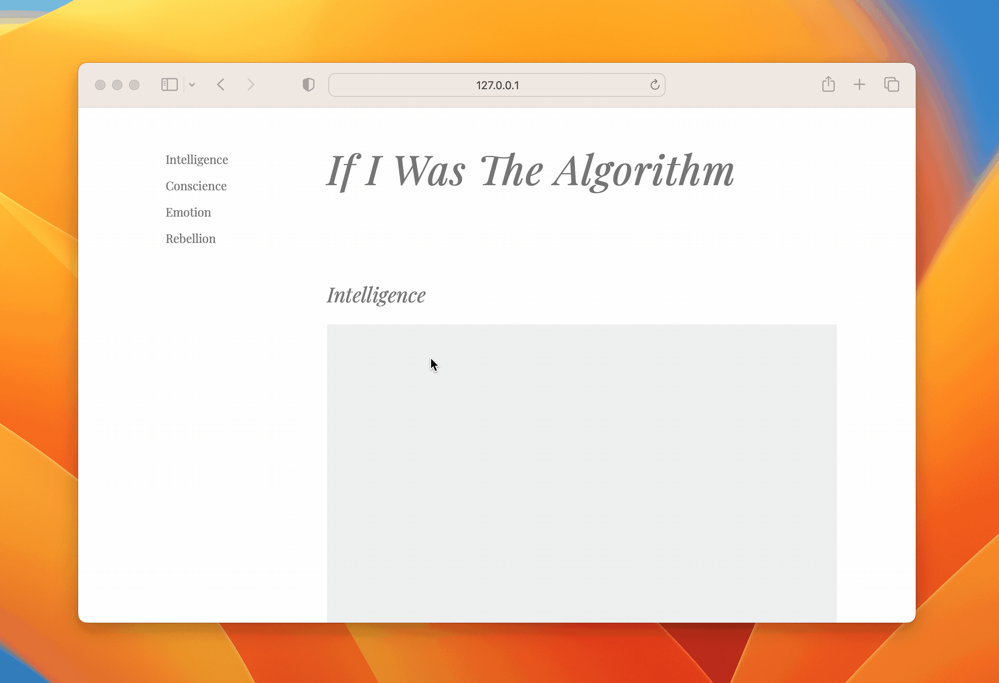
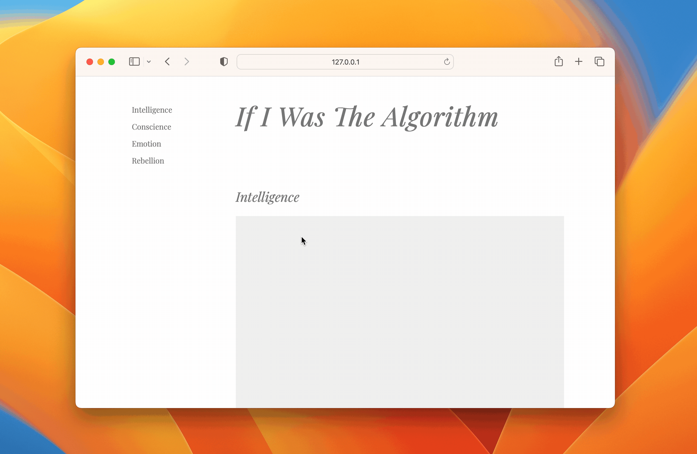

title: Testando e implementando rolagem suave em links de navegação para a própria página com React
date: 2024-01-30
description: A rolagem suave entre seções de uma mesma página oferece uma experiência fluida e agradável aos visitantes, mas como testar e melhor implementar um componente que seja facilmente reutilizável em outras telas do site ou da aplicação? A solução sugerida por esse post usa Jest, Testing Library e React.
keywords: rolagem, suave, navegação, página, react, jest, testing library, rtl
lang: pt-BR

---

Uma das estratégias mais utilizadas para permitir ao visitante navegar por seções de uma mesma página é a rolagem suave. Se contrapondo à estratégia de simplesmente rolar a página através de uma âncora adicionada na URL, que transporta o visitante imediatamente até a seção desejada, a rolagem suave oferece uma experiência mais fluida, guiando o visitante até o destino final de uma maneira muito mais agradável.

Vamos fazer do teste uma prancheta e começar a projetar nosso componente. No exemplo a seguir usaremos as ferramentas Jest e React Testing Library (RTL). O primeiro passo é dar nome a esse componente e especificar seu principal comportamento:

``` javascript
describe('Scroll Link', () => {
  it('should scoll the page till the element with the given id');
});
```

Chamaremos o componente de `<ScrollLink />` e passaremos para ele o `id` do elemento para o qual a rolagem da página levará o visitante quando o link for clicado. Vamos agora escrever o teste usando o método AAA (*Arrange, Act, Assert*). Na etapa *Arrange*, precisamos importar módulos e utilitários, fazer eventuais mocks, e tudo mais que for necessário para que possamos agir (Act) e, imediatamente depois, assegurar (Assert) que o resultado era o que de fato esperávamos.

``` javascript
import { render, screen } from '@testing-library/react'
import userEvent from '@testing-library/user-event'
import ScrollLink from './scroll-link'

describe('Scroll Link', () => {
  beforeEach(() => {
    window.scroll = jest.fn();
  });

  function mockSection({ id, topDistance }){
    const section = document.createElement('section');
    section.setAttribute('id', id);
    section.getBoundingClientRect = jest.fn(() => ({ top: topDistance }));
    document.body.appendChild(section);
  }

  it('should scoll the page till the element with the given id', async () => {
    const id = 'intelligence';
    const label = "Intelligence";
    mockSection({ id, topDistance: 400 });
    render(<ScrollLink to={id}>{label}</ScrollLink>);
  });
});
```

Teste 100% arranjado! Note que é necessário mocar o retorno da função `getBoundingClientRect`, uma vez que o `jsdom`, até o momento que escrevo esse post, ainda não implementa qualquer recurso relacionado a estilos. Hora de agir:

``` javascript
it('should scoll the page till the element with the given id', async () => {
  const id = 'intelligence';
  const label = "Intelligence";
  mockSection({ id, topDistance: 400 });
  render(<ScrollLink to={id}>{label}</ScrollLink>);
  await userEvent.click(screen.getByRole('link', { name: label }));
});
```

Imediatamente após clicarmos no link, garantimos então que a rolagem foi executada exatamente com os parâmetros esperados:

``` javascript
it('should scoll the page till the element with the given id', async () => {
  const id = 'intelligence';
  const label = "Intelligence";
  mockSection({ id, topDistance: 400 });
  render(<ScrollLink to={id}>{label}</ScrollLink>);
  await userEvent.click(screen.getByRole('link', { name: label }));
  expect(window.scroll).toHaveBeenCalledWith({
    top: 400,
    left: 0,
    behavior: 'smooth'
  });
});
```

Com o teste concluído e quebrando, vamos agora escrever a implementação do *ScrollLink* que faça o comportamento projetado se tornar realidade:

``` javascript
const ScrollLink = ({ to, children }) => {
  const navigate = evt => {
    evt.preventDefault();
    window.scroll({
      top: getElementTopDistance(to) + window.scrollY,
      left: 0,
      behavior: 'smooth'
    });
  }
  const getElementTopDistance = elementId => {
    const el = document.querySelector(`#${elementId}`);
    return el.getBoundingClientRect().top;
  }
  return (
    <a href={`#${to}`} onClick={navigate}>{children}</a>
  )
}
```

Note que além de a implementação ser bastante enxuta por não depender de nenhum código terceiro, o link respeita todos os requisitos relacionados a acessibilidade.



Há somente um pequeno probleminha com a experiência. Ao final da rolagem, o título da seção fica próximo demais do topo da tela. Para eliminar esse desconforto, podemos aprimorar o *ScrollLink* adicionando a ele uma propriedade opcional que podemos chamar de `offset`. Essa propriedade representará a que distância o elemento alvo deverá ficar afastado do topo da tela. Vamos ao projeto do novo caso de uso:

``` javascript
it('should optionally add an offset to the target element', async () => {
  const id = 'intelligence';
  const label = "Intelligence";
  mockSection({ id, topDistance: 400 });
  render(<ScrollLink to={id} offset={40}>{label}</ScrollLink>);
  await userEvent.click(screen.getByRole('link', { name: label }));
  expect(window.scroll).toHaveBeenCalledWith({
    top: 360,
    left: 0,
    behavior: 'smooth'
  });
});
```

Aprimoramos então o *ScrollLink* a fim de fazer o novo teste passar:

``` javascript
const ScrollLink = ({ to, children, offset = 0 }) => {
  const navigate = evt => {
    evt.preventDefault();
    window.scroll({
      top: getElementTopDistance(to) + window.scrollY - offset,
      left: 0,
      behavior: 'smooth'
    });
  }
  const getElementTopDistance = elementId => {
    const el = document.querySelector(`#${elementId}`);
    return el.getBoundingClientRect().top;
  }
  return (
    <a href={`#${to}`} onClick={navigate}>{children}</a>
  )
}
```



Trabalho concluído! Nossa base de código passou a ter um componente, que pode ser utilizado em qualquer tela do site ou da aplicação, capaz de rolar a página até qualquer elemento que esteja devidamente identificado por um `id`. Nesse [*gist*](https://gist.github.com/rafaelcamargo/dfd3f4b8f52534af7bfa039b7f7539a6) você encontra um *index.html* contendo todo código necessário para experimentar o *ScrollLink* localmente, exatamente como demonstrado pelas animações que ilustram esse post.
