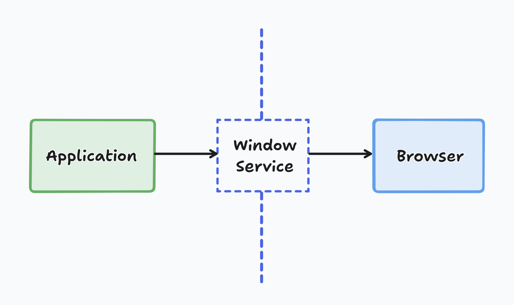

title: Testando redirecionamento feito via window.location.href com Jest
date: 2024-08-26
description: Redirects are pretty common in any web app. But when the destination is an external page, you might run into some challenges when testing that behavior. Learn how to set a boundary between your app's behavior and the browser's, making your tests easier to develop.
keywords: navigation not implemented, redirecionamento, window, location, href, testes
lang: pt-BR

---

Às vezes somos surpreendindos com o seguinte erro ao rodar nossos testes:

```
not implemented: navigation
```

Uma situação muito comum sob a qual este erro pode acontecer é quando a implementação altera o valor de `window.location.href`.

Se nenhuma situação como esta lhe vem à cabeça, pense no seguinte caso: ao clicar em um botão da sua aplicação, o usuário pode tanto ser redirecionado para outra view desta mesma aplicação — situação em que apenas o window.history é manipulado — quanto pode ser redirecionado para uma página externa. É quando a aplicação leva o usuário para a página externa alterando o valor de window.location.href, que o teste cai exatamente no erro comentado no início do post.

O jeito mais simples de evitar esse problema é estabelecendo uma fronteira entre o comportamento que está sob domínio da aplicação, e o comportamento que é responsabilidade do browser (carregar uma outra página a partir do novo valor atribuído ao `window.location.href`).

  
_Fronteira estabelecida pelo Window Service_

Essa fronteira pode ser estabelecida com a criação de um serviço que convenciono chamar de *window service*, dado que ele pode abrigar outros métodos que resolvem problemas similares ao da reatribuição do `href`. Especifico-o com a seguinte suite de testes:

``` javascript
// src/services/window.test.js
describe('Window Service', () => {
  it('should set window location href', () => {
    const { origin } = window.location;
    const newUrl = `${origin}/#my-custom-hash`;
    windowService.setHref(newUrl);
    expect(window.location.href).toEqual(newUrl);
  });
});
```

Como o objetivo desta suíte é garantir que o valor de `window.location.href` é de fato atualizado pelo browser quando eu o defino através do método `setHref`, temos toda a liberdade do mundo para definir um valor que não dispara qualquer navegação por parte do browser: `/#my-custom-hash`.

``` javascript
// src/services/window.js
const _public = {};

_public.setHref = href  => {
  window.location.href = href;
}

export default _public
```

Tendo agora a garantia de que chamando `windowService.setHref` usufruímos do mesmo resultado que atribuir diretamente um valor para `window.location.href`, podemos substituir a atribuição direta pelo método `setHref` na nossa implementação, e mocar o respectivo método nos testes:

``` javascript
describe('Conditional Button', () => {
  beforeEach(() => {
    windowService.setHref = jest.fn();
  });

  it('should redirect to help page if user does not satisfy some condition', () => {
    render (<ConditonalButton />);
    await screen.getByRole('button', { name: 'Go' });
    expect(windowService.setHref).toHaveBeenCalledWith(
      'https://some.support.page'
    );
  });
});
```

Se esta dica te ajudou a testar o redirecionamento para uma página externa, você provavelmente vai gostar de saber [como simular search params nos testes de um componente React](/blog/simulando-search-params-nos-testes-de-um-componente-react/).
