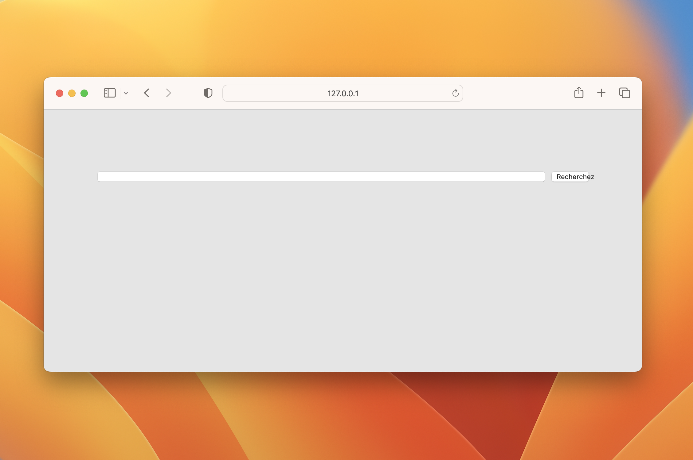

title: Usando flexbox para fazer um elemento ocupar todo o espaço restante disponível
date: 2023-12-20
description: Flexbox é de longe um dos recursos do CSS mais difíceis de se familiarizar. Por trás da sua complexidade se esconde porém um tremendo poder. Neste texto você vai descobrir como resolver, de uma maneira robusta e muito simples, um desafio super comum em layouts flexíveis.
keywords: flexbox, css, flex-gow
lang: pt-BR

---

Ao desenhar uma tela, existem situações nas quais tudo o que queremos é fazer com que um elemento ocupe completamente um espaço de largura variável.

Considere por exemplo a linha de um formulário contendo dois elementos: uma caixa de busca e um botão. Um vez que a largura da linha desse formulário é fluida, ou seja, pode às vezes ser mais curta e outras vezes ser mais estreita, como fazer com que a caixa de busca sempre preencha todo o espaço disponível, já descontado o espaço ocupado pelo botão?

Uma primeira estratégia seria usar a função `calc()`:

``` css
:root {
  --button-width: 60px;
  --textbox-margin: 10px;
}
form {
  margin: 100px auto 0;
  padding: 0 20px 0;
  max-width: 600px;
}
input {
  width: calc(100% - var(--button-width) - var(--textbox-margin));
  margin-right: var(--textbox-margin);
}
button {
  width: var(--button-width);
}
```

  
_Caixa de busca preenchendo todo o espaço restante disponível._

Essa estratégia incorre porém em pelo menos duas vulnerabilidades.

Considerando o modo padrão de exibição (display) tanto de caixas de busca quanto de botões, uma simples alteração na maneira como o HTML é escrito pode atrapalhar o cálculo e, acidentalmente, comprometer o resultado esperado. Experimente escrever o *input* e o *button* do seu documento HTML em linhas diferentes e você vai notar que o layout sofrerá um impacto indesejado.

A outra vulnerabilidade encontra-se no fato dessa estratégia precisar definir uma largura fixa para o botão. Quando uma interface precisa acomodar mais de um idioma, as traduções podem afetar o tamanho dos elementos. Eles devem portanto ser flexíveis o suficiente para acomodar essas variações, não sendo aconselhável portanto que suas dimensões sejam fixas.

  
_Elementos com largura fixa podem sofrer impactos indesejados em outros idiomas._

Uma outra estratégia, muito mais simples e robusta, é usar as possibilidades que o CSS oferece para tornarmos nosso layout **flexível**. Essas propriedades representam um módulo dentro do CSS chamado de *Flexbox*.

``` css
form {
  margin: 100px auto 0;
  padding: 0 20px 0;
  max-width: 600px;
}
.row {
  display: flex;
}
input {
  flex-grow: 1;
  margin-right: 10px;
}
```

Perceba que com o uso do Flexbox, alcançamos o mesmo resultado com uma quantidade de CSS menor, menos complexa, e sem precisar definir uma largura fixa para o botão, permitindo assim que ele mude de tamanho conforme seja necessário. Neste [Gist](https://gist.github.com/rafaelcamargo/82cd97cd55b5495b2d0570727b2aaf91) você encontra todo o código necessário para obter o resultado demonstrado pela animação a seguir.

  
_Solução simples e resiliente usando Flexbox._

Embora sua API não seja muito intuitiva, as propriedades Flexbox são extremamente poderosas. Esse [guia do site CSS Tricks](https://css-tricks.com/snippets/css/a-guide-to-flexbox/) é extremamente bem escrito e ilustrado, e me ajuda constantemente a entender e aplicar melhor as propriedades disponíveis no Flexbox. Para saber mais, você pode também consultar a [especificação Flexbox na W3C](https://www.w3.org/TR/css-flexbox-1/#overview).
