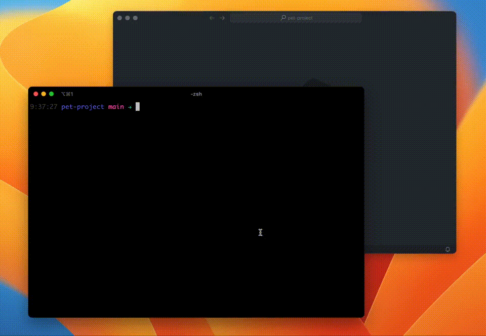

title: Usando Git Rebase para manter seu histórico de commits limpo e expressivo
date: 2024-06-30
description: Transformar o histórico de commits numa biografia que, capítulo a capítulo, descreve tudo que tem acontecido ao longo da vida de um software é um tremendo benefício para todos os envolvidos em seu desenvolvimento. Portanto, dominar o uso de algumas possibilidades oferecidas pelo Git Rebase — como rename, squash, fixup e drop — é fundamental para que essa história continue sendo sempre muito bem contada.
keywords: git, rebase, rename, squash, fixup, drop
lang: pt-BR

---

Um dos mais importantes fatores a serem observados em um Pull Request é o nível de legibilidade do código. Quão bem a nomenclatura de variáveis e funções é capaz de expressar sua intenção. Quão bem distribuídas estão as responsabilidades, para que, ao ler a implementação, não tenhamos que armazenar dezenas de variáveis em nossa frágil memória humana. Em resumo, quão bem contada está a história que aquelas alterações representam.

Existe, porém, um outro lugar no Pull Request onde uma história é contada e que, infelizmente, tem bem menos atenção dos revisores do que o código: o histórico de commits.

Todo commit representa a adição de um novo capítulo na biografia daquele software. A mensagem associada a cada um desses commits é a nossa oportunidade de resumir muito bem aquele acontecimento, a fim de facilitar um eventual trabalho de pesquisa que algum colega, ou nós mesmos, venha a fazer no futuro para descobrir quando exatamente uma funcionalidade foi incluída ou removida, quando e como foi feita a correção de um determinado problema, ou, até mesmo, qual foi a justificativa sobre o motivo de uma estratégia não tão comum ter sido adotada.

Ainda assim, não é raro nos depararmos com mensagens do tipo *wip*, *fix tests* ou *code review*. Essas mensagens não colaboram em nada com a biografia do software. Existindo ou não, acabam por dar na mesma.

Como podemos então zelar por um histórico de commits expressivo e relevante que transforme a jornada de um software numa história bem contada? A resposta é: editando o histórico sempre que necessário.

Uma das mais convenientes estratégias usadas para editar o histórico de commits é o `git rebase`.

## Inicializando a edição

Ao iniciar a edição do histórico de commits usando o modo interativo (`-i`) do comando `git rebase`, é necessário informar a partir de qual commit você pretende começar as alterações.

Se o que você precisa é apenas renomear o commit mais recente do histórico, passe como parâmetro do comando o valor `HEAD~1`:

```
git rebase -i HEAD~1
```

Mas se o que você precisa é unir os dois últimos commits ao antepenúltimo, passe como parâmetro o valor `HEAD~3`, uma vez que precisarás editar os 3 commits mais recentes do histórico:

```
git rebase -i HEAD~3
```

**Dica:** Ao executar um dos comandos acima, você vai notar que um editor de texto será aberto. O editor de texto padrão associado ao Git costuma ser o Vim. Eu não sou fã de Vim, por isso, editei essa configuração do git definindo o VS Code como editor de texto padrão. Dessa forma, todo git rebase passará a abrir o documento de edição do histórico não mais no Vim, mas sim no VS Code. Se você simpatizou com a minha preferência, basta executar o seguinte comando para fazer a mudança:

```
git config --global core.editor "code --wait"
```

A flag `--wait` informa ao Git que a execução de um comando deve aguardar até que o documento que foi aberto no editor seja fechado.

Entendido o funcionamento da inicialização do comando, é hora de entender como renomear, unir e excluir commits.

## Renomeando um commit

Após ter feito o commit, você pode eventualmente notar que a mensagem escolhida não expressa muito bem o significado dele. O uso do `git rebase` permite a você editar muito facilmente a mensagem de um commit já criado, seja ele o mais recente ou não no histórico.

Supondo que você precise renomear o último commit do histórico, execute:

```
git rebase -i HEAD~1
```

No documento que será aberto no editor de texto, você verá na primeira linha o termo `pick`, o código que identifica o commit, e a mensagem que foi associada a ele. Todo o resto do documento estará preenchido com instruções referentes ao próprio comando rebase.

Troque o termo `pick` por `r` (reword), salve e feche o arquivo. Um novo documento será aberto exibindo a mensagem associada ao commit (primeira linha) e, na sequência, diversas outras informações referentes ao commit, como data, horário e arquivos alterados. Edite a mensagem exibida na primeira linha como bem desejar, salve e feche o arquivo.

Pronto! Executando o comando `git log`, você pode confirmar que a mensagem do último commit foi atualizada de acordo com sua edição.

  
_Demonstração de um commit sendo renomeado_

## Unindo commits

Existem situações em que mais de um commit acabam fazendo parte de uma mesma alteração e, portanto, poderiam ser reduzidos a um único commit apenas. Neste caso, o comando a ser usado é o squash. Ele une dois ou mais commits em apenas um.

Considere a situação na qual a funcionalidade de excluir um produto está sendo implementada, e o estado atual do histórico de commits é o seguinte (mais antigo no topo):

```
feat: add deletion to the product resource
feat: add deletion button to the product actions
feat: add soft delete param to the product resource
```

Embora o penúltimo e o antepenúltimo commits tenham preocupações diferentes — um alterando interface gráfica e outro alterando um endpoint — e, portanto, seja válido deixar as alterações em diferentes commits, o último commit trata ainda do endpoint, como se fosse apenas um caso de uso que foi esquecido de ser adicionado ao antepenúltimo commit.

Neste caso, a história contada no histórico poderia ser encurtada a dois commits, unindo o último commit ao antepenúltimo. Para tal, o rebase deve ser iniciado com o comando a seguir:

```
git rebase -i HEAD~3
```

No documento de edição do histórico, o último commit foi movido para a penúltima posição, e o termo `pick` trocado por `s` (squash):

```
pick dc979e8 feat: create blog post delete resource
s f3abffc add soft delete param to the product resource
pick 24b7de5 feat: add deletion button to the product actions
```

Ao salvar e fechar o documento, o Git abrirá novamente o editor de texto para que você opte por deixar as duas mensagens no histórico, manter apenas uma, ou escrever uma mensagem completamente nova. Salvando e fechando novamente o arquivo, o rebase estará concluído.

  
_Demonstração da união de dois commits_

**Dica:** Nos casos em que a mensagem do commit que receberá o squash continue expressando bem o seu significado após a união dos commits, você pode usar o termo `f` (fixup) ao invés do `s`. O fixup tem o mesmo efeito do `squash`, mas elege como mensagem final, a mensagem do commit que recebe o fixup.

## Excluindo commits

Se o que você precisa é simplesmente eliminar um commit, a tarefa é bastante simples. Considerando que o commit a ser eliminado é o último commit feito, basta inicializar o `git rebase`:

```
git rebase -i HEAD~1
```

Em seguida, trocar o termo `pick` por `d` (drop) no documento de edição do histórico, salvar e fechar o arquivo. Pronto! Ao executar o comando `git log`, será possível confirmar o sumiço do commit excluído.

  
_Demonstração da exclusão de um commit_

## Atenção!

Você já deve ter ouvido falar que o Git é uma ferramenta muito poderosa, mas também muito perigosa. Ao editar o histórico, vale a pena prestar bastante atenção em alguns pontos:

1. Se durante a execução das alterações surgirem conflitos e você não souber como resolvê-los, pressione Cmd+C no terminal e rode o comando `git rebase --abort`. Pronto! Tudo será cancelado e você voltará para o estado que o histórico tinha antes de iniciar o rebase.

2. Se você já tiver enviado para o repositório remoto os commits que está tentando alterar, só conseguirá mandar as novas alterações para o repositório remoto passando a flag --force para o comando push. Isso porque haverá obviamente uma diferença entre o estado do histórico no repositório remoto e o estado do histórico na sua máquina. Antes de executar o comando push passando a flag --force, certifique-se de que só você está trabalhando na branch que possui tais commits. Do contrário, você corre o risco de excluir commits de outras pessoas e gerar um caos desnecessário.

Se você gostou do que leu aqui e quiser descobrir ainda mais possibilidades oferecidas pelo comando `git rebase`, acesse a [documentação](https://git-scm.com/book/en/v2/Git-Tools-Rewriting-History) oficial do Git.
