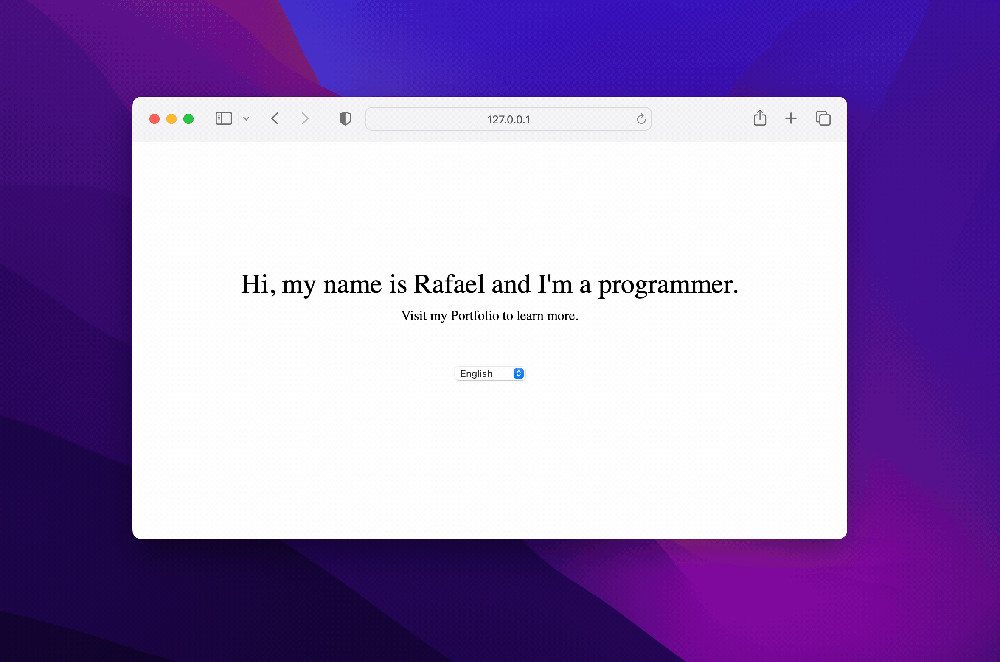
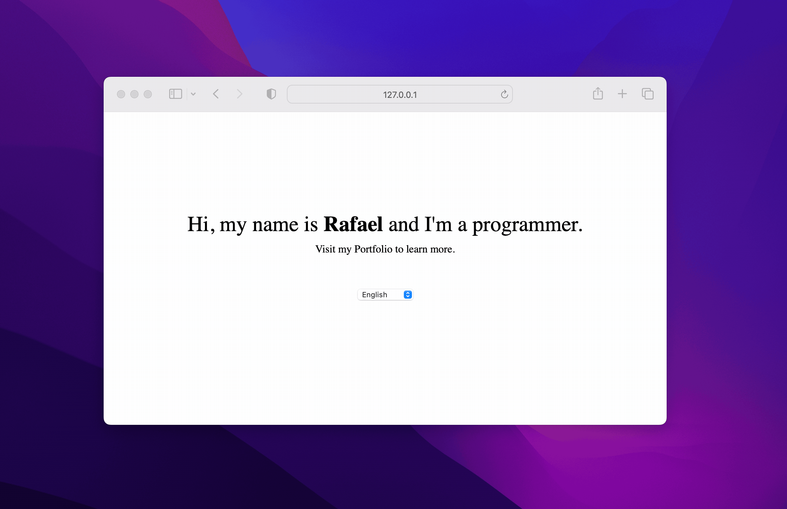
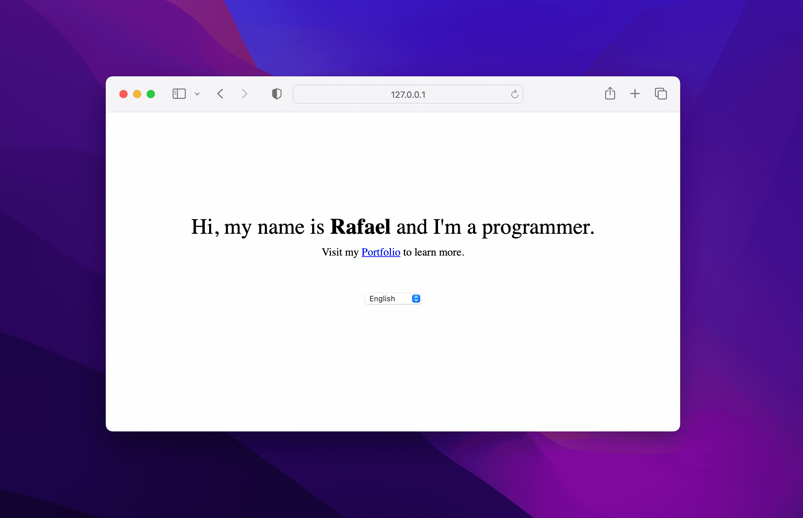

title: Usando HTML em traduções baseadas em React i18next
date: 2023-11-29
description: Lidar com textos planos em arquivos de tradução é uma atividade trivial. Mas quando parte desse texto precisa estar em negrito ou possui um link, alguns desafios podem surgir a sua frente. Descubra como superar esses desafios com a ajuda da biblioteca i18next.
keywords: html, traduções, react, i18next
lang: pt-BR

---

Suportar múltiplos idiomas num mesmo *software* pode ser uma enorme vantagem para empresas que pretendem conquistar mercados que estão além das fornteiras de seu próprio país.

Uma das mais populares biblioteca JavaScript focada na internacionalização de aplicações é a i18next. Uma das primeiras perguntas que podem vir à sua cabeça é: se a i18next é a *seguinte*, qual seria a *anterior*. Também não faço a menor ideia. Imagino que o *next* aqui é apenas uma brincadeira com a letra *n* presente em *i18n*, sigla que representa as letras *i* e *n* da palavra *internationalization* mais as *18* letras que existem entre elas. Mas se você souber o real significado, não hesite em me contar.

É importante deixar claro que todo o código apresentado nesse post utilizará a i18next em conjunto com a react-i18next, o *wrapper* da bilbioteca para React.

Bem, começamos então da maneira mais simples possível. Duas frases que não fazem uso de qualquer HTML. Texto puro. Além das duas frases, apenas um selector de idiomas:

``` javascript
import { useTranslation } from 'react-i18next';

const App = () => {
  const { t, i18n } = useTranslation();
  const languages = [
    { value: 'en', label: 'English' },
    { value: 'pt', label: 'Português' }
  ];
  const handleLanguageChange = ({ target: { value } }) => {
    i18n.changeLanguage(value);
  }

  return (
    <>
      <h1>{t('greeting')}</h1>
      <p>{t('tagline')}</p>
      <select
        aria-label="language"
        value={i18next.language}
        onChange={({ target }) => i18n.changeLanguage(target.value)}
      >
        {languages.map(({ label, value }) => (
          <option value={value}>{label}</option>
        ))}
      </select>
    </>
  );
}
```
As respectivas traduções para *greeting* e *tagline* são:
``` json
{
  "resources": {
    "en": {
      "translation": {
        "greeting": "Hi, my name is Rafael and I'm a programmer.",
        "tagline": "Visit my Portfolio to learn more."
      }
    },
    "pt": {
      "translation": {
        "greeting": "Olá, sou programador e me chamo Rafael.",
        "tagline": "Visite meu Portfolio para saber mais."
      }
    }
  }
}
```
Abaixo, o resultado do que já temos até aqui:



O resultado é legal, mas digamos que seja necessário interferir no estilo e na dinâmica de parte do texto. Que tal *Rafael* estar destacado em negrito e a palavra Portfolio ser um link?

Vamos começar com a estilização do nome Rafael. Para isso, precisaremos delimitar na nossa tradução a parte do texto que receberá a interferência de HTML:
``` json
{
  "resources": {
    "en": {
      "translation": {
        "greeting": "Hi, my name is <b>Rafael</b> and I'm a programmer.",
        "tagline": "Visit my Portfolio to learn more."
      }
    },
    "pt": {
      "translation": {
        "greeting": "Olá, sou programador e me chamo <b>Rafael</b>.",
        "tagline": "Visite meu Portfolio para saber mais."
      }
    }
  }
}
```
Uma vez delimitada, precisamos agora passar o componente HTML para a respectiva região do texto. Para isso, não podemos mais fazer uso apenas da função `t`. Precisamos de algo que nos dê maiores poderes. Para isso, a i18next oferece o componente `<Trans>`. Entre as propriedades que esse componente aceita, está aquela chamada `components`, justamente a propriedade que usaremos:
``` javascript
import { useTranslation, Trans } from 'react-i18next';

const App = () => {
  const { t, i18n } = useTranslation();
  // código existente

  return (
    <>
      <h1>
        <Trans
          i18nKey="greeting"
          components={{ b: <strong /> }}
        />
      </h1>
      <p>{t('tagline')}</p>
      {/* código existente */}
    </>
  );
}
```
A propriedade `components` recebe um objeto. Cada chave desse objeto é identificada de acordo com o marcador usado na tradução. Se eu tivesse marcado minha tradução com o símbolo `<c>`, a chave presente no objeto `components` não seria mais identifica com a letra `b`, mas sim com a letra `c`. Veja a seguir o resultado:



Concluída a estilização do nome Rafael, vamos agora um pouco mais longe. Além de embrulhar a palavra Portfolio em uma âncora `<a>`, vamos definir um atributo `href` para ela. Novamente, precisamos primeiro delimitar nossa tradução com uma maração específica:
``` json
{
  "resources": {
    "en": {
      "translation": {
        "greeting": "Hi, my name is <b>Rafael</b> and I'm a programmer.",
        "tagline": "Visit my <a>Portfolio</a> to learn more."
      }
    },
    "pt": {
      "translation": {
        "greeting": "Olá, sou programador e me chamo <b>Rafael</b>.",
        "tagline": "Visite meu <a>Portfolio</a> para saber mais."
      }
    }
  }
}
```
Em seguida, fazemos novamente uso do componente `<Trans>`:
``` javascript
import { useTranslation, Trans } from 'react-i18next';

const App = () => {
  const { t, i18n } = useTranslation();
  // código existente

  return (
    <>
      <h1>
        <Trans
          i18nKey="greeting"
          components={{ b: <strong /> }}
        />
      </h1>
      <p>
        <Trans
          i18nKey="tagline"
          components={{ a: <a href={`https://rafaelcamargo.com/?lang=${i18next.language}`} /> }}
        />
      </p>
      {/* código existente */}
    </>
  );
}
```

Enfim o resultado esperado:



Tanto a i18next quanto seu componente `<Trans>` são versáteis e muito poderosos. Além de estilizar parte de uma tradução ou inserir links, a i18next nos permite ainda formatar dados, interpolar variáveis, e gerenciar o singular e plural das palavras. Para conhecer mais sobre todo o poder dessa biblioteca, visite a sua documentação oficial em [i18next.com](https://www.i18next.com/) e também a documentação do seu wrapper para React em [react.i18next.com](https://react.i18next.com/).

Se você ficou curioso para rodar esse código aí no seu computador, confira esse [Gist](https://gist.github.com/rafaelcamargo/2b35ab21f8e5829247d25e94e3faa308) contendo tudo que é necessário para fazer a solução funcionar usando apenas um arquivo HTML.
