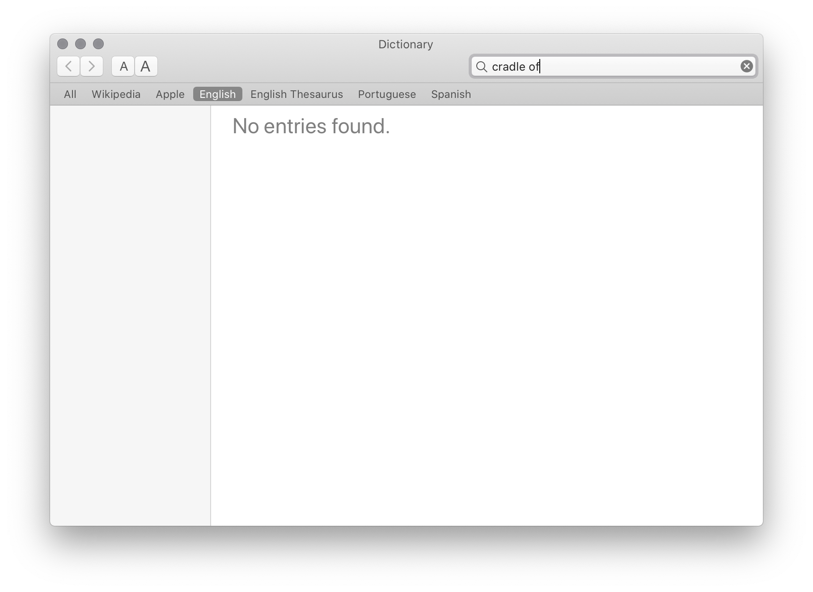
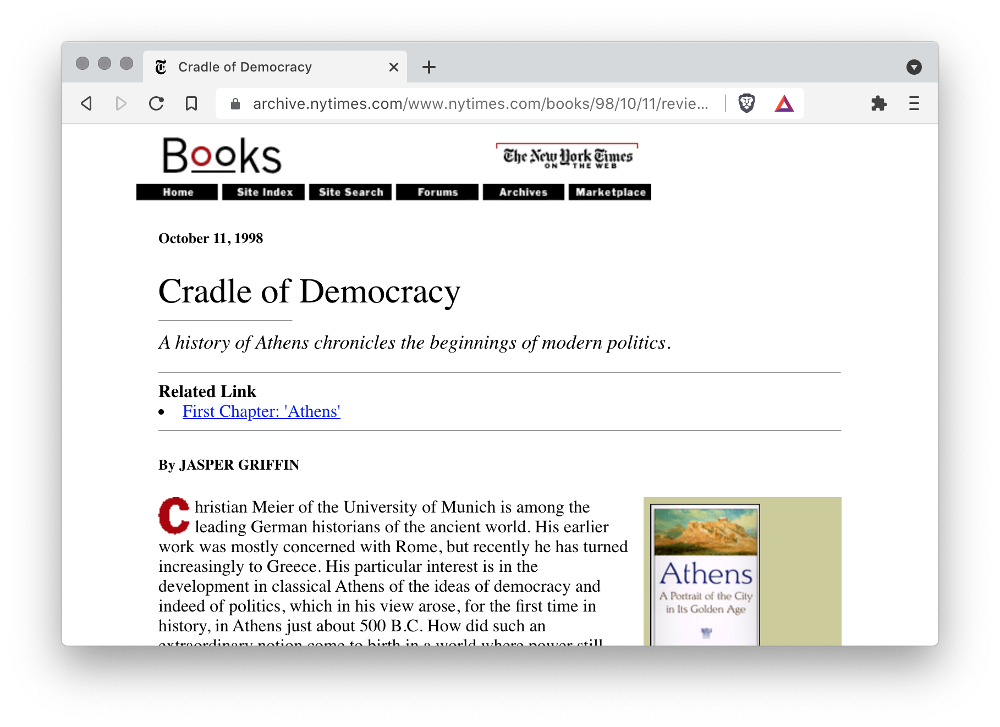
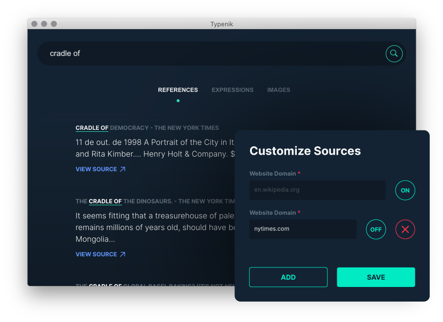

title: Why I built an English Augmented Dictionary
date: 2021-09-19
description: At the start of the past year, I was creating a cover letter to compete for a position at Basecamp. Along with my text, I wanted to use a metaphor. After all, Basecamp is the 'cradle' of Rails. But how to be sure that 'cradle of' would express in English the same meaning this metaphor has in Portuguese, my mother language?
keywords: augmented dictionary, english, typenik

---

In my mother language, Carta de Apresentação is the term that translates to cover letter in English.

At the start of the past year, I was creating a cover letter to compete for a position at Basecamp. Along with my text, I wanted to use a metaphor. After all, Basecamp is the "cradle" of Rails. But how to be sure that "cradle of" would express in English the same meaning this metaphor has in Portuguese? One option would be forgetting that metaphor and express the intent literally: *the company where Rails was created*. Ok, it would vanish any possibility of committing a mistake. But, removing that possibility would also remove a little of the "flavor" of my writing. And a tasteless cover letter wouldn't increase my chances. I needed to keep my copy well seasoned as much as I could.

If you search for "cradle of" in a traditional dictionary, it does not help. To be clear, it won't help you at all.

  
_Traditional dictionaries don't allow terms containing more than one word._

Alternatively, I searched for references to that term - *cradle of* - on popular publications like The New York Times, The New Yorker, and The Guardian. The idea was to clear my doubts by reading the context in which the reference was applied on. Bingo! Reading references on popular publications was all I needed to check if a metaphor keeps working in English, or if a phrase, or part of it, is arranged correctly.

  
_Reference for "cradle of" in the archives of The New York Times_

But there was still an issue. Searching for terms on two, three or four publications manually is tedious and time-consuming. So would there be a way of automating this job?

Typenik is the output of that automation. A product I called [English Augmented Dictionary](https://typenik.com/blog/what-is-an-english-augmented-dictionary/) because it delivers everything a traditional dictionary does and goes further. It is a toolbox that connects several web resources to clear doubts related to definitions, metaphors, expressions, conjugation, or any other term containing more than one word.

  
_Search for references from how many sources you want._

If you write in English frequently and have already faced some of the challenges I cited here, try to have [Typenik](https://typenik.com) at your side when building your next copy.
